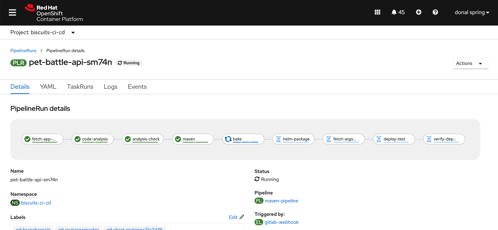
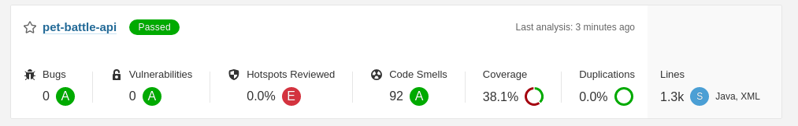

## Extend Tekton Pipeline with Sonar Scanning

> In this exercise, we're going to edit the tekton `Pipeline` to run code-analysis using sonar of the API and add an additional `Task` to analyse the results

1. Add `code-analysis` step to our `Pipeline`. Edit `tech-exercise/tekton/templates/pipelines/maven-pipeline.yaml` file, add this step before the `maven` build step. We don't need to create a new task here, we can just supply some new parameters to the existing `maven` task giving us great reusability of Tekton components.

    ```yaml
        # Code Analysis
        - name: code-analysis
          taskRef:
            name: maven
          params:
            - name: WORK_DIRECTORY
              value: "$(params.APPLICATION_NAME)/$(params.GIT_BRANCH)"
            - name: GOALS
              value: "test sonar:sonar"  # - org.owasp:dependency-check-maven:check
            - name: MAVEN_BUILD_OPTS
              value: "-Dsonar.host.url=http://sonarqube-sonarqube:9000 -Dsonar.userHome=/tmp/sonar"
          runAfter:
            - fetch-app-repository
          workspaces:
            - name: maven-settings
              workspace: maven-settings
            - name: maven-m2
              workspace: maven-m2
            - name: output
              workspace: shared-workspace
            - name: sonarqube-auth
              workspace: sonarqube-auth
    ```

2. We also need to bind the `sonarqube-auth` workspace to our secret when we trigger the Pipeline to run. To do this edit `tekton/templates/triggers/gitlab-trigger-template.yaml` file, add this code to the end of the `workspaces list` where the `# sonarqube-auth` placeholder is:

    ```yaml
            # sonarqube-auth
            - name: sonarqube-auth
              secret:
                secretName: sonarqube-auth
    ```

3. Tekton Tasks are just piece of yaml. So it's easy for us to add more tasks. The Tekton Hub is a great place to go find some reusable components for doing specific activities. In our case, we're going to grab the `sonarqube-quality-gate-check.yaml` task and add it to our cluster. If you open `tekton/templates/tasks/sonarqube-quality-gate-check.yaml` file afterwards, you'll see the task is a simple one that executes one shell script in an image.

    ```bash
    cd /projects/tech-exercise
    cat <<'EOF' >> tekton/templates/tasks/sonarqube-quality-gate-check.yaml
    apiVersion: tekton.dev/v1beta1
    kind: Task
    metadata:
      name: sonarqube-quality-gate-check
    spec:
      description: >-
        This Task can be used to check sonarqube quality gate
      workspaces:
        - name: output
        - name: sonarqube-auth
          optional: true
      params:
        - name: WORK_DIRECTORY
          description: Directory to start build in (handle multiple branches)
          type: string
        - name: IMAGE
          description: the image to use
          type: string
          default: "quay.io/eformat/openshift-helm:latest"
      steps:
      - name: check
        image: $(params.IMAGE)
        script: |
          #!/bin/sh
          test -f $(workspaces.sonarqube-auth.path) || export SONAR_USER="$(cat $(workspaces.sonarqube-auth.path)/username):$(cat $(workspaces.sonarqube-auth.path)/password)"
      
          cd $(workspaces.output.path)/$(params.WORK_DIRECTORY)
          TASKFILE=$(find . -type f -name report-task.txt)
          if [ -z ${TASKFILE} ]; then
            echo "Task File not found"
            exit 1
          fi
          echo ${TASKFILE}

          TASKURL=$(cat ${TASKFILE} | grep ceTaskUrl)
          TURL=${TASKURL##ceTaskUrl=}
          if [ -z ${TURL} ]; then
            echo "Task URL not found"
            exit 1
          fi
          echo ${TURL}

          AID=$(curl -u ${SONAR_USER} -s $TURL | jq -r .task.analysisId)
          if [ -z ${AID} ]; then
            echo "Analysis ID not found"
            exit 1
          fi
          echo ${AID}

          SERVERURL=$(cat ${TASKFILE} | grep serverUrl)
          SURL=${SERVERURL##serverUrl=}
          if [ -z ${SURL} ]; then
            echo "Server URL not found"
            exit 1
          fi
          echo ${SURL}

          BUILDSTATUS=$(curl -u ${SONAR_USER} -s $SURL/api/qualitygates/project_status?analysisId=${AID} | jq -r .projectStatus.status)
          if [ "${BUILDSTATUS}" != "OK" ]; then
            echo "Failed Quality Gate - please check - $SURL/api/qualitygates/project_status?analysisId=${AID}"
            exit 1
          fi

          echo "Quality Gate Passed OK - $SURL/api/qualitygates/project_status?analysisId=${AID}"
          exit 0
    EOF
    ```

4. Let's add this task to our pipeline. Edit `tech-exercise/tekton/templates/pipelines/maven-pipeline.yaml` file and add the `code-analysis-check` step to our pipeline as shown below.

    ```yaml
        # Code Analysis Check
        - name: analysis-check
          retries: 1
          taskRef:
            name: sonarqube-quality-gate-check
          workspaces:
            - name: output
              workspace: shared-workspace
            - name: sonarqube-auth
              workspace: sonarqube-auth
          params:
          - name: WORK_DIRECTORY
            value: "$(params.APPLICATION_NAME)/$(params.GIT_BRANCH)"
          runAfter:
          - code-analysis
    ```

5. In Tekton, we can control flow by using `runAfter` to organize the structure of the pipeline. Adjust the `maven` build step's `runAfter` to be `analysis-check` so the static analysis steps happen before we even compile the app!

    <div class="highlight" style="background: #f7f7f7"><pre><code class="language-yaml">
        - name: maven
          taskRef:
            name: maven
          runAfter:
            - analysis-check # <- update this 💪💪
          params:
            - name: WORK_DIRECTORY
              value: "$(params.APPLICATION_NAME)/$(params.GIT_BRANCH)"
            - name: GOALS
              value: "package"
            - name: MAVEN_BUILD_OPTS
              value: "-Dquarkus.package.type=fast-jar -DskipTests"
          workspaces:
            - name: maven-settings
              workspace: maven-settings
            - name: maven-m2
              workspace: maven-m2
            - name: output
              workspace: shared-workspace
    </code></pre></div>

6. With all these changes in place - Git add, commit, push your changes so our pipeline definition is updated on the cluster:

    ```bash
    cd /projects/tech-exercise
    git add .
    git commit -m  "🥽 ADD - code-analysis & check steps 🥽"
    git push 
    ```

7. Now let's trigger a pipeline build - we can push an empty commit to the repo to trigger the pipeline:

    ```bash
    cd /projects/pet-battle-api
    git commit --allow-empty -m "🧦 TEST - running code analysis steps 🧦"
    git push
    ```

    <p class="warn"><b>TIP</b> - If we didn't want to add a commit to the repo, we could always go to GitLab and trigger the WebHook directly from there which would also kick the pipeline but leave no trace in the git history 🧙‍♀️✨🧙‍♀️.</p>

    

8. When the pipeline has complete - we can inspect the results in Sonarqube UI. Browse to Sonarqube URL

    ```bash
    echo https://$(oc get route sonarqube --template='{{ .spec.host }}' -n ${TEAM_NAME}-ci-cd)
    ```

    
