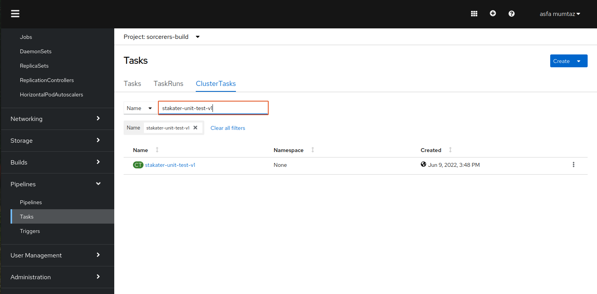
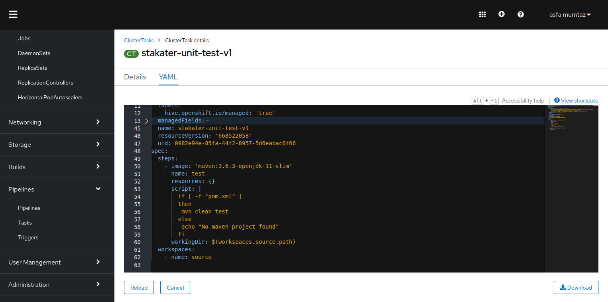
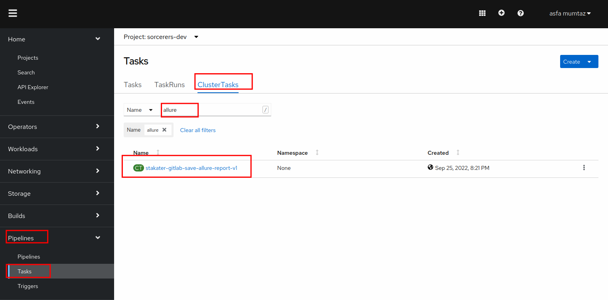
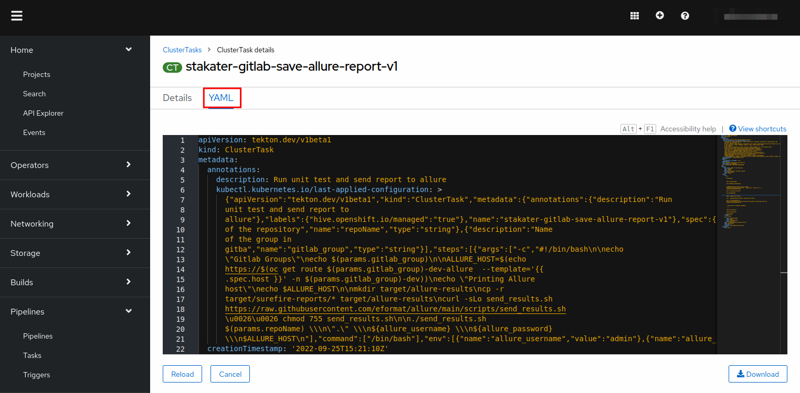
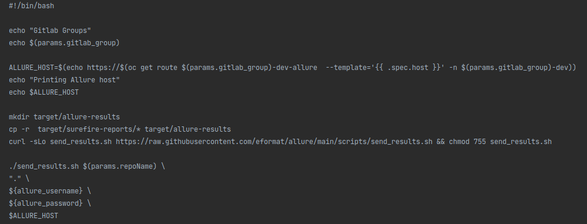

# Automated Testing

> Testing testing .... is this thing on?

Continuous Delivery needs rapid and reliable feedback. Investing in continuous testing is a worthwhile activity.

## Task

#### SAAP Unit testing:

We will be using mvn clean test to run the unit tests in nordmart application

1. To view the already defined unit-test cluster task, open up the `Pipelines` section from the left menu and click `Tasks`

2. Select `ClusterTasks`. A number of tasks will be displayed on your screen. Type in stakater-unit-test in the search box. You will see a task ` sstakater-unit-test-v1`
   
  

3. Click YAML to display the task definition.

 

The unit test task run mvn clean test if it is a mvn project

#### SAAP Save Allure Results:

We will be using mvn clean test to run the unit tests in nordmart application

1. To view the already defined unit-test cluster task, open up the `Pipelines` section from the left menu and click `Tasks`. Now type `allure` in search box and select  `stakater-gitlab-save-allure-report-v1`

2. CLick YAML to display the task definition.

   

In the allure task, we run a script that gets the test result files returned by mvn test and sends those over to allure.
  

#### Integrate the pipeline with Tekton:

Now let's head over to the next section to integrate automated testing to our pipelines.

- Add mvn test and Alure test reporting to the pipeline 
- [tekton](3-revenge-of-the-automated-testing/2b-tekton.md)
