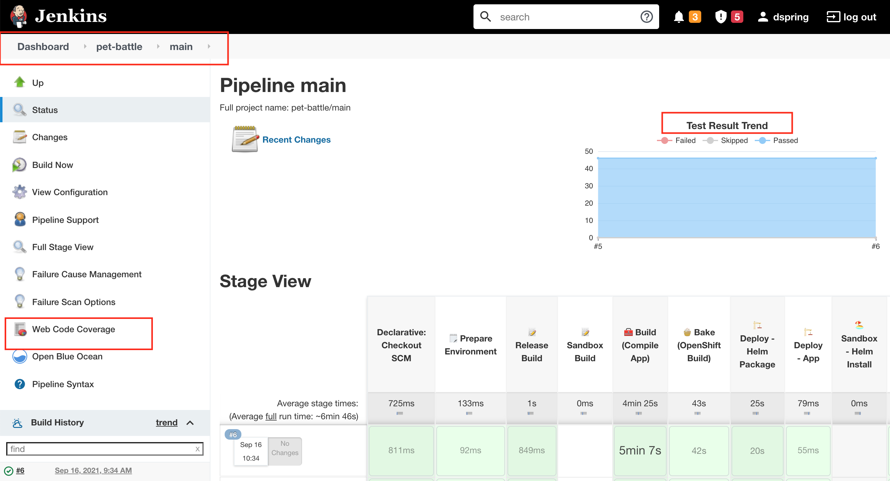
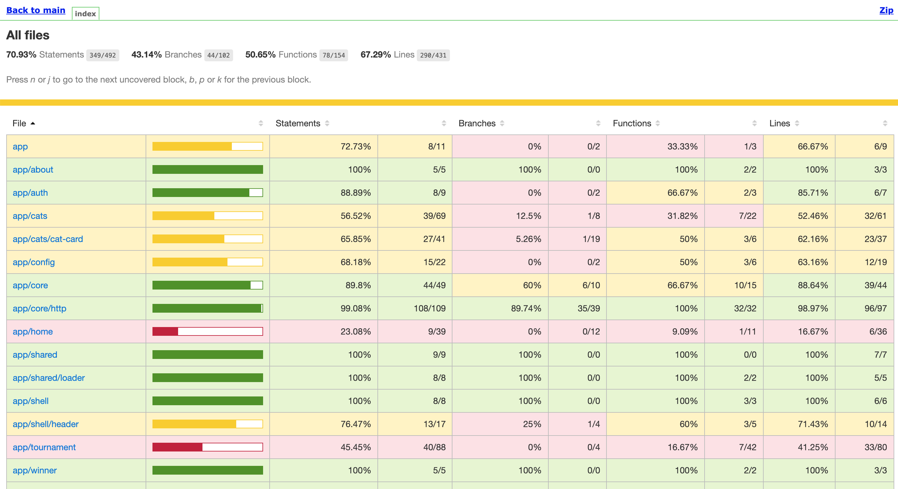

## Extend Jenkins Pipeline with Automated Testing

> Jest is a super fast light weight JavaScript testing framework built by the friendly people at Facebook. We will use it to assess our Angular components.

1. For the Frontend - we'll use Jest to run our unit tests. The tests are written in the format of `Describe("something")` and a series of `it('')` statements that define what the thing should do / not do. Writing tests this way makes them easily understood.

    <div class="highlight" style="background: #f7f7f7">
    <pre>
    <code class="language-javascript">
    describe('MyAwesomeComponent', () => {
    let component: MyAwesomeComponent;
    beforeEach(async () => {
        // Do test setup stuff here
    });
    it('should not be visible by default', () => {
        // Some assertions ....
        expect(div.getAttribute('hidden')).not.toBeNull();
    });
    it('should be visible when a button is clicked', () => {
        // Write some assertions
    });
    it('should display a message by default', () => {
        // Arrange
        const span = element.querySelectorAll('span')[0];
        // Assert
        expect(span.textContent).toBe('Some cool thing');
    });
    });
    </code>
    </pre>
    </div>

2. Our tests can be executed in our IDE (in `/projects/pet-battle`) by first installing our dependencies (`npm i`) running `npm run test` but let's jump ahead and get them going in our pipeline as it doesn't matter if they work on your machine! To do this, we're going to extend the `Build{}` stage in `Jenkinsfile`. Extend the pipeline where <span style="color:green;" >// 🃏 Jest Testing</span> placeholder is. This should happen before we run the build.

    ```groovy
                    // 🃏 Jest Testing
                    echo '### Running Jest Testing ###'
                    sh 'npm run test:ci'
    ```

3. If running the tests in `ci` mode, we've set them up to output an `xml` of the scores - this is great for Jenkins as he can˙ read the results and decide to fail the build or not! Let's add the `junit` report to the `Jenkinsfile` too. When the tests execute, they also collect code coverages statistics. This is another report we can feed Jenkins with!

    `post{}` steps in a Jenkinsfile allows us to do certain activities after parts of the build finsish. There are hooks provided by Jenkins such as `always{}`, `success{}` and `failure{}` which provide us an ability to do flow control based on the result of the build such as sending a notification or calling another job. In our case, we `alwasys{}` want to report the test results. Therefore, add these `post` steps to the pipeline by the <span style="color:green;" >// 📰 Post steps go here</span> placeholder.

    ```groovy
          // 📰 Post steps go here
                post {
                    always {
                        dir('pet-battle'){
                        junit 'junit.xml'
                        publishHTML target: [
                            allowMissing: true,
                            alwaysLinkToLastBuild: false,
                            keepAll: false,
                            reportDir: 'reports/lcov-report',
                            reportFiles: 'index.html',
                            reportName: 'Web Code Coverage'
                        ]
                        }
                    }
                }
    ```

    <p class="warn">
    ⛷️ <b>NOTE</b> ⛷️ - If you have completed `Sonar Scanning` step, you can include code coverage result into Sonarqube as well. Open up `/projects/pet-battle/sonar-project.js` file and uncomment below line by removing `//` at the beginning to have the coverage report stored in SonarQube:
    </p>

    ```bash
        'sonar.javascript.lcov.reportPaths': 'reports/lcov.info',
    ```

4. Push the changes to the git repository, which also will trigger a new build.

    ```bash
    cd /projects/pet-battle
    git add .
    git commit -m "🍊 ADD - save test results 🍊"
    git push
    ```

5. On Jenkins we should be able to see the test results (Run the build at least twice to see the graph. Because it needs more than one data point to plot on the graph for it to be visible)


6. The code coverage report should also be visisble too by Opening the `Web Code Coverage` HTML:

