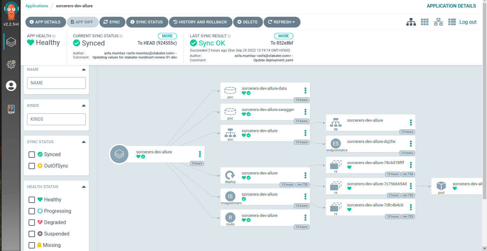
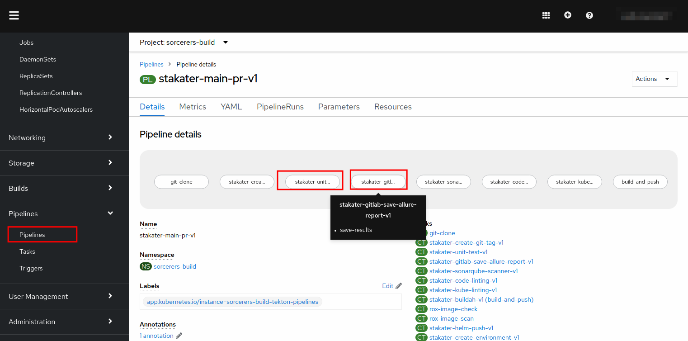
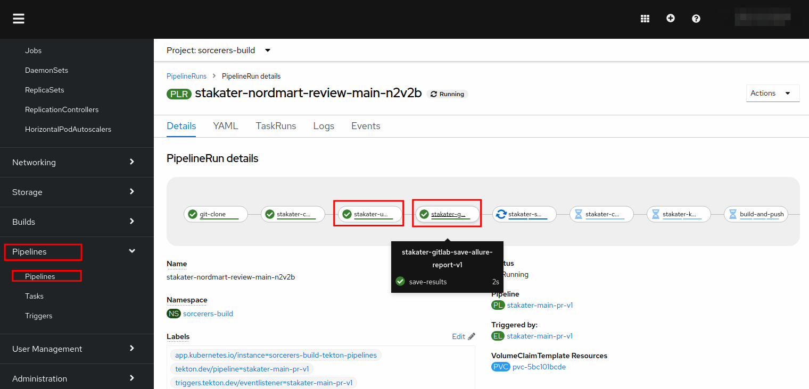
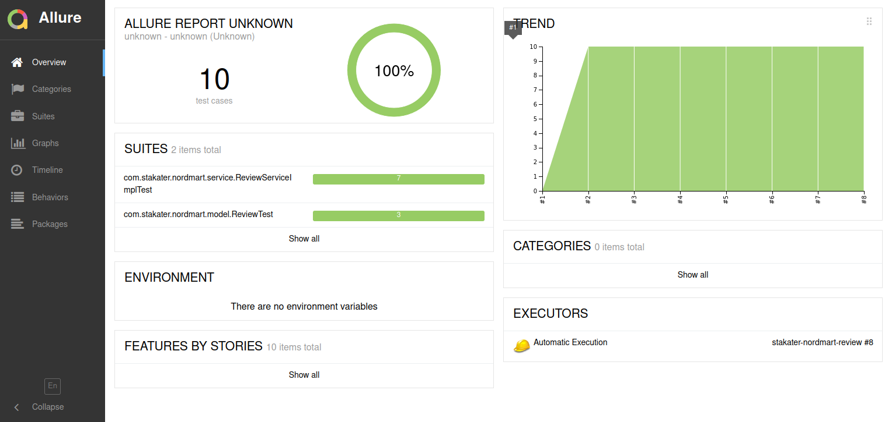

## Extend Tekton Pipeline with Automated Testing

> In this exercise we'll deploy Allure - a useful tool for managing your java tests and other reports from your CI/CD server. The exercise is in two parts: first we'll deploy Allure using GitOps and then add the tests to our pipeline

### Part 1 - Allure 

1. For this exercise, we will use a tool called `Allure`.

2. Open the `nordmart-apps-gitops-config` and navigate to `01-<TENANT_NAME>` > `00-argocd-apps` > `01-dev`

3. Create a file named `Allure` and add the following ArgoCD application and commit the changes. Remember to replace `TENANT_NAME` with your tenant.

```yaml
    apiVersion: argoproj.io/v1alpha1
    kind: Application
    metadata:
      name: <TENANT_NAME>-dev-allure
      namespace: openshift-gitops
      labels:
        stakater.com/tenant: <TENANT_NAME>
        stakater.com/env: dev
        stakater.com/kind: dev         
    spec:
      destination:
        namespace: <TENANT_NAME>-dev
        server: 'https://kubernetes.default.svc'
      project: <TENANT_NAME> 
      source:
        path: stakater/allure
        repoURL: 'https://github.com/stakater/charts.git'
        targetRevision: HEAD
      syncPolicy:
        automated:
          prune: true
          selfHeal: true
```

4. Now head over to ArgoCD and refresh `<TENANT_NAME>-dev` application. You should be able to see allure resources being deployed



You should see the Allure UI come up in a few moments after ArgoCD syncs it. You can browse the default project on Allure to verify it's up and running

```bash
oc project ${TENANT_NAME}-dev
echo https://$(oc get route <TENANT_NAME>-dev-allure --template='{{ .spec.host }}' -n ${TENANT_NAME}-dev)/allure-docker-service/projects/default/reports/latest/index.html
```

### Part 2 - Testing Tasks

> In this part, we will add a unit test to our pipeline and then send the results to allure.

1.  Open the chart directory found in GitLab at `<TENANT_NAME>/nordmart-apps-gitops-config/01-<TENANT_NAME>/01-tekton-pipelines/00-build/`

` folder.

2. Open the values file in the editor. After the `stakater-sonarqube-scanner-v1`, reference the unit test task and add a `runAfter` field to make it run after the `stakater-sonarqube-scanner-v1` task:

```yaml
- defaultTaskName: stakater-unit-test-v1
  runAfter:
    - stakater-sonarqube-scanner-v1
```

Also add the `stakater-gitlab-save-allure-report-v1` after the unit test task

```yaml
- defaultTaskName: stakater-gitlab-save-allure-report-v1
```

2. The pipeline will become:

   ```yaml
   pipeline-charts:
     name: stakater-main-pr-v1
     workspaces:
     - name: source
       volumeClaimTemplate:
         accessModes: ReadWriteOnce
         resourcesRequestsStorage: 1Gi
     pipelines:
       tasks:
         - defaultTaskName: git-clone
         - defaultTaskName: stakater-create-git-tag-v1
         - defaultTaskName: stakater-sonarqube-scanner-v1
           runAfter:
             - stakater-create-git-tag-v1
         - defaultTaskName: stakater-unit-test-v1
           runAfter: 
             - stakater-sonarqube-scanner-v1
         - defaultTaskName: stakater-gitlab-save-allure-report-v1
         - defaultTaskName: stakater-buildah-v1
           name: build-and-push
           params:
             - name: BUILD_IMAGE
               value: "true"
         - defaultTaskName: stakater-helm-push-v1
         - defaultTaskName: stakater-create-environment-v1
         - defaultTaskName: stakater-gitlab-update-cd-repo-v1
           params: 
             - name: gitlab_group
         - defaultTaskName: stakater-push-main-tag-v1
     triggertemplate:
           serviceAccountName: stakater-workshop-tekton-builder
           pipelineRunNamePrefix: $(tt.params.repoName)-$(tt.params.prnumberBranch)
           params:
             - name: repoName
             - name: prnumberBranch
               default: "main"
     eventlistener:
           serviceAccountName: stakater-workshop-tekton-builder
           triggers:
           - name: gitlab-mergerequest-create
             bindings:
               - ref: stakater-gitlab-merge-request-v1
               - name: oldcommit
                 value: "NA"
               - name: newcommit
                 value: $(body.object_attributes.last_commit.id)
           - name: gitlab-mergerequest-synchronize
             bindings:
               - ref: stakater-gitlab-merge-request-v1
               - name: oldcommit
                 value: $(body.object_attributes.oldrev)
               - name: newcommit
                 value: $(body.object_attributes.last_commit.id)
           - name: gitlab-push
             bindings:
               - name: newcommit
                 value: $(body.after)
               - name: oldcommit
                 value: $(body.before)
               - ref: stakater-gitlab-push-v1
     rbac:
       enabled: false
     serviceAccount:
       name: stakater-workshop-tekton-builder
       create: false
        
   ```

4. Commit the changes.


5. Now open ArgoCD and check if the changes were synchronized. Click refresh if ArgoCD has not synced the changes yet.


Open up the console and navigate to your pipeline definition by going to `Pipelines` and selecting your pipeline from the list. You should see a unit test and allure task there as well.



6. If the sync is green, you're good to go. You have successfully added automated to your pipeline!

7. Now make a small change on the `stakater-nordmart-review` application to trigger the pipeline. Head over to the console and check the running pipeline. You should be able to see unit test and allure task running.



8. Once the task completes, head over to `allure` by opening the link found in the OpenShift console via `Networking` > `Routes` in the `TENANT_NAME-dev` namespace.



CONGRATULATION!!! You have added automated testing to your pipeline.
