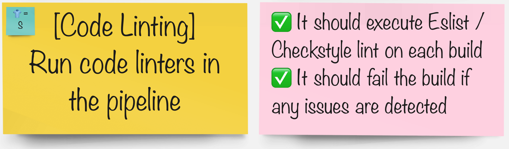

# Code Linting
> Linting is important to reduce errors and improve the overall quality of your code. Using lint tools can help you accelerate development and reduce costs by finding errors earlier.

## Task

#### In your groups pick the tool you'd like to integrate the pipeline with:

| 🐈‍⬛ **Jenkins Group** 🐈‍⬛  |  🐅 **Tekton Group** 🐅 |
|-----------------------|----------------------------|
| * Use ESlint to analyse the codebase | * Use maven check-style to analyse the code |
| [jenkins](3-revenge-of-the-automated-testing/4a-jenkins.md) | [tekton](3-revenge-of-the-automated-testing/4b-tekton.md) |
