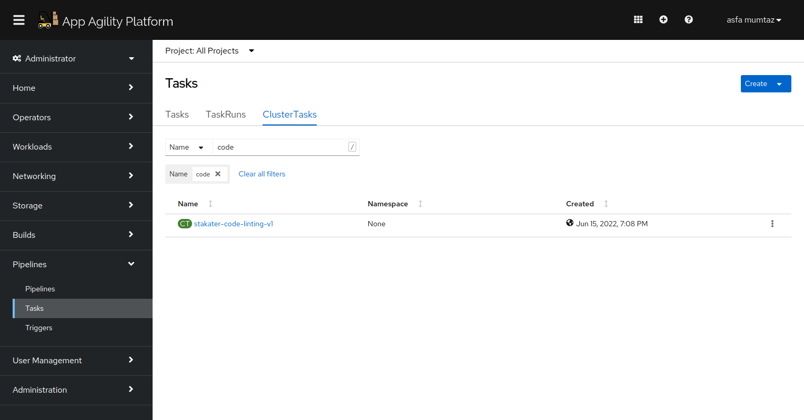
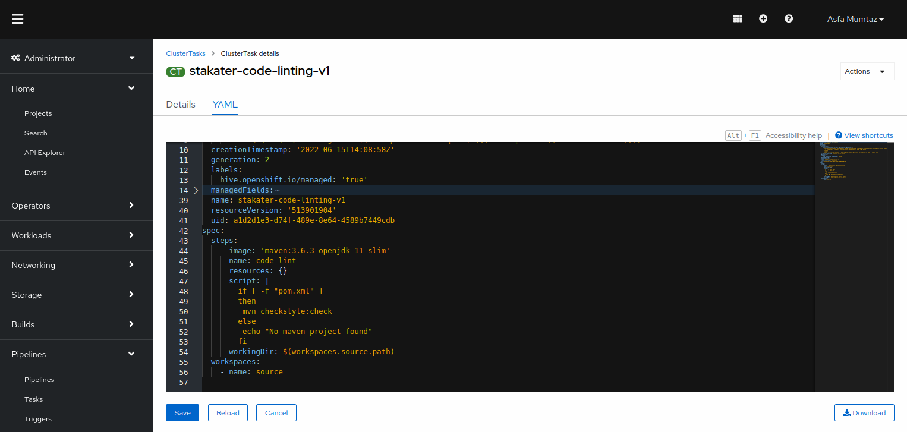

# Code Linting
> Linting is important to reduce errors and improve the overall quality of your code. Using lint tools can help you accelerate development and reduce costs by finding errors earlier.

## Task

#### SAAP Code Linting:

We will be using maven Checkstyle plugin to check the code in nordamrt-review and `nordmart-review-ui` repositories.
SAAP cluster is shipped with a code-linting task that uses maven checkstyle to check the quality of code. We will be using this task to integrate code-lint in our pipeline.

Follow the below-mentioned procedure to add code linting to the already deployed main-pr-v1 pipeline.

1. To view the already defined sonarqube cluster task, open up the `Pipelines` section from the left menu and click `Tasks`
    
  

2. Select `ClusterTasks`. A number of tasks will be displayed on your screen. Type in code-lint in the search box. You will see a task ` stakater-code-linting-v1`
   
  

3. CLick YAML to display the task definition.

   

The SAAP code linting task has one simple code-lint task that uses `mvn checkstyle:check` command to perform code linting.

