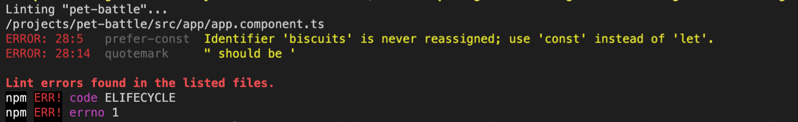

## Extend Jenkins Pipeline with Code Linting Step

1. JavaScript has many wonderful _quirks_ and because it's not compiled being able to ensure code is written to a specific style is very important. Enter linting the code! In a large software project ensuring consistency across all engineers can be really helpful for support. We can also enforce the rules in the build! Let's play with them locally first, in your IDE install the app dependencies and run the linter:

    ```bash
    cd /projects/pet-battle
    npm i
    npm run lint
    ```

2. Linting should show no errors (huzzah!) but let's introduce something that will break our coding standards and see what happens:

    ```bash
    echo 'let biscuits="something"'  >> src/app/app.component.ts 
    npm run lint
    ```

    

3. As we can see, our rules are setup to not allow `let` be used if a variable is not reassigned and to use single quotes instead of double quotes because of browser compatability issues. Let's fix this up with a handy one-liner 💪🔥

    ```bash
    npm run lint:fix
    ```

4. Now let's add the linter to the pipeline so on every build it checks our style, extend the `stage{ "Build" }` of the `Jenkinsfile` with the lint task...

    ```groovy
                    //💅 Lint exercise here
                    echo '### Running Linting ###'
                    sh 'npm run lint'
    ```

5. Push our changes to the repo to trigger a new build


    ```
    cd /projects/pet-battle
    git add .
    git commit -m "💅 ADD - linting to the pipeline 💅"
    git push
    ```

6. On Jenkins you should see a new build has been triggered and the linter running as part of it.
