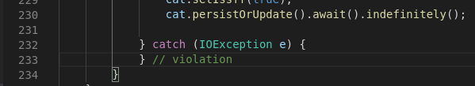

## Extend Tekton Pipeline with Code Linting Task

1. Code formatting as part of the maven build lifecycle
    - https://code.revelc.net/formatter-maven-plugin/usage.html

    ```bash
    mvn formatter:format
    ```

2. Edit a java class file add some TAB/spaces

    

    Then rerun the `formatting:format` maven command:

    

    Your changes should be removed !

3. Linting and Formatting using Checkstyle (`checkstyle.xml`)

    - install an IDE extensions for realtime feedback

    

    For VSCode IDE .. there is a great help page here:

    - https://code.visualstudio.com/docs/java/java-linting

4. There is a Sonar Lint Extension for realtime checking in your IDE

    - https://marketplace.visualstudio.com/items?itemName=SonarSource.sonarlint-vscode

5. Lets have a look at how we use these tools from the command line.

    - Sonar build and pipeline feedback
    - mvn command line

    By default we have an overall checkstyle severity of `warning` in our Pet Battle API `checkstyle.xml` config file. This means we don't stop the build when codestyle is not met. So we will only see this on the command line:

    ```bash
    mvn checkstyle:check
    ```

6. Let's set an individual severity of **error** in our configuration for the **EmptyCatchBlock** check
    - https://checkstyle.sourceforge.io/config_blocks.html#EmptyCatchBlock

    ```xml
            <module name="EmptyCatchBlock">
                <property name="severity" value="error"/>
                <property name="exceptionVariableName" value="expected"/>
            </module>
    ```

    We can turn on checkstyle debugging by adding `consoleOutput` true to our pom.xml

    ```xml
                    <configuration>
                        <configLocation>checkstyle.xml</configLocation>
                        <consoleOutput>true</consoleOutput>
                    </configuration>
    ```

7. Edit the `CatResource.java` class file and remove the comment in the catch block making it empty.

    

    Now when we run the check we should get a hard error telling us we have an empty code block.

    ```bash
    mvn checkstyle:check
    ```

    

8. These types of checks (as well as tests) are included in the Maven lifecycle phase called **verify**

    ```bash
    mvn verify
    ```

9. In our CICD pipeline, these checks are run as part of the `mvn test` lifecycle phase.

    A Maven phase represents a stage in the Maven build lifecycle. Each phase is responsible for a specific task.

    Here are some of the most important phases in the default build lifecycle:

    - clean: remove all files generated by the previous build
    - validate: check if all information necessary for the build is available
    - compile: compile the source code
    - verify: run any checks to verify the package is valid and meets quality criteria
    - test: run unit tests

    We use these phases in out build pipeline. The full lifecycle reference is here
    - https://maven.apache.org/guides/introduction/introduction-to-the-lifecycle.html#Lifecycle_Reference

    We use the checkstyle plugin in Sonarqube which is found under **Rues** - **Java** language, **Repository**

    

    Sonarqube reports warnings under **Code Smells*.

    
