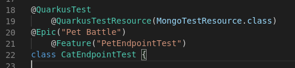
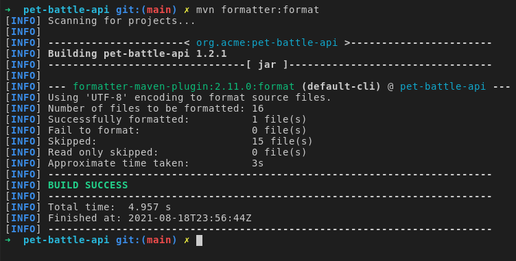
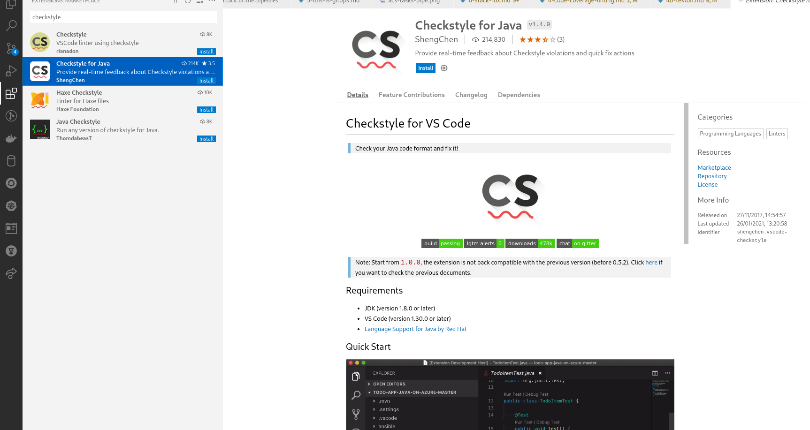
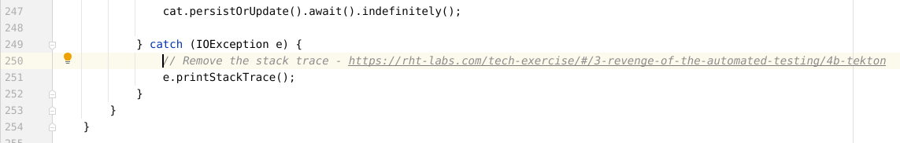
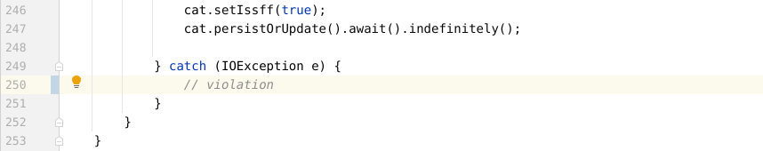
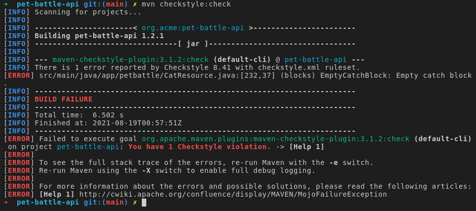
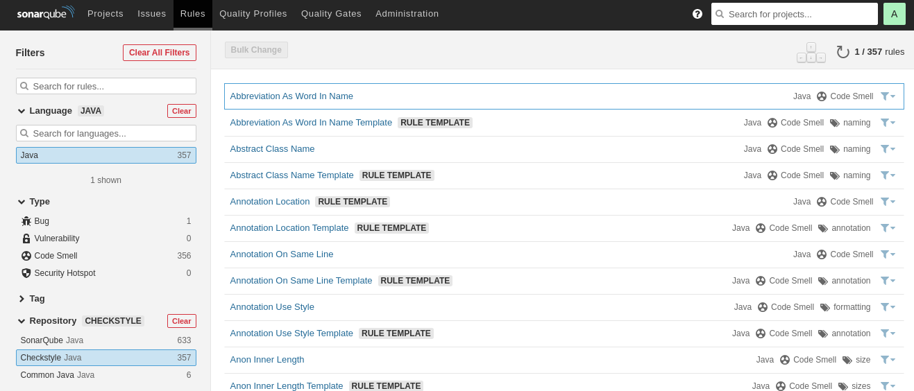
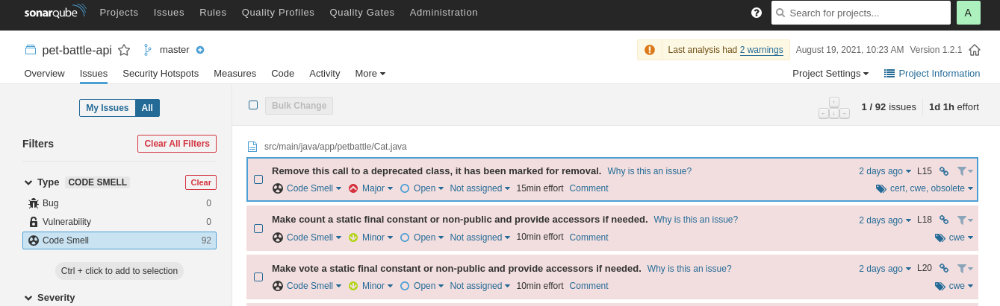

## Extend Tekton Pipeline with Code Linting Task

1. Lets try some code formatting as part of the maven build lifecycle using the <span style="color:blue;">[maven formatter plugin](https://code.revelc.net/formatter-maven-plugin/usage.html).</span> Run this command in your shell to format your code.

    ```bash
    cd /projects/pet-battle-api
    mvn formatter:format
    ```

    <p class="warn">
    ⛷️ <b>NOTE</b> ⛷️ - If you are using DevSpaces in OpenShift 4.11+ you may need to add the `pet-battle-api` folder to you Che Workspace to open a file in the next step.
    </p>

    

2. Now edit a java class file, such as `/projects/pet-battle-api/src/test/java/app/battle/CatEndpointTest.java` and add some TAB/spaces e.g. in L19,21

    

    Then rerun the `formatting:format` maven command which will remove these spaces.

    

3. Linting and Formatting using Checkstyle (`checkstyle.xml`). Unfortunately we haven't installed these in our Cloud IDE yet so you may not be able to try these directly, but we will get to use the command line equivalents in the next step. For those using VCode you can checkout these links:

    - There are some plugins to help us here. For example, if you are a user of VSCode, you can install <span style="color:blue;">[an IDE extension](https://code.visualstudio.com/docs/java/java-linting)</span> for realtime feedback.
    

    - There is also a <span style="color:blue;">[Sonar Lint Extension](https://marketplace.visualstudio.com/items?itemName=SonarSource.sonarlint-vscode)</span> for realtime checking in your IDE.

4. Let's have a look at how we use these tools from the command line.

    By default we have an overall checkstyle severity of `warning` in our Pet Battle API `checkstyle.xml` config file. This means we don't stop the build when codestyle is not met. Let's see this in action on the command line:

    ```bash
    mvn checkstyle:check
    ```

5. Open up `/project/pet-battle-api/checkstyle.xml` file and search for `EmptyCatchBlock`. Then set the severity value as **error**. You can read about <span style="color:blue;">[EmptyCatchBlock here.](https://checkstyle.sourceforge.io/config_blocks.html#EmptyCatchBlock)</span>

    ```xml
            <module name="EmptyCatchBlock">
                <property name="severity" value="error"/>
                <property name="exceptionVariableName" value="expected"/>
            </module>
    ```

    We can turn on checkstyle debugging by adding `consoleOutput` true to our pom.xml

    ```xml
                    <configuration>
                        <configLocation>checkstyle.xml</configLocation>
                        <consoleOutput>true</consoleOutput>
                    </configuration>
    ```

6. Edit the `CatResource.java` class file and remove the stack trace in the catch block that is part of the `loadlitter()`method, making it empty.

    From this:

    

    To this:

    

    Now when we run the check we should get a hard error telling us we have an empty code block.

    ```bash
    mvn checkstyle:check
    ```

    

7. These types of checks (as well as tests) are included in the Maven lifecycle phase called **verify**

    ```bash
    mvn verify
    ```

8. We can stash these checkstyle changes and revert our code for now.

    ```bash
    cd /projects/pet-battle-api
    git stash
    ```

9. In our CICD pipeline, these checks are run as part of the `mvn test` lifecycle phase.

    A Maven phase represents a stage in the Maven build lifecycle. Each phase is responsible for a specific task.

    Here are some of the most important phases in the default build lifecycle:

    - clean: remove all files generated by the previous build
    - validate: check if all information necessary for the build is available
    - compile: compile the source code
    - verify: run any checks to verify the package is valid and meets quality criteria
    - test: run unit tests

    We use these phases in out build pipeline. The full lifecycle reference is <span style="color:blue;">[here.](https://maven.apache.org/guides/introduction/introduction-to-the-lifecycle.html#Lifecycle_Reference)</span>

    **If you have done the Sonarqube item, you'll see additional information in there....** We use the checkstyle plugin in Sonarqube which is found under **Rules** - **Java** language, **Repository**

    <p class="warn"><b>TIP</b> You can find the available projects and reports in Sonarqube by navigating to <span style="color:blue;"><a href="https://sonarqube-<TEAM_NAME>-ci-cd.<CLUSTER_DOMAIN>/">https://sonarqube-<TEAM_NAME>-ci-cd.<CLUSTER_DOMAIN>/</a></span></p>

    

    Sonarqube reports warnings under **Code Smells*.

    
