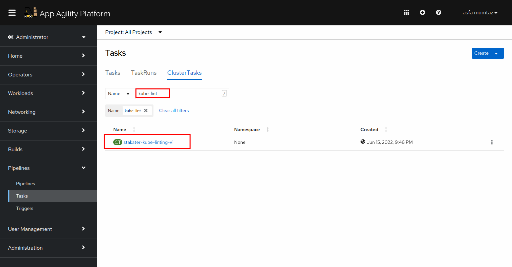
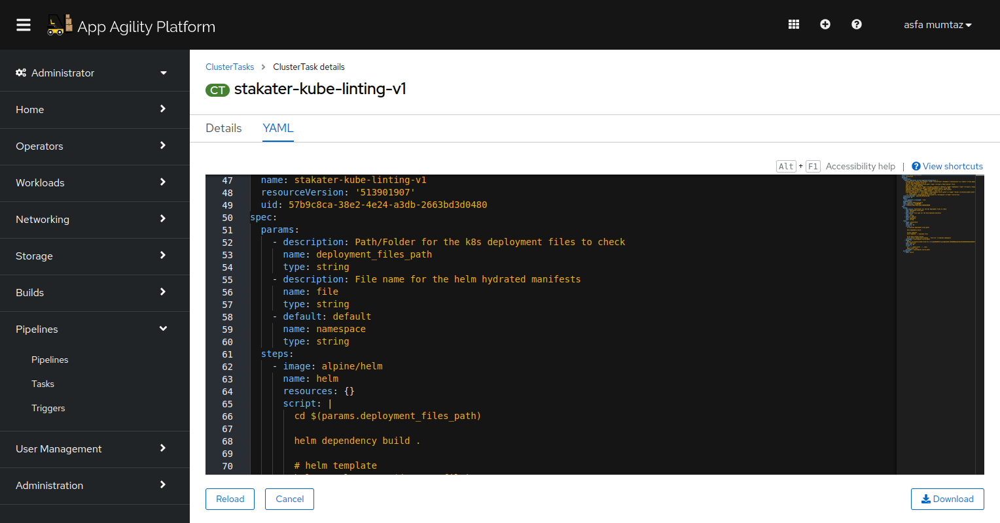
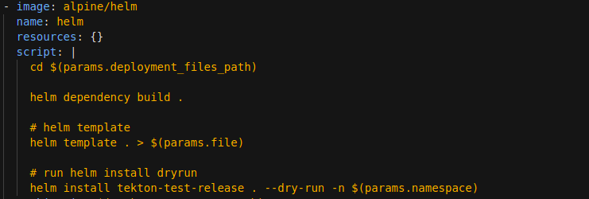
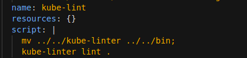

# Kube Linting

> KubeLinter is an open source tool that analyzes Kubernetes YAML files and Helm charts, checking them against a variety of best practices, with a focus on production readiness and security.

## Task

#### SAAP Kube Linting:

SAAP cluster is shipped with a kube-linting task that uses kube linter and Helm to verify the YAML files. We will be using this task to integrate kube linting in our pipeline.

Follow the below-mentioned procedure to add kube linting to the already deployed main-pr-v1 pipeline.

1. To view the already defined sonarqube cluster task, open up the `Pipelines` section from the left menu and click `Tasks`

2. Select `ClusterTasks`. A number of tasks will be displayed on your screen. Type in kube-lint in the search box. You will see a task ` stakater-kube-linting-v1`

3. CLick YAML to display the task definition.

   

The kube linting tasks has two steps:
* `helm` - this step uses Helm template and Helm dry run to check the Helm chart files.

* kube-lint - this step uses kube-linter to analyse the kubernetes yaml files.

