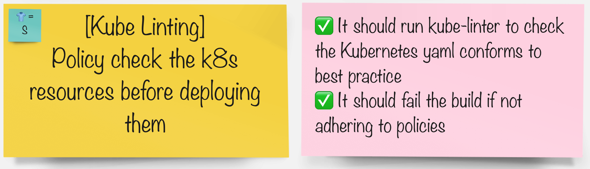

# Kube Linting

> KubeLinter is an open source tool that analyzes Kubernetes YAML files and Helm charts, checking them against a variety of best practices, with a focus on production readiness and security.

## Task



## Get Familiar with kube-linter

1. KubeLinter has a load of built in best practices to check for when performing a lint. We can list them.

    ```bash
    kube-linter checks list | grep Name:
    ```

    <div class="highlight" style="background: #f7f7f7">
    <pre><code class="language-yaml">
    Name: cluster-admin-role-binding
    Name: dangling-service
    Name: default-service-account
    Name: deprecated-service-account-field
    Name: docker-sock
    Name: drop-net-raw-capability
    Name: env-var-secret
    Name: exposed-services
    Name: host-ipc
    Name: host-network
    Name: host-pid
    Name: mismatching-selector
    Name: no-anti-affinity
    Name: no-extensions-v1beta
    Name: no-liveness-probe
    Name: no-read-only-root-fs
    Name: no-readiness-probe
    Name: non-existent-service-account
    Name: privilege-escalation-container
    Name: privileged-container
    Name: privileged-ports
    Name: required-annotation-email
    Name: required-label-owner
    Name: run-as-non-root
    Name: sensitive-host-mounts
    Name: ssh-port
    Name: unsafe-proc-mount
    Name: unsafe-sysctls
    Name: unset-cpu-requirements
    Name: unset-memory-requirements
    Name: writable-host-mount
    </code></pre></div>

2. Let's try **kube-linter** out locally on one of the **chart** folder. (As you can see we've got a list of things we need to fix 👀)

    ```bash
    cd /projects/pet-battle-api
    kube-linter lint chart/
    ```

    Let's advance how to include kube-linter into our pipelines.

#### In your groups pick the tool you'd like to integrate the pipeline with:

| 🐈‍⬛ **Jenkins Group** 🐈‍⬛  |  🐅 **Tekton Group** 🐅 |
|-----------------------|----------------------------|
| * Add new jenkins agent to our list | * Add a task from Tekton Hub to our pipeline |
| * Run kube-lint in the pipeline | * Run kube-lint when code is built in the pipeline |
| <span style="color:blue;">[jenkins](3-revenge-of-the-automated-testing/5a-jenkins.md)</span> | <span style="color:blue;">[tekton](3-revenge-of-the-automated-testing/5b-tekton.md)</span> |
