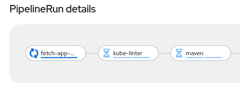
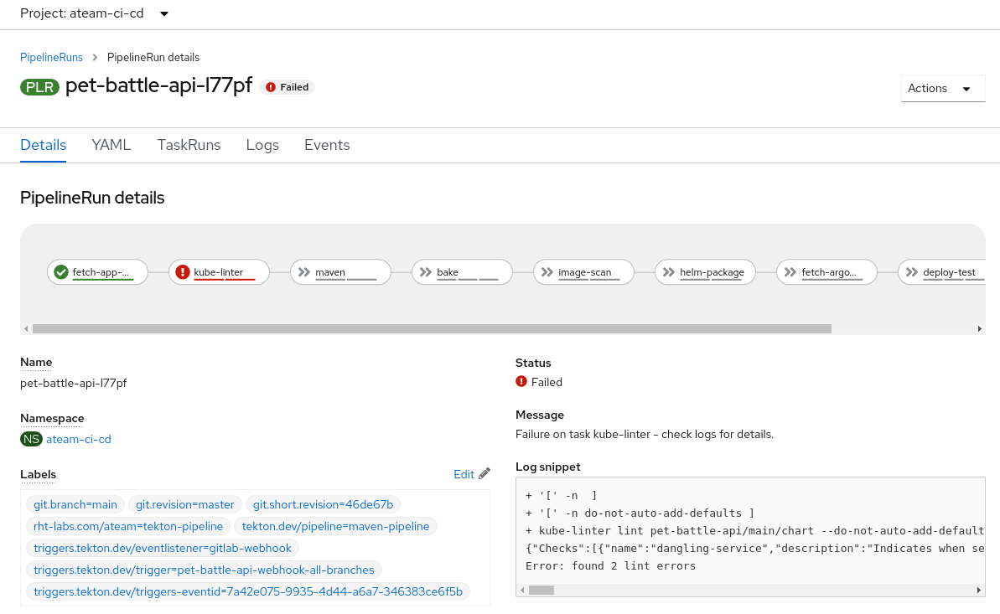
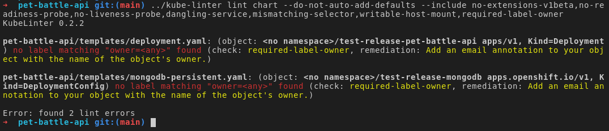

# Extend Tekton Pipeline with Kube Linting Task

Let's enable the **kube-linter** task in our pipeline.

1. Kube lint has a tekton task on Tekton Hub so let's grab it and add the `Task` to our cluster. Feel free to explore what the `Task` will be doing 

    ```bash
    curl -sLo /projects/tech-exercise/tekton/templates/tasks/kube-linter.yaml \
    https://raw.githubusercontent.com/tektoncd/catalog/main/task/kube-linter/0.1/kube-linter.yaml
    ```

    ```bash
    # commit this so ArgoCD will sync it 
    cd /projects/tech-exercise
    git add .
    git commit -m  "☎️ ADD - kube-linter task ☎️"
    git push
    ```

2. We could run the **kube-linter** task with all default checks in our pipeline but this would fail the build. So let's do the _naughty thing_ and run with a restricted set of checks. Add the following step in our `maven-pipeline.yaml` (stored in `/projects/tech-exercise/tekton/templates/pipelines/maven-pipeline.yaml`). 

    ```yaml
        # Kube-linter
        - name: kube-linter
          runAfter:
          - fetch-app-repository
          taskRef:
            name: kube-linter
          workspaces:
            - name: source
              workspace: shared-workspace
          params:
            - name: manifest
              value: "$(params.APPLICATION_NAME)/$(params.GIT_BRANCH)/chart"
            - name: default_option
              value: do-not-auto-add-defaults
            - name: includelist
              value: "no-extensions-v1beta,no-readiness-probe,no-liveness-probe,dangling-service,mismatching-selector,writable-host-mount"
    ```

    Be sure to update the `maven` task in the pipeline as well so its `runAfter` is the `kube-linter` task 💪💪💪

    <p class="warn">
    ⛷️ <b>NOTE</b> ⛷️ - If you've completed Sonarqube step, you need to set <strong>runAfter</strong> as <strong>analysis-check</strong>
    </p>

    You should have a pipeline definition like this:
    <div class="highlight" style="background: #f7f7f7">
    <pre><code class="language-yaml">
        - name: kube-linter
        runAfter:
        - fetch-app-repository
    ...
        - name: maven
          taskRef:
            name: maven
          runAfter: <== make sure you update this 💪💪
            - kube-linter # check the NOTE above❗❗ this could be `analysis-check` as well.
          params:
            - name: WORK_DIRECTORY
            value: "$(params.APPLICATION_NAME)/$(params.GIT_BRANCH)"
    ...
    </code></pre></div>

3. Check our changes into git.

    ```bash
    cd /projects/tech-exercise
    # git add, commit, push your changes..
    git add .
    git commit -m  "🐡 ADD - kube-linter checks 🐡"
    git push
    ```

4. Trigger a pipeline build.

    ```bash
    cd /projects/pet-battle-api
    git commit --allow-empty -m "🐡 test kube-linter step 🐡"
    git push
    ```

    🪄 Watch the pipeline run with the **kube-linter** task.

    

## Breaking the Build

Let's run through a scenario where we break/fix the build with **kube-linter**.

1. Edit `maven-pipeline.yaml` again and add **required-label-owner** to the **includelist** list on the **kube-linter** task:

    ```yaml
            - name: includelist
              value: "no-extensions-v1beta,no-readiness-probe,no-liveness-probe,dangling-service,mismatching-selector,writable-host-mount,required-label-owner"
    ```

2. Check in these changes and trigger a pipeline run.

    ```bash
    cd /projects/tech-exercise
    # git add, commit, push your changes..
    git add .
    git commit -m  "🐡 ADD - kube-linter required-label-owner check 🐡"
    git push
    ```

    <p class="warn">If you get an error like <b>error: failed to push some refs to..</b>, please run <b><i>git pull</i></b>, then push your changes again by running above commands.</p>

    Make an empty commit to trigger the pipeline.

    ```bash
    cd /projects/pet-battle-api
    git commit --allow-empty -m "🩴 test required-label-owner check 🩴"
    git push
    ```

3. Wait for the pipeline to sync and trigger a **pet-battle-api** build. This should now fail.

    

4. We can take a look at the error and replicate it on the command line:

    ```bash
    cd /projects/pet-battle-api
    kube-linter lint chart --do-not-auto-add-defaults --include no-extensions-v1beta,no-readiness-probe,no-liveness-probe,dangling-service,mismatching-selector,writable-host-mount,required-label-owner
    ```

    

5. The linter is complaining we're missing a label on our resources - let's fix our deployment by adding an **owner** label using helm. Edit `pet-battle-api/chart/values.yaml` file and add a value for **owner**:

    ```yaml
    # Owner value
    owner: <TEAM_NAME>
    ```

6. In helm land, the `_helpers.tpl` file allows us to define variables and chunks of yaml that can be reused across all resources in a chart easily. Let's update our label definitions in there to fix the kube-lint issue. Edit `pet-battle-api/chart/templates/_helpers.tpl` and add the `owner` label like this in two places - where we **define "pet-battle-api.labels"** and where we **define "mongodb.labels"** append it below `app.kubernetes.io/managed-by: {{ .Release.Service }}`

    ```yaml
    owner: {{ .Values.owner }}
    ```

    So it looks like this:
    <div class="highlight" style="background: #f7f7f7">
    <pre><code class="language-yaml">
    ...
        {{- end }}
        app.kubernetes.io/managed-by: {{ .Release.Service }}
        owner: {{ .Values.owner }}
        {{- end }}
    ...
    </code></pre></div>

7. We can now trigger the Pipeline with the new version. Edit pet-battle-api `pom.xml` found in the root of the `pet-battle-api` project and update the `version` number. The pipeline will update the `chart/Chart.yaml` with these versions for us. Increment and change the version number to suit.

    ```xml
        <artifactId>pet-battle-api</artifactId>
        <version>1.3.1</version>
    ```

    You can also run this bit of code to do the replacement if you are feeling uber lazy!

    ```bash#test
    cd /projects/pet-battle-api
    mvn -ntp versions:set -DnewVersion=1.3.1
    ```

8. We can check the **kube-linter** command again and check these changes in:

    ```bash
    cd /projects/pet-battle-api
    git add .
    git commit -m  "🐊 ADD - kube-linter owner labels 🐊"
    git push
    ```

    🪄 Observe the **pet-battle-api** pipeline running successfully again.
