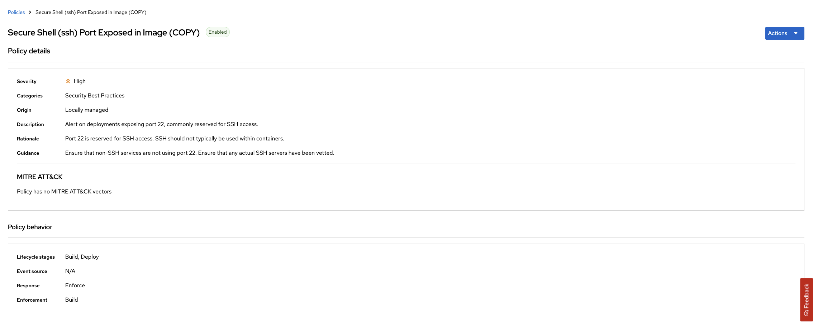

### Stack Rox
> what is it why important


#### Group Exercise

StackRox / Advanced Cluster Security (ACS) is deployed once at the cluster scope. It can be used to monitor multiple clusters. As **cluster-admin** perform the setup of Stackrox as a class together. These step(s) may have been done for you, ask your instructor.

1. Create a project called **stackrox** in your cluster

2. Install the **Advanced Cluster Security** Operator at cluster scope


**FIXME** - gitopsify this

```yaml
apiVersion: operators.coreos.com/v1alpha1
kind: Subscription
metadata:
  name: rhacs-operator
  namespace: openshift-operators
spec:
  channel: latest
  installPlanApproval: Automatic
  name: rhacs-operator
  source: redhat-operators
  sourceNamespace: openshift-marketplace
  startingCSV: rhacs-operator.v3.63.0
```

3. Create a **Central** configuration.

**FIXME** - gitopsify this

```yaml
apiVersion: platform.stackrox.io/v1alpha1
kind: Central
metadata:
  namespace: openshift-operators
  name: stackrox-central-services
spec:
  central:
    exposure:
      loadBalancer:
        enabled: false
        port: 443
      nodePort:
        enabled: false
      route:
        enabled: true
    persistence:
      persistentVolumeClaim:
        claimName: stackrox-db
  egress:
    connectivityPolicy: Online
  scanner:
    analyzer:
      scaling:
        autoScaling: Enabled
        maxReplicas: 5
        minReplicas: 2
        replicas: 3
    scannerComponent: Enabled
```

4. Once deployed you can connect to the ACS WebUI Route using the **admin** credentials - *https://central-stackrox.<CLUSTER_DOMAIN>*

```bash
oc -n stackrox get secret central-htpasswd -o go-template='{{index .data "password" | base64decode}}'
```

5. Create an **API Token** Integration to use in our automations from the *ACS WebUI -> Integration page*


6. Save the token, we will need of later on. Export these environment variables:

```bash
export ROX_API_TOKEN=eyJhbGciOiJSUzI1NiIsIm...
export ROX_ENDPOINT=central-stackrox.<CLUSTER_DOMAIN>
```

6. Download the **roxctl** client for your local machine. You can aslo download directly from ACS WebUI

```bash
curl -O https://mirror.openshift.com/pub/rhacs/assets/3.63.0/bin/Linux/roxctl && chmod 755 ./roxctl
```

7. Test that **roxctl** works by running

```bash
./roxctl central whoami --insecure-skip-tls-verify -e $ROX_ENDPOINT:443
```

8. Generate the init bundle to connect the current cluster (or any other cluster!) to ACS. This can be done from the ACS WebUI or by downloading the Kubernetes secrets file and applying

```bash
oc -n stackrox create -f sandbox1350-cluster-init-secrets.yaml
```


9. Create a **Secured Cluster** object in the ACS Operator. You can use the internal ServiceName for the same cluster:

```yaml
  centralEndpoint: 'central.stackrox:443'
  clusterName: sandbox1350
```


10. You should now be able to see your cluster and all the data in ACS for you cluster. Take a look around.


!> **FIXME** to make **roxctl** cli work on internal OpenShift images i needed to manually add a registry. There is automatically discovered registries there so it should be automatic using the ServiceAccount? *Platform Configurations -> Generic Docker Registry* add **image-registry.openshift-image-registry.svc:5000** -- password --> `$(oc sa get-token pipeline)`

11. As a group we are going to update a *Build* policy that we will use later in the exercise. Browse to the *Platform Configuration -> System Policies* view. Type in *Policy* and then *secure shell*, select the **Secure Shell (ssh) Port Exposed in Image** policy.


Select and *Edit* this policy. Click *Next* and add **22** to the regular expression for *Arguments* in the disallowed Dockerfile line.


Hit *Next* and *Next* and turn **ON** policy enforcement at *Build* time.


*Save* the policy. It should look like this now.



#### Task per group

Now we can use ACS to help move security **LEFT** in our build pipeline. In each group we will:

🐈‍⬛ `Jenkins Group` 🐈‍⬛

- [ ] Configure a StackRox kubelinter - to check resources prior to packaging with [helm](https://hub.tekton.dev/tekton/task/kube-linter)
- [ ] Configure a `Lifecycle Stage:Build` policy in [ACS](https://docs.openshift.com/acs/integration/integrate-with-ci-systems.html#integrate-ci-check-existing-build-phase-policies_integrate-with-ci-systems)
- [ ] Configure you pipeline to `check` build time policy violations
- [ ] Configure you pipeline to `scan` images for CVE/CVSS
- [ ] Configure you pipeline to test `deployment` configuration files
- [jenkins](3-revenge-of-the-automated-testing/6a-jenkins.md)

🐅 `Tekton Group` 🐅

- [ ] Configure a StackRox kubelinter - to check resources prior to packaging with [helm](https://hub.tekton.dev/tekton/task/kube-linter)
- [ ] Configure a `Lifecycle Stage:Build` policy in [ACS](https://docs.openshift.com/acs/integration/integrate-with-ci-systems.html#integrate-ci-check-existing-build-phase-policies_integrate-with-ci-systems)
- [ ] Configure you pipeline to `check` build time policy violations
- [ ] Configure you pipeline to `scan` images for CVE/CVSS
- [ ] Configure you pipeline to test `deployment` configuration files
- [tekton](3-revenge-of-the-automated-testing/6b-tekton.md)
