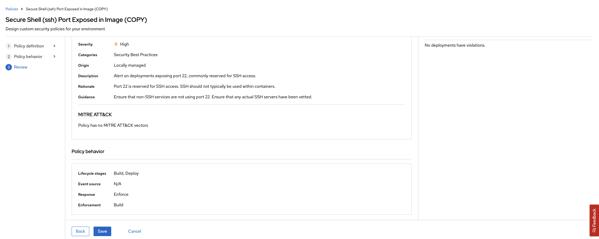

### Stack Rox
> what is it why important


#### Group Exercise

StackRox / Advanced Cluster Security (ACS) is deployed once at the cluster scope. It can be used to monitor multiple clusters. The ACS/StackRox operator should already be deployed in the cluster.

As **cluster-admin** perform the setup of Stackrox as a class together.

1. Connect to the ACS WebUI Route using the **admin** credentials:

```bash
# get web url
oc -n stackrox get route central --template='{{ .spec.host }}'
```

```bash
# get credentials
oc -n stackrox get secret central-htpasswd -o go-template='{{index .data "password" | base64decode}}'
```

2. Create an **API Token** from the ***PlatformConfiguration - Integration** ACS WebUI page.


3. **Save** this token somewhere safe, we will need of later on. Export these environment variables:

```bash
export ROX_API_TOKEN=eyJhbGciOiJSUzI1NiIsIm...
export ROX_ENDPOINT=central-stackrox.<CLUSTER_DOMAIN>
```

4. Download the **roxctl** client to your local machine. You can also download it directly from ACS WebUI or via ACS API.

```bash
curl -O https://mirror.openshift.com/pub/rhacs/assets/3.63.0/bin/Linux/roxctl && chmod 755 roxctl
```

5. Test that **roxctl** works by running

```bash
roxctl central whoami --insecure-skip-tls-verify -e $ROX_ENDPOINT:443
```

6. Generate the init bundle for the cluster. This can be done from the **PlatformConfiguration - Integration - Cluster Init Bundle** ACE web page. Or from the CLI.

**command line**

```bash
roxctl -e "${ROX_ENDPOINT}:443" central init-bundles generate do500 --output-secrets cluster_init_bundle.yaml --insecure-skip-tls-verify
```

**web ui**


7. Download the Kubernetes secrets file and apply it to the cluster.

```bash
oc -n stackrox create -f cluster_init_bundle.yaml
```

8. You should now be able to see your cluster and all the data in ACS for you cluster. Take a look around.


!> **FIXME** to make **roxctl** cli work on internal OpenShift images i needed to manually add a registry. There is automatically discovered registries there so it should be automatic using the ServiceAccount? *Platform Configurations -> Generic Docker Registry* add **image-registry.openshift-image-registry.svc:5000** -- password --> `$(oc sa get-token pipeline)`

9. As a group we are going to update a *Build* policy that we will use later in the exercise. Browse to the *Platform Configuration -> System Policies* view. Type in *Policy* and then *secure shell*, select the **Secure Shell (ssh) Port Exposed in Image** policy.


Select and *Edit* this policy. Click *Next* and add **22** to the regular expression for *Arguments* in the disallowed Dockerfile line.


Hit *Next* and *Next* and turn **ON** policy enforcement at *Build* time.



*Save* the policy. It should look like this now.


#### Tasks per group

Now we can use ACS to help move security **LEFT** in our build pipeline. In each group we will do the following:

🐈‍⬛ `Jenkins Group` 🐈‍⬛

- [ ] Configure a StackRox kubelinter - to check resources prior to packaging with [helm](https://hub.tekton.dev/tekton/task/kube-linter)
- [ ] Configure your pipeline to `check` build time policy violations
- [ ] Configure your pipeline to `scan` images for CVE/CVSS
- [ ] Break/Fix your pipeline
- [jenkins](3-revenge-of-the-automated-testing/6a-jenkins.md)

🐅 `Tekton Group` 🐅

- [ ] Configure a StackRox kubelinter - to check resources prior to packaging with [helm](https://hub.tekton.dev/tekton/task/kube-linter)
- [ ] Configure your pipeline to `check` build time policy violations
- [ ] Configure your pipeline to `scan` images for CVE/CVSS
- [ ] Break/Fix your pipeline
- [tekton](3-revenge-of-the-automated-testing/6b-tekton.md)
