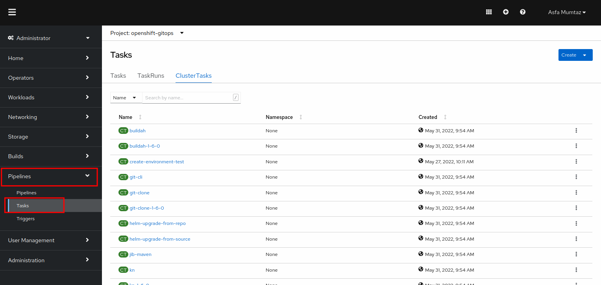
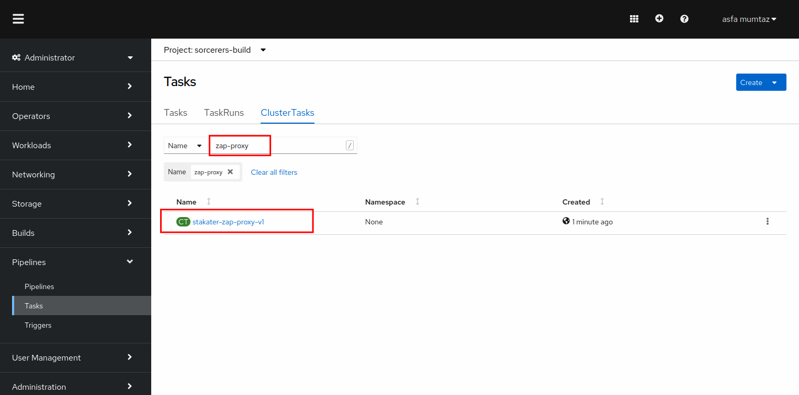
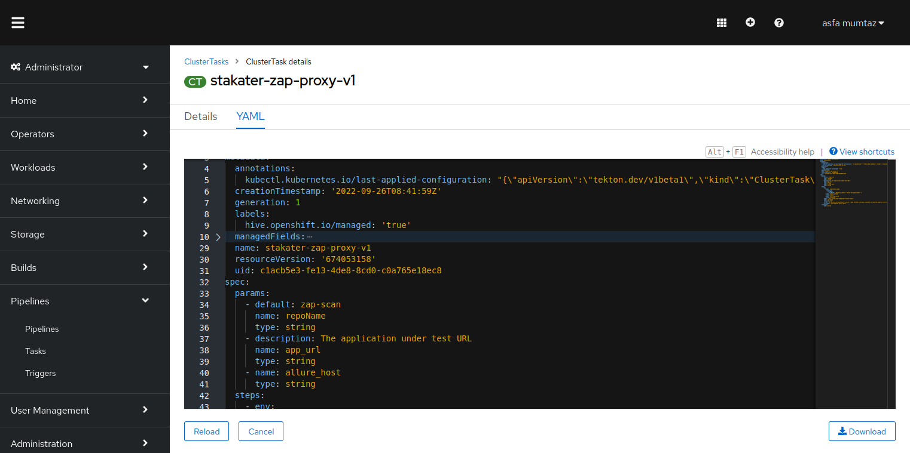
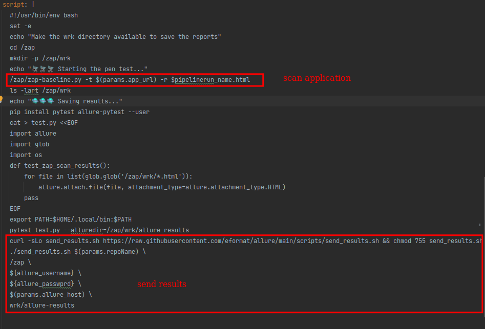

# OWASP ZAP Vulnerability Scanning

> What is [OWASP Zed Attack Proxy](https://www.zaproxy.org/)? 

For this exercise, we will use a tool called "OWASP Zed Attack Proxy" or ZAP in short. It helps automatically find security vulnerabilities in your applications. This allows the developers to automate penetration testing and security regression testing of the application in the CI/CD pipeline.

## Task

## Task

#### SAAP ZAP Proxy :

SAAP cluster is shipped with a `zap-proxy` task that scan your application for any vulnerabilities.

1. To view the already defined ZAP cluster task, open up the `Pipelines` section from the left menu and click `Tasks`

2. Select `ClusterTasks`. A number of tasks will be displayed on your screen. Type in `zap-proxy` in the search box. You will see a task ` stakater-zap-proxy-v1`

3. CLick YAML to display the task definition.

   

The zap proxy task first scans your application for OWASP vulnerabilities and then sends the results over to Allure for visualization.

#### Integrate the pipeline with Tekton:

- Add a stage to our pipeline to run the security scan
- [Tekton](6b-tekton.md)