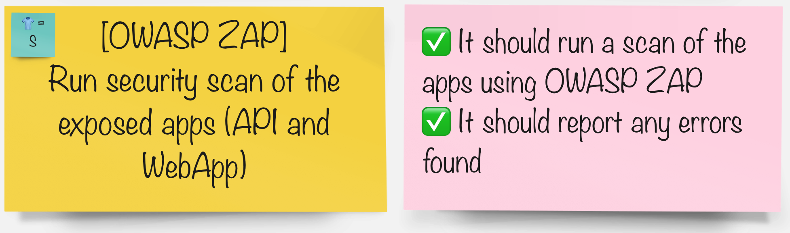

# OWASP ZAP Vulnerability Scanning

> What is [OWASP Zed Attack Proxy](https://www.zaproxy.org/)? 

For this exercise, we will use a tool called "OWASP Zed Attack Proxy" or ZAP in short. It helps automatically find security vulnerabilities in your applications. This allows the developers to automate penetration testing and security regression testing of the application in the CI/CD pipeline.

## Task

#### In your groups pick the tool you'd like to integrate the pipeline with:

| 🐈‍⬛ **Jenkins Group** 🐈‍⬛  |  🐅 **Tekton Group** 🐅 |
|-----------------------|----------------------------|
| * Add a stage to our pipeline to run the security scan | * Add a task to our pipeline to run the security scan |
| [jenkins](3-revenge-of-the-automated-testing/6a-jenkins.md) | [tekton](3-revenge-of-the-automated-testing/6b-tekton.md) |
