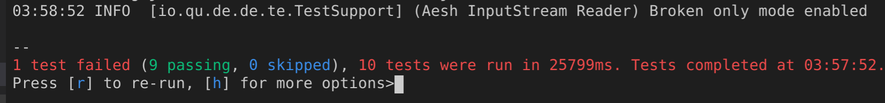
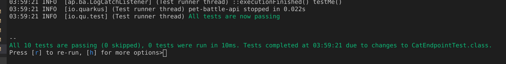
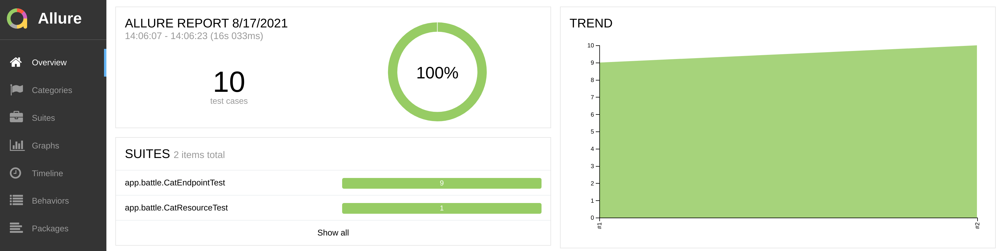
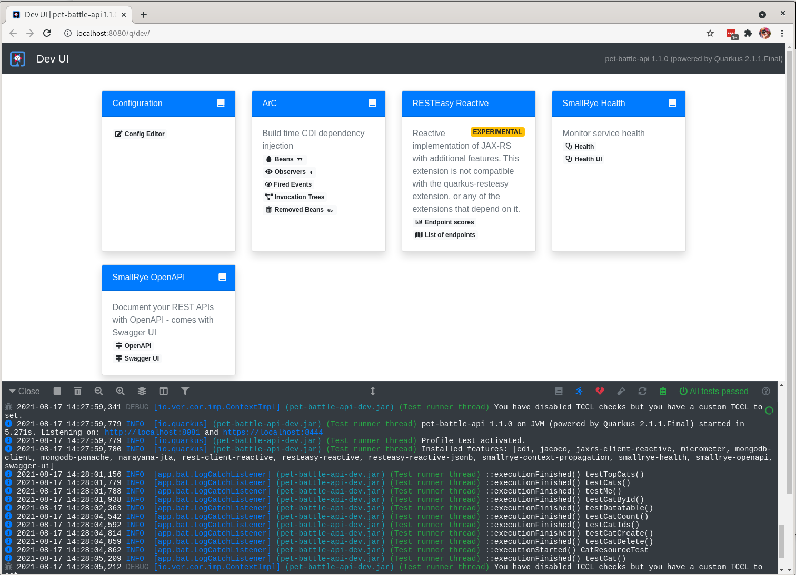
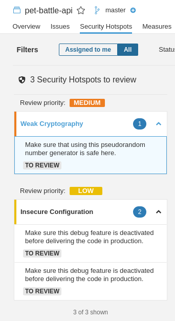
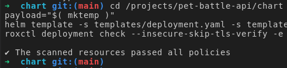

# Here be dragons!


### Testing Extensions

- Something something TestContainers

### Continuous Testing

Quarkus <span style="color:blue;">[Continuous Testing](https://quarkus.io/guides/continuous-testing)</span>

<div class="highlight" style="background: #f7f7f7">
<pre><code class="language-yaml">
The following commands are available:
[r] - Re-run all tests
[f] - Re-run failed tests
[b] - Toggle 'broken only' mode, where only failing tests are run (disabled)
[v] - Print failures from the last test run
[p] - Pause tests
[o] - Toggle test output (disabled)
[i] - Toggle instrumentation based reload (disabled)
[l] - Toggle live reload (enabled)
[s] - Force restart
[h] - Display this help
[q] - Quit
</code></pre></div>

Run tests.

```bash
mvn quarkus:test
```

Add a new failing test.

```java
    @Test
    @Story("Test me")
    void testMe() {
        Assert.assertFalse(false);
    }
```


Switch to **broken only mode** by pressing `b`



Make the test pass.

```java
    @Test
    @Story("Test me")
    void testMe() {
        Assert.assertFalse(true);
    }
```



```bash
git add .
git commit -m  "⛑️ ADD - new test ⛑️"
git push 
```

Allure new test added, test trend shown.



`TODO`

- [ ] Document the steps
- [ ] Allure Task should this be in repo already?
- [ ] Allure Annotations, Add a new test, Historical test results
- [ ] DevUI: `mvn quarkus:dev` mode - would need mongodb running in image



### Sonar Quality Gates

- [ ] Code Exercise to fix up **Security HotSpots** and improve quality.



```java
diff --git a/src/main/java/app/petbattle/Cat.java b/src/main/java/app/petbattle/Cat.java
index c9dad23..a5bcbed 100644
--- a/src/main/java/app/petbattle/Cat.java
+++ b/src/main/java/app/petbattle/Cat.java
@@ -85,7 +85,7 @@ public class Cat extends ReactivePanacheMongoEntity {
                     .encodeToString(baos.toByteArray());
             setImage("data:image/jpeg;base64," + encodedString);
         } catch (IOException e) {
-            e.printStackTrace();
+            // do nothing
         }
     }
 
diff --git a/src/main/java/app/petbattle/CatResource.java b/src/main/java/app/petbattle/CatResource.java
index 5b194b5..c9ed55c 100644
--- a/src/main/java/app/petbattle/CatResource.java
+++ b/src/main/java/app/petbattle/CatResource.java
@@ -26,6 +26,7 @@ import javax.ws.rs.core.MediaType;
 import javax.ws.rs.core.Response;
 import java.io.IOException;
 import java.io.InputStream;
+import java.security.SecureRandom;
 import java.time.Duration;
 import java.util.*;
 
@@ -216,7 +217,7 @@ public class CatResource {
             try {
                 InputStream is = Thread.currentThread().getContextClassLoader().getResourceAsStream(tc);
                 Cat cat = new Cat();
-                cat.setCount(new Random().nextInt(5) + 1);
+                cat.setCount(new SecureRandom().nextInt(5) + 1);
                 cat.setVote(false);
                 byte[] fileContent = new byte[0];
                 fileContent = is.readAllBytes();
@@ -229,7 +230,7 @@ public class CatResource {
                 cat.persistOrUpdate().await().indefinitely();
 
             } catch (IOException e) {
-                e.printStackTrace();
+                // do nothing
             }
         }
     }
```

Git add, commit, push your changes

```bash
cd /projects/pet-battle-api
git add .
git commit -m  "💍 FIX Security HotSpots 💍"
git push 
```


- [ ] Setup a code quality gate e.g. chart <span style="color:blue;">[here](https://github.com/eformat/sonarqube-jobs)</span>

```yaml
  # Sonarqube setup
  - name: sonarqube-setup
    enabled: true
    source: https://github.com/eformat/sonarqube-jobs
    source_path: charts/quality-gate
    source_ref: main
    values:
      qualityGate:
        new_coverage:
          enabled: false
```

### Linting Extensions


### ACS/StackRox Command Line fun

> We are going to make use of ACS to move security checks into our pipeline. We will look at:
> - **roxctl** - using the ACS/StackRox CLI
> - **kube-linter** - adding the ACS/StackRox kube linter Task to check deployment configurations
> - **scan,check** - container image scanning and policy checking as part of our pipeline using ACS/StackRox

## roxctl command line

Let's learn how to use the **roxctl** command line.

1. Export these environment variables, your facilitator will give you these from the group exercise.

    ```bash
    export ROX_API_TOKEN=eyJhbGciOiJSUzI1NiIsIm...
    export ROX_ENDPOINT=central-stackrox.<CLUSTER_DOMAIN>
    ```

2. The following command checks **build-time** violations of your security policies in images.

    We can run a **check** on our **pet-battle** image by doing:

    ```bash
    roxctl image check --insecure-skip-tls-verify -e $ROX_ENDPOINT:443 --image quay.io/petbattle/pet-battle:latest -o json | jq -c '.alerts[].policy | select ( .severity == "HIGH_SEVERITY" or .severity == "CRITICAL_SEVERITY" )' | jq .
    ```

    This returns a Policy error that should look something like this:

    <div class="highlight" style="background: #f7f7f7">
    <pre><code class="language-json">
    Error: Violated a policy with CI enforcement set
    {
    "id": "a919ccaf-6b43-4160-ac5d-a405e1440a41",
    "name": "Fixable Severity at least Important",
    "description": "Alert on deployments with fixable vulnerabilities with a Severity Rating at least Important",
    "rationale": "Known vulnerabilities make it easier for adversaries to exploit your application. You can fix these high-severity vulnerabilities by updating to a newer version of the affected component(s).",
    "remediation": "Use your package manager to update to a fixed version in future builds or speak with your security team to mitigate the vulnerabilities.",
    "categories": [
        "Vulnerability Management"
    ],
    "lifecycleStages": [
        "BUILD",
        "DEPLOY"
    ],
    "severity": "HIGH_SEVERITY",
    "enforcementActions": [
        "FAIL_BUILD_ENFORCEMENT"
    ],
    "SORTName": "Fixable Severity at least Important",
    "SORTLifecycleStage": "BUILD,DEPLOY",
    "SORTEnforcement": true,
    "policyVersion": "1.1",
    "policySections": [
        {
        "policyGroups": [
            {
            "fieldName": "Fixed By",
            "values": [
                {
                "value": ".*"
                }
            ]
            },
            {
            "fieldName": "Severity",
            "values": [
                {
                "value": ">= IMPORTANT"
                }
            ]
            }
        ]
        }
    ]
    }
    </code></pre></div>

    You can also check the scan results for specific images.

3. We can also perform image **scans** directly. Try:

    ```bash
    roxctl image scan --insecure-skip-tls-verify -e $ROX_ENDPOINT:443 --image quay.io/petbattle/pet-battle:latest -o table
    ```

    We can run the **scan** command with a format of *json, csv, and table. default "json"*.

4. We can try this on the **pet-battle-api** image we built using the image reference (this is printed out in the **bake** stage of our pipeline)

    ```bash
    roxctl image check --insecure-skip-tls-verify -e $ROX_ENDPOINT:443 --image \
    image-registry.openshift-image-registry.svc:5000/ateam-test/pet-battle-api@sha256:cf2ccbf8d117c2ea98425f9b70b2b937001ccb9b3cdbd4ab10b42ba8a082caf7
    ```

    <div class="highlight" style="background: #f7f7f7">
    <pre><code class="language-yaml">
    ✗ Image image-registry.openshift-image-registry.svc:5000/ateam-test/pet-battle-api@sha256:cf2ccbf8d117c2ea98425f9b70b2b937001ccb9b3cdbd4ab10b42ba8a082caf7 failed policy 'Red Hat Package Manager in Image' 
    - Description:
        ↳ Alert on deployments with components of the Red Hat/Fedora/CentOS package
        management system.
    - Rationale:
        ↳ Package managers make it easier for attackers to use compromised containers,
        since they can easily add software.
    - Remediation:
        ↳ Run `rpm -e $(rpm -qa *rpm*) $(rpm -qa *dnf*) $(rpm -qa *libsolv*) $(rpm -qa
        *hawkey*) $(rpm -qa yum*)` in the image build for production containers.
    - Violations:
        - Image includes component 'rpm' (version 4.14.3-14.el8_4.x86_64)
    </code></pre></div>

    You can check the shell result of this command:

    ```bash
    if [ $? -eq 0 ]; then
    echo "🦸 no issues found 🦸"; 
    else
    echo "🦠 checks failed 🦠"; 
    fi
    ```

5. We can also check other external images. This may take a minute to download and scan the image:

    ```bash
    roxctl image check --insecure-skip-tls-verify -e $ROX_ENDPOINT:443 --image quay.io/petbattle/pet-battle-api:latest
    ```

6. The following command checks build-time and deploy-time violations of your security policies in YAML deployment files.

    Use this command to validate Kubernetes resources in our helm template

    ```bash
    cd /projects/pet-battle-api/chart
    payload="$( mktemp )"
    helm template -s templates/deployment.yaml -s templates/pdb.yaml -s templates/service.yaml . > $payload
    roxctl deployment check --insecure-skip-tls-verify -e $ROX_ENDPOINT:443 -f $payload
    ```

    
