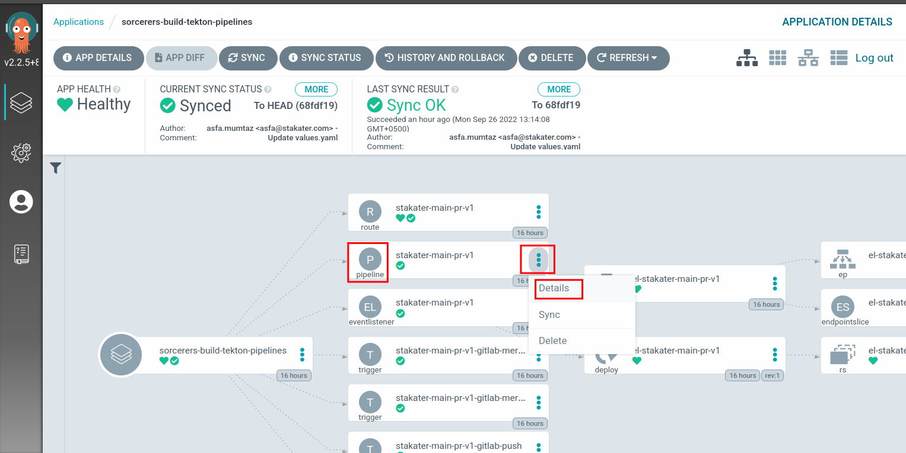
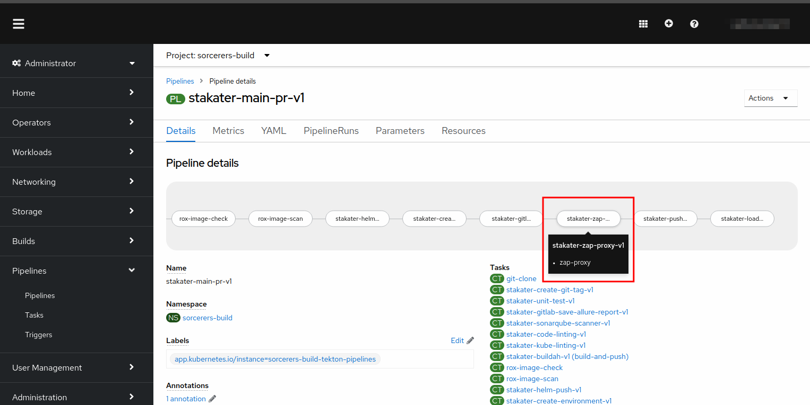
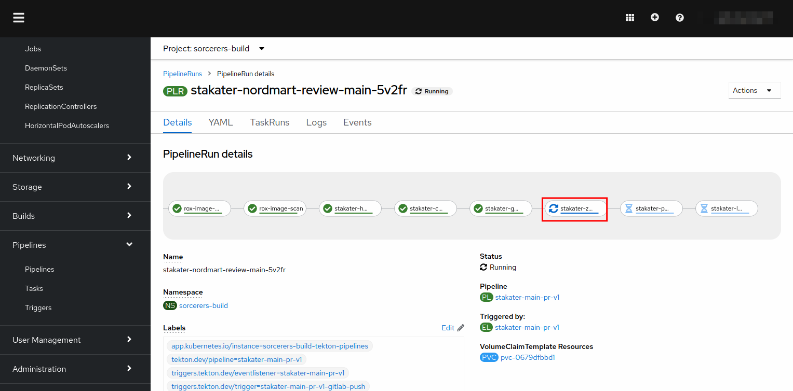
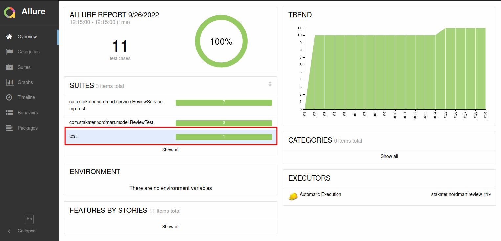
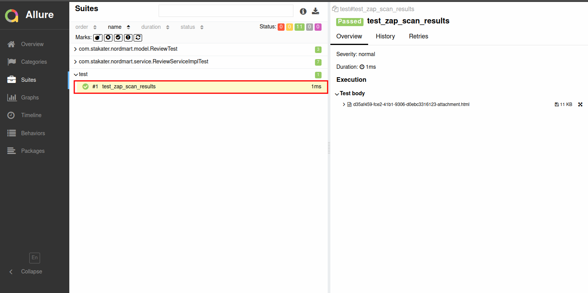

## Extend Tekton Pipeline with ZAP

> In this section we are going to improve our already built pipeline and add ZAP scanning to it.

1. To run zap scanning, we first need to get the application URL on which we will perform our vulnerability scanning.
    Below the command below in your crw workspace to retrieve you application URL:

```bash
oc project ${TENANT_NAME}-dev
 echo https://$(oc get route review --template='{{ .spec.host }}' -n ${TENANT_NAME}-dev)
```
This is the URL for your application. 

2. We want to be able to send result to allure. So we need to get the URL for allure as well. Run the below oc command to get allure URL.

```bash
 oc project ${TENANT_NAME}-dev
 echo https://$(oc get route ${TENANT_NAME}-dev-allure --template='{{ .spec.host }}' -n ${TENANT_NAME}-dev)
```
Now that you have both the URLs require. Let's add our task to the pipeline.

3. Open the chart directory found in GitLab at `<TENANT_NAME>/nordmart-apps-gitops-config/01-<TENANT_NAME>/01-tekton-pipelines/00-build/`

   

2. Open the `values.yaml` file in the editor. After the `stakater-gitlab-update-cd-repo-v1`. We need to add a couple of params as well. `app_url` and `allure_host`
Replace `<APP_URL>` with the URL you obtained from step 1.
Replace `<ALLURE_HOST>` with URL you obtained from step 2.

```yaml
- defaultTaskName: stakater-zap-proxy-v1
  params:
    - name: app_url
      value: <APP_URL>
    - name: allure_host
      value: <ALLURE_HOST>
```

5. Commit the changes.


6. Now open ArgoCD and check if the changes were synchronized. Click refresh if ArgoCD has not synced the changes yet.
   You can check the pipelines definition by clicking the three dots next to it, opening `details` and checking the live manifest.


Open up the console and navigate to your pipeline definition by going to `Pipelines` and selecting your pipeline from the list. You should see a zap-proxy task there as well.




7. If the sync is green, you're good to go. You have successfully added zap to your pipeline!


8. Now make a small change on the `stakater-nordmart-review` application to trigger the pipeline. Push directly to main. Head over to the console and check the running pipeline. You should be able to see zap-proxy task running.



9. Once the task completes, head over to `allure` by opening the following URL.

```bash
oc project ${TENANT_NAME}-dev
echo https://$(oc get route ${TENANT_NAME}-dev-allure --template='{{ .spec.host }}' -n ${TENANT_NAME}-dev)/allure-docker-service/projects/stakater-nordmart-review/reports/latest/index.html

```
It will take you to the projects page. You should be able to see zap test results under `test`



Open the `test` suite. You will be taken to the below screen.



CONGRATULATIONS!!! You now have zap vulnerability scanner in your pipeline.

