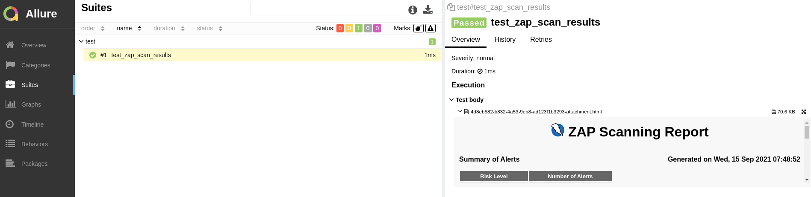
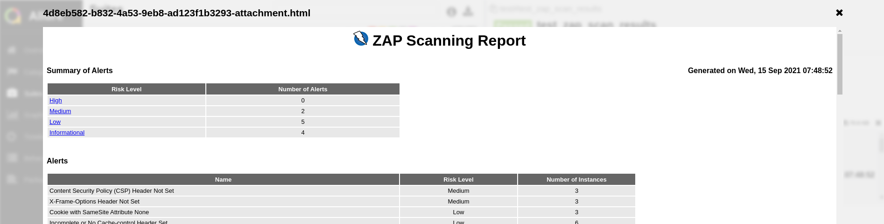

<<<<<<< HEAD
## Extend Tekton Pipeline with OWASP Zap Security Scanning

<p class="warn"> You will need to have *Allure* deployed from the testing exercise to run this task. If you did not do this task when prioritizing your work, no big deal, just <a href="/#/3-revenge-of-the-automated-testing/2b-tekton?id=part-1-allure">head over here</a> and do <strong>Part 1 only</strong>.
</p>

1. Add a task into our codebase to zap scan our deployed app in test

    ```bash
    cd /projects/tech-exercise
    cat <<'EOF' > tekton/templates/tasks/zap-proxy.yaml
    apiVersion: tekton.dev/v1beta1
    kind: Task
    metadata:
      name: zap-proxy
    spec:
      workspaces:
        - name: output
      params:
        - name: APPLICATION_NAME
          type: string
          default: "zap-scan"
        - name: APP_URL
          description: The application under test URL
        - name: ALLURE_HOST
          type: string
          description: "Allure Host"
          default: "http://allure:5050"
        - name: ALLURE_SECRET
          type: string
          description: Secret containing Allure credentials
          default: allure-auth
        - name: WORK_DIRECTORY
          description: Directory to start build in (handle multiple branches)
      steps:
        - name: zap-proxy
          image: quay.io/rht-labs/zap2docker-stable:latest
          env:
            - name: PIPELINERUN_NAME
              valueFrom:
                fieldRef:
                  fieldPath: metadata.labels['tekton.dev/pipelineRun']
            - name: ALLURE_USERNAME
              valueFrom:
                secretKeyRef:
                  name: $(params.ALLURE_SECRET)
                  key: username
            - name: ALLURE_PASSWORD
              valueFrom:
                secretKeyRef:
                  name: $(params.ALLURE_SECRET)
                  key: password
          workingDir: $(workspaces.output.path)/$(params.WORK_DIRECTORY)
          script: |
            #!/usr/bin/env bash
            set -x
            echo "Make the wrk directory available to save the reports"
            cd /zap
            mkdir -p /zap/wrk
            echo "🪰🪰🪰 Starting the pen test..."
            /zap/zap-baseline.py -t $(params.APP_URL) -r $PIPELINERUN_NAME.html
            ls -lart /zap/wrk
            echo "🛸🛸🛸 Saving results..."
            # FIXME for now this works, move to script+image
            pip install pytest allure-pytest --user
            cat > test.py <<EOF
            import allure
            import glob
            import os
            def test_zap_scan_results():
                for file in list(glob.glob('/zap/wrk/*.html')):
                    allure.attach.file(file, attachment_type=allure.attachment_type.HTML)
                pass
            EOF
            export PATH=$HOME/.local/bin:$PATH
            pytest test.py --alluredir=/zap/wrk/allure-results
            curl -sLo send_results.sh https://raw.githubusercontent.com/eformat/allure/main/scripts/send_results.sh && chmod 755 send_results.sh
            ./send_results.sh $(params.APPLICATION_NAME) \
            /zap \
            ${ALLURE_USERNAME} \
            ${ALLURE_PASSWORD} \
            $(params.ALLURE_HOST) \
            wrk/allure-results
    EOF
    ```

2. Lets try this in our pipeline. Edit `maven-pipeline.yaml` and add a step definition for `pentesting-test`. Remember to adjust the `runAfter` to match the current state of your pipeline:

    ```yaml
        # Pen Testing
        - name: pentesting-test
          taskRef:
            name: zap-proxy
          runAfter:
            - verify-deployment
          params:
            - name: APP_URL
              value: "https://pet-battle-api-{{ .Values.team }}-test.{{ .Values.cluster_domain }}"
            - name: WORK_DIRECTORY
              value: "$(params.APPLICATION_NAME)/$(params.GIT_BRANCH)"
          workspaces:
            - name: output
              workspace: shared-workspace
    ```

3. Check our changes into git.

    ```bash
    cd /projects/tech-exercise
    # git add, commit, push your changes..
    git add .
    git commit -m  "🪰 ADD - zap scan pentest 🪰"
    git push
    ```

4. Trigger a pipeline build.

    ```bash
    cd /projects/pet-battle-api
    git commit --allow-empty -m "🩴 test zap-scan step 🩴"
    git push
    ```

5. Check report in *Allure*

    ```bash
    echo https://allure-<TENANT_NAME>-ci-cd.<CLUSTER_DOMAIN>/allure-docker-service/projects/zap-scan/reports/latest/index.html
    ```

Drill down to test body attachments.




=======
## Extend Tekton Pipeline with ZAP

> In this section we are going to improve our already built pipeline and add ZAP scanning to it.

1. To run zap scanning, we first need to get the application url on which we will perform our vulnerability scanning.
    Below the command below in your crw workspace to retrieve you application url:

```bash
 echo https://$(oc get route review --template='{{ .spec.host }}' -n ${TENANT_NAME}-dev)
```
This is the url for your application. 

2. We want to be able to send result to allure. So we need to get the url for allure as well. Run the below oc command to get allure url.
**Replace the <TENANT_NAME> with your tenant**
```bash
 echo https://$(oc get route <TENANT_NAME>-dev-allure --template='{{ .spec.host }}' -n ${TENANT_NAME}-dev)
```
Now that you have both the urls require. Let's add our task to the pipeline.

3. Open the Chart we added to `00-tekton-pipelines` folder in section 2.
   

2. Open the values file in the editor. After the `stakater-gitlab-update-cd-repo-v1`. We need to add a couple of params as well. `app_url` and `allure_host`
Replace <APP_URL> with the url you obtained from step 1.
Replace <ALLURE_HOST> with url you obtained from step 2.
```
- defaultTaskName: stakater-zap-proxy-v1
  params:
    - name: app_url
      value: <APP_URL>
    - name: allure_host
      value: <ALLURE_HOST>

```


3. Commit the changes.


5. Now open ArgoCD and check if the changes were synchronized. Click refresh if ArgoCD has not synced the changes yet.
   You can check the pipelines definition by clicking the three dots next to it, opening `details` and checking the livemmanifest


Open up the console and navigate to your pipeline definition by going to `Pipelines` and selecting your pipeline from the list. You should see a zap-proxy task there as well.


6. If the sync is green, you're good to go. You have successfully added zap to your pipeline!


7. Now make a small change on the `stakater-nordmart-review` application to trigger the pipeline. Push directly to main. Head over to the console and check the running pipeline. You should be able to see SonarQube task running.


8. Once the task completes, head over to `allure` by opening the following URL.

```bash
echo https://$(oc get route <TENANT_NAME>-dev-allure --template='{{ .spec.host }}' -n ${TENANT_NAME}-dev)/allure-docker-service/projects/stakater-nordmart-review/reports/latest/index.html

```
It will take you to the projects page. You should be able to see zap test results under `test`


Open the `test` suite. You will be taken to the below screen.


CONGRATULATIONS!!! You now have zap vulnerability scanner in your pipeline.
>>>>>>> add zap docs
