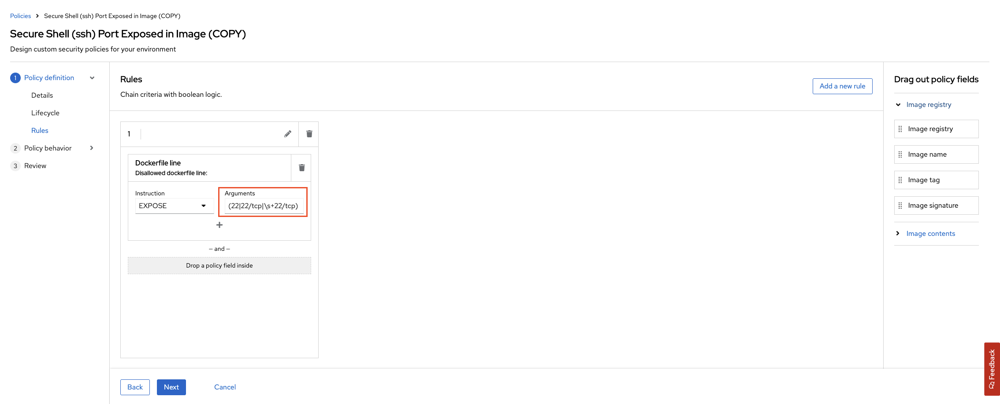

# Image Security (Stack Rox)

> We use some ready container images to build our own application images. We use them as base and add our app binaries, or install packages on top of them. We need to protect our containers from errors and vulnerabilities in public registry images, or outdated packages and libraries. Image security step in our pipeline helps us to discover them before moving images to production.

## Task


## Set Up StackRox Access

StackRox / Advanced Cluster Security (ACS) is deployed once at the cluster scope. It can be used to monitor multiple clusters. The ACS/StackRox operator is already deployed in the cluster for you to configure.

1. Connect to the ACS WebUI Route using the **admin** credentials:

    ```bash
    # get web url
    echo https://$(oc -n stackrox get route central --template='{{ .spec.host }}')
    ```

    ```bash
    # get credentials
    echo $(oc -n stackrox get secret central-htpasswd -o go-template='{{index .data "password" | base64decode}}')
    ```

2. Create an **API Token** from ACS WebUI page. From the left menu, go to  **Platform Configuration > Integrations** . Down in the page, from **Authentication Tokens**, select **StackRox**.

    Name it `do500-<TEAM_NAME>` and give it `Admin` permissions.

    
    
    

3. **Save** this token somewhere safe, we will need of it. 

    Export the token as environment variable:

    ```bash
    export ROX_API_TOKEN=eyJhbGciOiJSUzI1NiIsIm...
    ```

    Export the StackRox endpoint:

    ```bash
    export ROX_ENDPOINT=central-stackrox.<CLUSTER_DOMAIN>
    ```

4. Verify the token by running **roxctl**

    ```bash
    roxctl central whoami --insecure-skip-tls-verify -e $ROX_ENDPOINT:443
    ```

5. This API token will be used by our pipelines. Let's create SealedSecret definition for it.

    ```bash
    cat << EOF > /tmp/rox-auth.yaml
    apiVersion: v1
    data:
      password: "$(printf ${ROX_API_TOKEN} | base64 -w0)"
      username: "$(printf ${ROX_ENDPOINT} | base64 -w0)"
    kind: Secret
    metadata:
      labels:
        credential.sync.jenkins.openshift.io: "true"
      name: rox-auth
    EOF
    ```

    Use `kubeseal` commandline to seal the secret definition.

    ```bash
    kubeseal < /tmp/rox-auth.yaml > /tmp/sealed-rox-auth.yaml \
        -n ${TEAM_NAME}-ci-cd \
        --controller-namespace do500-shared \
        --controller-name sealed-secrets \
        -o yaml
    ```

    As always, we want to grab the results of this sealing activity, in particular the `encryptedData`. Because this is GitOps, and we will save it in our Git repos :)

    ```bash
    cat /tmp/sealed-rox-auth.yaml | grep -E 'username|password'
    ```

    <div class="highlight" style="background: #f7f7f7">
    <pre><code class="language-yaml">
        username: AgAj3JQj+EP23pnzu...
        password: AgAtnYz8U0AqIIaqYrj...
    </code></pre></div>

    Open up `ubiquitous-journey/values-tooling.yaml` file and extend the Sealed Secrets entry. Copy the output of `username` and `password` from the previous command and update the values. Make sure you indent the data correctly.

    ```yaml
            - name: rox-auth
              type: kubernetes.io/basic-auth
              labels:
                credential.sync.jenkins.openshift.io: "true"
              data:
                username: AgAj3JQj+EP23pnzu...
                password: AgAtnYz8U0AqIIaqYrj...
    ```

    Check our changes into git.

    ```bash
    cd /projects/tech-exercise
    # git add, commit, push your changes..
    git add .
    git commit -m  "🔒 ADD - stackrox sealed secret 🔒"
    git push
    ```

## Group Exercise

> Below steps should only be done *once* because this is a cluster-wide operation.

1. Generate the init bundle for the cluster. This can be done from the **Platform Configuration > Integration > Cluster Init Bundle** ACE web page also.

    **command line**

    ```bash
    roxctl -e "${ROX_ENDPOINT}:443" central init-bundles generate do500 --output-secrets /tmp/cluster_init_bundle.yaml --insecure-skip-tls-verify
    ```

    You should see an output like this:
    <div class="highlight" style="background: #f7f7f7">
    <pre><code class="language-bash">
    Successfully generated new init bundle.

    Name:       do500
    Created at: 2021-09-28T21:36:37.072807179Z
    Expires at: 2022-09-28T21:37:00Z
    Created By: do500
    ID:         559ebc94-191d-4f17-8d64-21adbff2f054

    The newly generated init bundle has been written to file "cluster_init_bundle.yaml".
    </code></pre></div>

    _Alternatively, you can do the same step via web UI👇_

    

2. Above command saved `cluster_init_bundle.yaml` file under /tmp. Let's apply it to the cluster.

    ```bash
    oc -n stackrox create -f /tmp/cluster_init_bundle.yaml
    ```

3. It may take a few min for the collector pods in the `stackrox` project to become ready. If the `secured cluster` is listed as `unreconcileable`, delete and recreate it from the ACS operator in the `stackrox` project.

    
    

4. You should now be able to see your cluster and all the data in ACS for you cluster. Take a look around.

    
    
    

5. OpenShift internal registry fix.

    <p class="tip"><b>FIXME</b> to make roxctl cli work on internal OpenShift images, we need to manually add a registry. There is automatically discovered registries there so it should be automatic using the ServiceAccount. Browse to <code class="language-bash" style="background: #f7f7f7">Platform Configurations -> Generic Docker Registry</code> and add a Registry entry with: <b>image-registry.openshift-image-registry.svc:5000</b> and password from: <code class="language-bash" style="background: #f7f7f7">echo $(oc -n <TEAM_NAME>-ci-cd sa get-token pipeline)</code></p>

    

6. As a group we are going to update a *Build* policy that we will use later in the exercise. Browse to the *Platform Configuration -> System Policies* view. Type in *Policy* and then *secure shell*, select the **Secure Shell (ssh) Port Exposed in Image** policy.

    

7. Clone this Policy so we can edit it, give it a new name.

    

8. Click *Next* and add **22** to the regular expression for *Arguments* in the disallowed Dockerfile line.

    

9. Hit *Next* and *Next* and turn **ON** policy enforcement at *Build* time.

    

10. *Save* the policy. It should look like this now.

    

#### In your groups pick the tool you'd like to integrate the pipeline with:

Now we can use ACS to help move security **LEFT** in our build pipeline. In each group we will do the following:

| 🐈‍⬛ **Jenkins Group** 🐈‍⬛  |  🐅 **Tekton Group** 🐅 |
|-----------------------|----------------------------|
| * Configure your pipeline to `check` build time policy violations | * Configure your pipeline to `check` build time policy violations |
| * Configure your pipeline to `scan` images for CVE/CVSS | * Configure your pipeline to `scan` images for CVE/CVSS |
| * Break/Fix your pipeline | * Break/Fix your pipeline |
| <span style="color:blue;">[jenkins](3-revenge-of-the-automated-testing/7a-jenkins.md)</span> | <span style="color:blue;">[tekton](3-revenge-of-the-automated-testing/7b-tekton.md)</span> |
