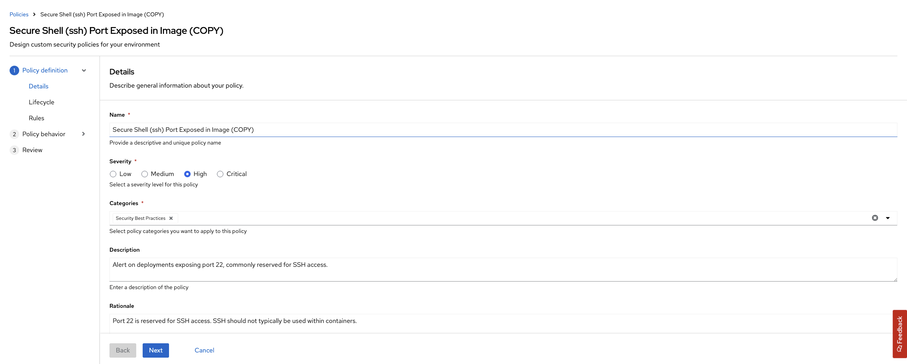

# Image Security (Stack Rox)

> We use some ready container images to build our own application images. We use them as base and add our app binaries, or install packages on top of them. We need to protect our containers from errors and vulnerabilities in public registry images, or outdated packages and libraries. Image security step in our pipeline helps us to discover them before moving images to production.

## Task


## Set Up StackRox Access

StackRox / Advanced Cluster Security (ACS) is deployed once at the cluster scope. It can be used to monitor multiple clusters. The ACS/StackRox operator is already deployed and configured in the cluster for you.

1. Connect to the ACS WebUI Route:

    ```bash
    # get web url
    echo https://$(oc -n stackrox get route central --template='{{ .spec.host }}')
    ```

    Using the **admin** username:

    ```bash
    # get password to go with the "admin" username:
    echo $(oc -n stackrox get secret central-htpasswd -o go-template='{{index .data "password" | base64decode}}')
    ```

    
    

2. An API Token was created for us as part of the install configuration. We can retrieve it using:

    Export the token as environment variable:

    ```bash
    export ROX_API_TOKEN=$(oc -n stackrox get secret rox-api-token-tl500 -o go-template='{{index .data "token" | base64decode}}')
    ```

    Export the StackRox endpoint:

    ```bash
    export ROX_ENDPOINT=central-stackrox.<CLUSTER_DOMAIN>
    ```

3. Verify the token by running **roxctl**

    ```bash
    roxctl central whoami --insecure-skip-tls-verify -e $ROX_ENDPOINT:443
    ```

4. This API token will be used by our pipelines. Let's create SealedSecret definition for it.

    ```bash
    cat << EOF > /tmp/rox-auth.yaml
    apiVersion: v1
    data:
      password: "$(echo -n ${ROX_API_TOKEN} | base64 -w0)"
      username: "$(echo -n ${ROX_ENDPOINT} | base64 -w0)"
    kind: Secret
    metadata:
      labels:
        credential.sync.jenkins.openshift.io: "true"
      name: rox-auth
    EOF
    ```

    Use `kubeseal` commandline to seal the secret definition.

    ```bash
    kubeseal < /tmp/rox-auth.yaml > /tmp/sealed-rox-auth.yaml \
        -n ${TEAM_NAME}-ci-cd \
        --controller-namespace tl500-shared \
        --controller-name sealed-secrets \
        -o yaml
    ```

    As always, we want to grab the results of this sealing activity, in particular the `encryptedData`. Because this is GitOps, and we will save it in our Git repos :)

    ```bash
    cat /tmp/sealed-rox-auth.yaml | grep -E 'username|password'
    ```

    <div class="highlight" style="background: #f7f7f7">
    <pre><code class="language-yaml">
        username: AgAj3JQj+EP23pnzu...
        password: AgAtnYz8U0AqIIaqYrj...
    </code></pre></div>

    Open up `ubiquitous-journey/values-tooling.yaml` file and extend the Sealed Secrets entry. Copy the output of `username` and `password` from the previous command and update the values. Make sure you indent the data correctly.

    ```yaml
            - name: rox-auth
              type: kubernetes.io/basic-auth
              labels:
                credential.sync.jenkins.openshift.io: "true"
              data:
                username: AgAj3JQj+EP23pnzu...
                password: AgAtnYz8U0AqIIaqYrj...
    ```

    Check our changes into git.

    ```bash
    cd /projects/tech-exercise
    # git add, commit, push your changes..
    git add .
    git commit -m  "🔒 ADD - stackrox sealed secret 🔒"
    git push
    ```

5. As a team we are going to update a *Build* policy that we will use later in the exercise. Browse to the *Platform Configuration -> Policy Management* view. Type in *Policy* and then *secure shell*, select the **Secure Shell (ssh) Port Exposed in Image** policy.

    

6. Clone this Policy by clicking three dots on the right so we can edit it, give it a new name.

    

7. Click *Next* until we reach **Policy Behaviour**. Select **Inform and enforce** and configure the **Build** behaviour to **Enforce on Build**. This will fail the build if the policy conditions are matched.

    

8. Click *Next* until we reach **Policy Criteria**. Add **22** to the regular expression for *Arguments* in the disallowed Dockerfile line.

    

9. Hit *Next* and *Next* until you reach **Review Policy**, check the policy enforcement is enabled at *Build* time.

    

10. *Save* the policy. It should look like this now.

    

    <p class="tip">
    🐌 THIS IS NOT GITOPS - Manually configuring the policy and setup is a good way to play with StackRox. See advanced exercises for creating and storing the policy as code. 🐎
    </p>

#### In your groups pick the tool you'd like to integrate the pipeline with:

Now we can use ACS to help move security **LEFT** in our build pipeline. In each group we will do the following:

| 🐈‍⬛ **Jenkins Group** 🐈‍⬛  |  🐅 **Tekton Group** 🐅 |
|-----------------------|----------------------------|
| * Configure your pipeline to `check` build time policy violations | * Configure your pipeline to `check` build time policy violations |
| * Configure your pipeline to `scan` images for CVE/CVSS | * Configure your pipeline to `scan` images for CVE/CVSS |
| * Break/Fix your pipeline | * Break/Fix your pipeline |
| <span style="color:blue;">[jenkins](3-revenge-of-the-automated-testing/7a-jenkins.md)</span> | <span style="color:blue;">[tekton](3-revenge-of-the-automated-testing/7b-tekton.md)</span> |
