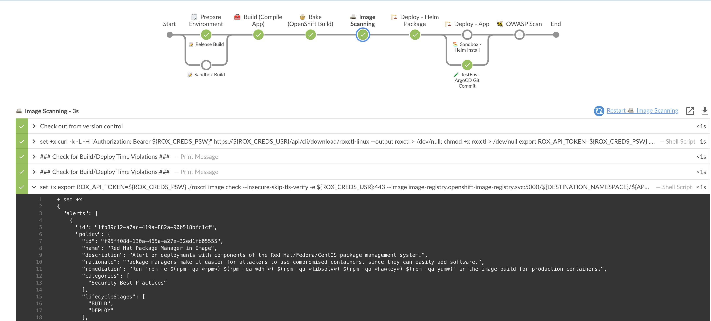
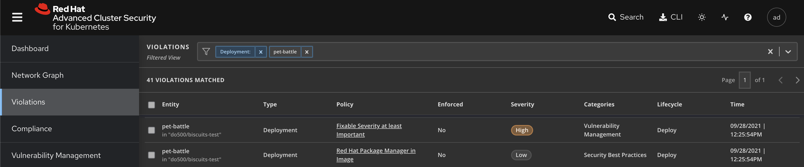

# Extend Jenkins Pipeline with Stackrox

## Scan Images

1. First, add the access credentials to Jenkinsfile. Open the file under `/projects/pet-battle` and add the following to the list of other `CREDS` in the `environment {}` block in the `Jenkinsfile`.

    ```groovy
            ROX_CREDS = credentials("${OPENSHIFT_BUILD_NAMESPACE}-rox-auth")
    ```

    You'll have something like this afterwards:
    <div class="highlight" style="background: #f7f7f7">
    <pre><code class="language-groovy">
    environment {
        // .. other stuff ...
            // Credentials bound in OpenShift
            GIT_CREDS = credentials("${OPENSHIFT_BUILD_NAMESPACE}-git-auth")
            NEXUS_CREDS = credentials("${OPENSHIFT_BUILD_NAMESPACE}-nexus-password")
            SONAR_CREDS = credentials("${OPENSHIFT_BUILD_NAMESPACE}-sonar-auth")
            ROX_CREDS = credentials("${OPENSHIFT_BUILD_NAMESPACE}-rox-auth")
        // .. more stuff ...
    }
    </code></pre></div>

2. And add a new stage to the pipeline where `// IMAGE SCANNING` placeholder is. This needs to be happen after `bake` / before `deploy`. Because we do not want to deploy any unsecure image :)

    ```groovy
            // 📠 IMAGE SCANNING EXAMPLE GOES HERE
            stage("📠 Image Scanning") {
                agent { label "master" }
                steps {
                    script {
                        sh '''
                            set +x
                            curl -k -L -H "Authorization: Bearer ${ROX_CREDS_PSW}" https://${ROX_CREDS_USR}/api/cli/download/roxctl-linux --output roxctl  > /dev/null;
                            chmod +x roxctl > /dev/null
                            export ROX_API_TOKEN=${ROX_CREDS_PSW}
                            ./roxctl image scan --insecure-skip-tls-verify -e ${ROX_CREDS_USR}:443 --image image-registry.openshift-image-registry.svc:5000/${DESTINATION_NAMESPACE}/${APP_NAME}:${VERSION} -o table
                        '''

                        // BUILD & DEPLOY CHECKS
                        echo '### Check for Build/Deploy Time Violations ###'

                    }
                }
            }
    ```

3. Push the changes to the repo, which also will trigger the pipeline.

    ```bash
    # git add, commit, push your changes..
    cd /projects/pet-battle
    git add .
    git commit -m  "🎄 ADD - image scan stage 🎄"
    git push 
    ```

     🪄 Observe the **pet-battle** pipeline running with the **image-scan** stage.

## Check Build/Deploy Time Violations

?> **Tip** We could extend the previous check by changing the output format to **json** and installing and using the **jq** command. For example, to check the image scan output and return a results when the **riskScore** and **topCvss** are below a certain value say. These are better handled as *Build Policy* within ACS which we can check next.

1. Lets extend the stage to check for any build time violations. Add the following into the placeholder inside the image-scanning stage:

    ```groovy
                        // BUILD & DEPLOY CHECKS
                        echo '### Check for Build/Deploy Time Violations ###'
                        sh '''
                            set +x
                            export ROX_API_TOKEN=${ROX_CREDS_PSW}
                            ./roxctl image check --insecure-skip-tls-verify -e ${ROX_CREDS_USR}:443  --image image-registry.openshift-image-registry.svc:5000/${DESTINATION_NAMESPACE}/${APP_NAME}:${VERSION} -o json
                        '''
    ```

2. Again, push the changes to the repo, which also will trigger the pipeline.

    ```bash
    # git add, commit, push your changes..
    cd /projects/pet-battle
    git add .
    git commit -m  "🎄 ADD - image scan stage 🎄"
    git push 
    ```

    🪄 Observe the **pet-battle** pipeline, check the logs for image scanning stage and detects some violations for deploy 😔😔

    

3. Go back to StackRox webUI and see the failure in the *Violations* view. 
    <p class="tip">We should have broken the pipeline and fix these violations in order to continue to our pipeline. Please refer _Here Be Dragons_ section for it.</p>

    
