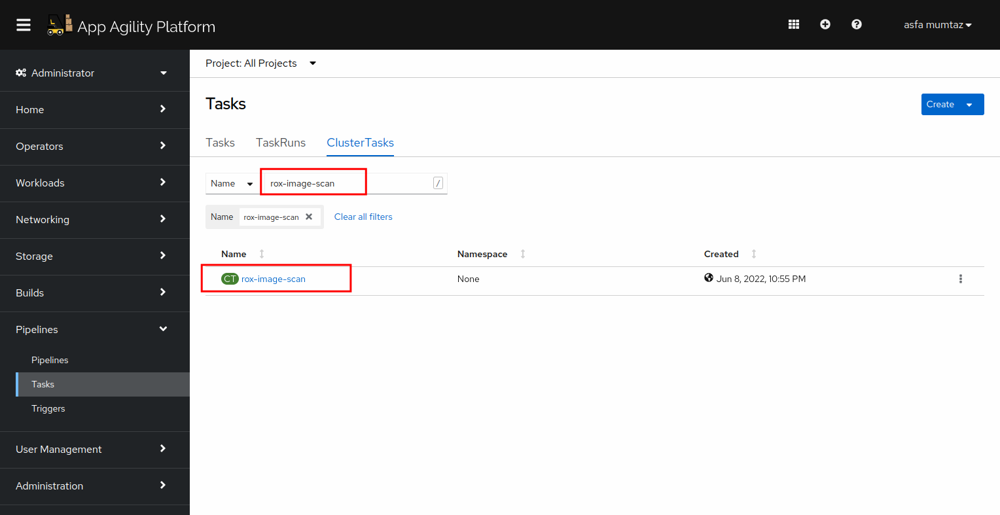
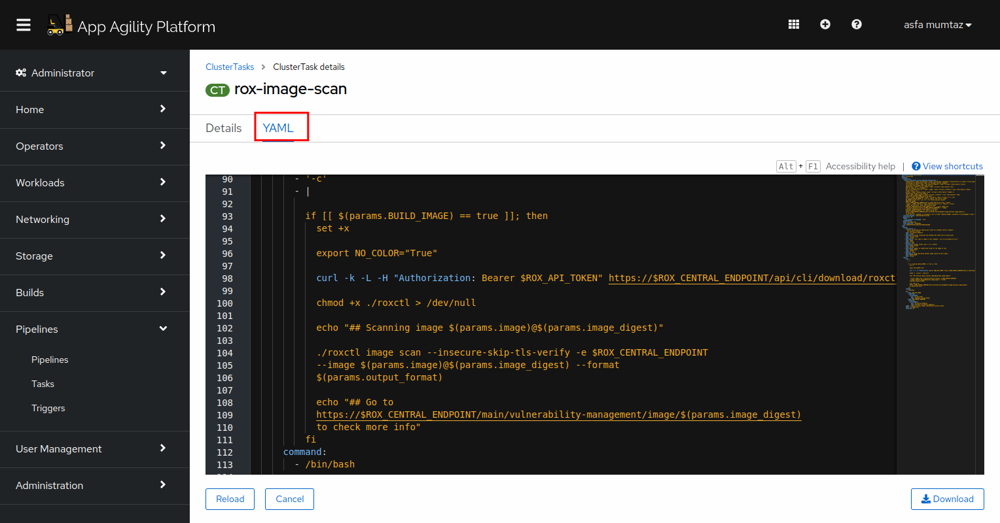

# Extend Tekton Pipeline with Stackrox (WIP)

## Image scanning

We will be using roxctl, the command line interface for RHACS, for scanning our images.

Let's start by opening up the image scanning tasks already available in the SAAP cluster:

1. Once gain, open up the `Pipelines` section from the left menu and click `Tasks`, and then select ClusterTasks.

   


2. Now type in rox-image-scan in the search box. You will see a task with the same name.

   

3. Click on the task and open up its YAML.

   

The task uses the `roxctl image scan` command to scan the image that we have built. Once scanning is finished, it prints the url that you can use to view the result.
We will see an example of this once we integrate the task to our pipeline and trigger the pipeline by making a change in the code.

To integrate the image scanning task into our pipeline, open up the existing pipeline definition in code ready workspace.

1. Add another task to the pipeline after the build-and-push task. The taskName should be `rox-image-scan` and it should run after the `build-and-push` and `stakater-sonnarqube-scanner-v1`
task.

```
- taskName: rox-image-scan
  runAfter:
    - build-and-push
    - stakater-sonarqube-scanner-v1
```
The pipeline will now become:
   ````
   apiVersion: v2
   pipeline-charts:
     name: stakater-main-pr-v1
     workspaces:
     - name: source
       volumeClaimTemplate:
       accessModes: ReadWriteOnce
       resourcesRequestsStorage: 1Gi
     pipelines:
       tasks:
         - taskName: stakater-set-commit-status-v1
           params:
           - name: state
             value: pending
         - taskName: git-clone
         - taskName: stakater-create-git-tag-v1
           params:
             - name: oldcommit
             - name: action
         - taskName: stakater-sonarqube-scanner-v1
           runAfter:
             - stakater-create-git-tag-v1
         - taskName: stakater-code-lint-v1
           runAfter:
            - stakater-sonarqube-scanner-v1
         - taskName: stakater-kube-linting-v1
           runAfter:
            - stakater-code-linting-v1
         - taskName: stakater-build-image-flag-v1
           runAfter:
            - stakater-create-git-tag-v1
              workspaces:
            - name: source
              workspace: source
              params:
               - name: oldcommit
               - name: newcommit
         - taskName: stakater-buildah-v1
           name: build-and-push
           runAfter:
            - stakater-build-image-flag-v1
              params:
               - name: BUILD_IMAGE
                 value: $(tasks.stakater-build-image-flag-v1.results.build-image)
               - name: IMAGE_REGISTRY
                 value: $(params.image_registry_url)
               - name: CURRENT_GIT_TAG
                 value: $(tasks.stakater-create-git-tag-v1.results.CURRENT_GIT_TAG)
         - taskName: rox-image-scan
           runAfter:
            - build-and-push
            - stakater-sonarqube-scanner-v1
         - taskName: stakater-comment-on-github-pr-v1
         - taskName: stakater-helm-push-v1
         - taskName: stakater-update-cd-repo-v3
         - taskName: stakater-push-main-tag-v1
         - taskName: stakater-app-sync-and-wait-v1
           params:
             - name: timeout
               value: "120"
       triggertemplate:
         serviceAccountName: stakater-tekton-builder
         pipelineRunNamePrefix: $(tt.params.repoName)-$(tt.params.prnumberBranch)
       eventlistener:
         serviceAccountName: stakater-tekton-builder
         triggers:
         - name: pullrequest-create
           interceptors:
           - ref:
             name: "cel"
             params:
               - name: "filter"
                 value: "(header.match('X-Gitlab-Event', 'Merge Request Hook') && body.object_attributes.action == 'open' )"
               - name: "overlays"
                 value:
                   - key: marshalled-body
                     expression: "body.marshalJSON()"
           bindings:
             - ref: stakater-pr-v1
             - name: oldcommit
               value: "NA"
             - name: newcommit
               value: $(body.object_attributes.last_commit.id)
         - name: pullrequest-synchronize
           interceptors:
             - ref:
               name: "cel"            
               params:
               - name: "filter"
                 value: "(header.match('X-Gitlab-Event', 'Merge Request Hook') && body.object_attributes.action == 'update' )"
               - name: "overlays"
                 value:
                   - key: marshalled-body
                     expression: "body.marshalJSON()"
           bindings:
             - ref: stakater-pr-v1
             - name: oldcommit
               value: $(body.object_attributes.oldrev)
             - name: newcommit
               value: $(body.object_attributes.last_commit.id)
         - name: push
           interceptors:
             - ref:
               name: "cel"
               params:
             - name: "filter"
               value: (header.match('X-Gitlab-Event', 'Merge Request Hook') && body.object_attributes.action == 'merge' )
             - name: "overlays"
               value:
                 - key: marshalled-body
                   expression: "body.marshalJSON()"
           bindings:
             - name: newcommit
               value: $(body.after)
             - name: oldcommit
               value: $(body.before)
             - ref: stakater-pr-v1
               kind: ClusterTriggerBinding
         - name: stakater-pr-cleaner-v2-pullrequest-merge
           create: false
        rbac:
          enabled: false
        serviceAccount:
          name: stakater-tekton-builder
          create: false

````
4. Commit and push the changes to git.

5. Now open Argocd and check if the changes were synchronized.   


