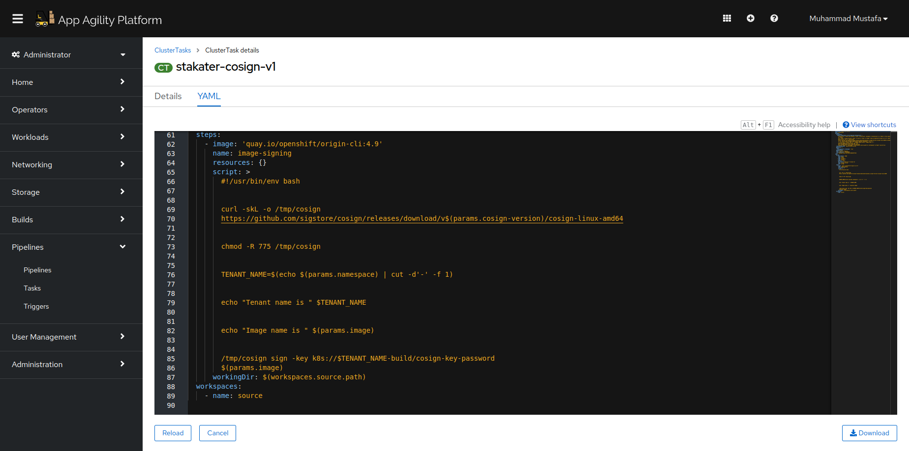
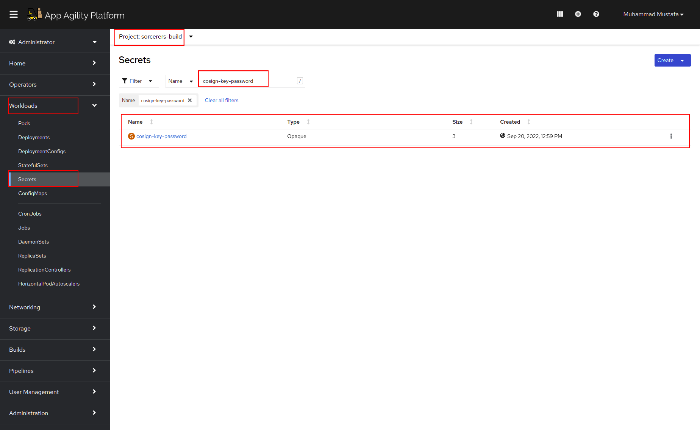

# Image Signing

> It is important to verify that the container image we deploy to our clusters has not been tampered and comes from a valid source. This is generally achieved by signing the image after building and verifying the signature before deployment. In this exercise, we will user `cosign` for creating, storing and verifying container image signatures.

_You can find more info about cosign here [Cosign documentation](https://docs.sigstore.dev/cosign/overview/)_

## Task

## SAAP Image Signing:

SAAP cluster is shipped with a `stakater-cosign-v1` task that signs image with key.

Lets view this task in our cluster:

1. To view the already defined Image Scanning/Checking Cluster Task, Open up the `Pipelines` section from the left menu and click `Tasks`

   
    
2. Select `ClusterTasks`. A number of tasks will be displayed on your screen. Type in `stakater-cosign-v1` in the search box that is displayed. Click `YAML` to display the task definition.

    

## Image Sign Key

Private key is used to sign the images and it is automatically saved as a secret in your `build` namespace alongside the password. Public key is used to verify the signed images. You can share your public key for people to verify your images but private one should not be shared or at least sealed before storing publicly. We are using Redhat Advanced Cluster Security to verify whether are images are signed or not.   

Navigate to Secrets under Workloads search for `cosign-key-password` in <TENANT_NAME>-build namespace

Now let's proceed to extend the pipelines with image signing step.

_This step makes more sense when you use an external image registry and share images across clusters or publicly._

#### Integrate the pipeline with Tekton:

- Add image signing stage to your pipeline
- [Tekton](8b-tekton.md) 
