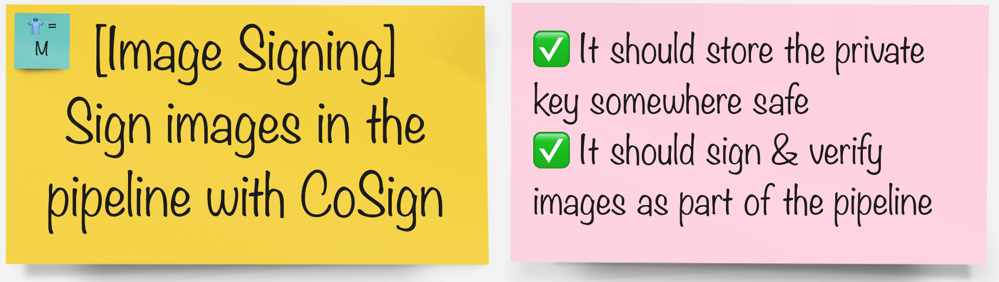

# Image Signing

> It is important to verify that the container image we deploy to our clusters has not been tampered and comes from a valid source. This is generally achieved by signing the image after building and verifying the signature before deployment. In this exercise, we will user `cosign` for creating, storing and verifying container image signatures.

## Task



## Before starting, generate your keys

1. Generate a keypair to use for signing images. It expects you to enter a password for private key. Feel free to select anything you like :)

    ```bash
    cd /tmp
    cosign generate-key-pair k8s://${TEAM_NAME}-ci-cd/${TEAM_NAME}-cosign --allow-insecure-registry
    ```

    You should get an output like this:
    <div class="highlight" style="background: #f7f7f7">
    <pre><code class="language-bash">
    $ cosign generate-key-pair k8s://${TEAM_NAME}-ci-cd/${TEAM_NAME}-cosign --allow-insecure-registry
    Enter password for private key:
    Enter again:
    Successfully created secret cosign in namespace <TEAM_NAME>-ci-cd
    Public key written to cosign.pub
    </code></pre></div>

    You just generated two keys (one private key, one public key). Private key is used to sign the images and it is automatically saved as a secret in your `ci-cd` namespace alongside the password you choose. Public key is used to verify the signed images. You can share your public key for people to verify your images but private one should not be shared or at least sealed before storing publicly.

    <p class="tip">
    🐌 THIS IS NOT GITOPS - The generated private key is stored in a Kubernetes secret in you <TEAM_NAME>-ci-cd project. We'll leave it as an exercise to the reader to extract and store this as a SealedSecret instead! 🐎
    </p>


Now let's proceed to extend the pipelines with image signing step.

_This step makes more sense when you use an external image registry and share images across clusters or publicly._

#### In your groups pick the tool you'd like to integrate the pipeline with:

| 🐈‍⬛ **Jenkins Group** 🐈‍⬛  |  🐅 **Tekton Group** 🐅 |
|-----------------------|----------------------------|
| * Add image signing stage to your pipeline | * Add image signing task to your pipeline |
| <span style="color:blue;">[jenkins](3-revenge-of-the-automated-testing/8a-jenkins.md)</span> | <span style="color:blue;">[tekton](3-revenge-of-the-automated-testing/8b-tekton.md)</span> |
