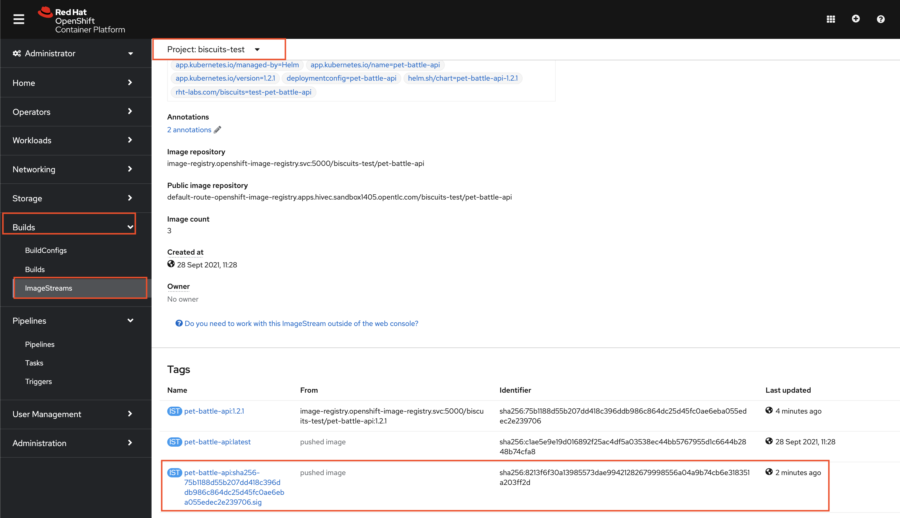

## Extend Tekton Pipeline with Image Signing

1. Add a task into our codebase to sign our built images.

    ```bash
    cd /projects/tech-exercise
    cat <<'EOF' > tekton/templates/tasks/image-signing.yaml
    apiVersion: tekton.dev/v1beta1
    kind: Task
    metadata:
      name: image-signing
    spec:
      workspaces:
        - name: output
      params:
        - name: APPLICATION_NAME
          description: Name of the application
          type: string
        - name: TEAM_NAME
          description: Name of the team that doing this exercise :)
          type: string
        - name: VERSION
          description: Version of the application
          type: string
        - name: COSIGN_VERSION
          type: string
          description: Version of cosign CLI
          default: 1.0.0
        - name: WORK_DIRECTORY
          description: Directory to start build in (handle multiple branches)
          type: string
      steps:
        - name: image-signing
          image: quay.io/openshift/origin-cli:4.9
          workingDir: $(workspaces.output.path)/$(params.WORK_DIRECTORY)
          script: |
            #!/usr/bin/env bash
            curl -skL -o /tmp/cosign https://github.com/sigstore/cosign/releases/download/v$(params.COSIGN_VERSION)/cosign-linux-amd64
            chmod -R 775 /tmp/cosign

            oc registry login
            /tmp/cosign sign -key k8s://$(params.TEAM_NAME)-ci-cd/$(params.TEAM_NAME)-cosign `oc registry info`/$(params.TEAM_NAME)-test/$(params.APPLICATION_NAME):$(params.VERSION) --allow-insecure-registry
    EOF
    ```

2. Let's add this task into pipeline. Edit `tekton/templates/pipelines/maven-pipeline.yaml` and copy below yaml where the placeholder is.

    ```yaml
        # Cosign Image Sign
        - name: image-signing
          runAfter:
          - verify-deployment
          taskRef:
            name: image-signing
          workspaces:
            - name: output
              workspace: shared-workspace
          params:
            - name: APPLICATION_NAME
              value: "$(params.APPLICATION_NAME)"
            - name: TEAM_NAME
              value: "$(params.TEAM_NAME)"
            - name: VERSION
              value: "$(tasks.maven.results.VERSION)"
            - name: WORK_DIRECTORY
              value: "$(params.APPLICATION_NAME)/$(params.GIT_BRANCH)"
    ```

3. It's not real unless it's in git, right?

    ```bash
    # git add, commit, push your changes..
    cd /projects/tech-exercise
    git add .
    git commit -m  "👨‍🎤 ADD - image-signing-task 👨‍🎤"
    git push
    ```

4. Store the public key in `pet-battle-api` repository for anyone who would like to verify our images. This push will also trigger the pipeline.

    ```bash
    cp /tmp/cosign.pub /projects/pet-battle-api/
    cd /projects/pet-battle-api
    git add cosign.pub
    git commit -m  "🪑 ADD - cosign public key for image verification 🪑"
    git push
    ```

    🪄 Observe the **pet-battle-api** pipeline running with the **image-sign** task.

    After the task successfully finish, go to OpenShift UI > Builds > ImageStreams and select `pet-battle-api`. You'll see a tag ending with `.sig` which shows you that this is image signed. 

    

5. Let's verify the signed image with the public key. Make sure you use the right `APP VERSION` for the image. (`1.3.1` in this case)

    ```bash
    cd /projects/pet-battle-api
    oc registry login $(oc registry info) --insecure=true
    cosign verify --key k8s://<TEAM_NAME>-ci-cd/<TEAM_NAME>-cosign default-route-openshift-image-registry.<CLUSTER_DOMAIN>/<TEAM_NAME>-test/pet-battle-api:1.3.1 --allow-insecure-registry
    ```

    The output should be like:

    <div class="highlight" style="background: #f7f7f7">
    <pre><code class="language-bash">
    Verification for default-route-openshift-image-registry.<CLUSTER_DOMAIN>/<TEAM_NAME>-test/pet-battle-api:1.3.1 --
    The following checks were performed on each of these signatures:
      - The cosign claims were validated
      - The signatures were verified against the specified public key
      - Any certificates were verified against the Fulcio roots.
    {"critical":{"identity":{"docker-reference":"default-route-openshift-image-registry.<CLUSTER_DOMAIN>/<TEAM_NAME>-test/pet-battle-api"},"image":{"docker-manifest-digest":"sha256:1545e1d2cf0afe5df99fe5f1d39eef8429a2018c3734dd3bdfcac5a068189e39"},"type":"cosign container image signature"},"optional":null}
    </code></pre></div>
