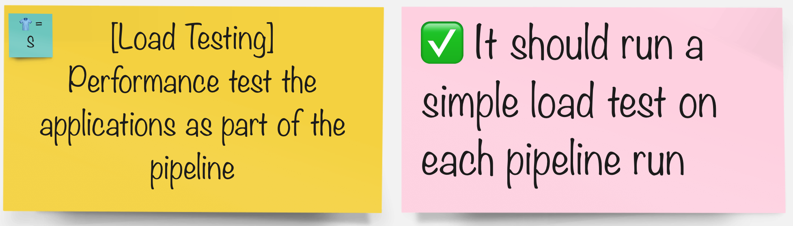

### Load Testing

Load testing helps us to understand how our application behaves in production. Even the application passes all functional tests, if it doesn't perform well, the endusers become unhappy.
For that reason, we shoud understand how our users interract with our applications and set realistic benchmarkes for performance.

### Task

🐈‍⬛ `Jenkins Group` 🐈‍⬛

- [ ] A
- [ ] B
- [ ] C
- [jenkins](3-revenge-of-the-automated-testing/9a-jenkins.md)

🐅 `Tekton Group` 🐅

- [ ] A
- [ ] B
- [ ] C
- [tekton](3-revenge-of-the-automated-testing/9b-tekton.md)
