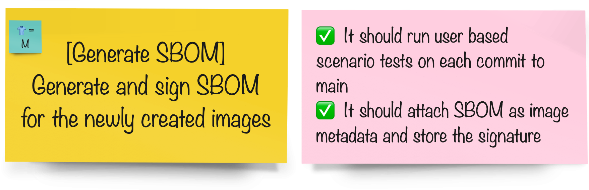

# Generate and Attest SBOM

> SBOM refers to the Software Bill of Materials. An SBOM reflects what is in a particular build. It provides transparency and visibility into the produced components of the software organizations market and use. Basically it's the list of components that software contains. It allows you to keep track of the security vulnerabilities of each component of the application to make sure everything is up-to-date and secure.

SBOM doesn’t hold much value without an attestation or assurance that the code you received is the code that was released. An attestation is cryptographically-signed metadata used to verify the integrity of an event or artifact, known as a predicate. In this case, the SBOM is the predicate, and the attestation is the metadata that verifies the code within an SBOM. An attestation with an SBOM should be generated as part of the build process, to assure that the SBOM hasn’t been tampered with before being attached to an image. <a href="https://next.redhat.com/2022/10/27/establishing-a-secure-pipeline/"><sup>[1]</sup></a>

In this exercise, we'll use [Syft](https://github.com/anchore/syft) to generate SBOM. Then, we use `cosign` to attach the produced SBOM document to the image metadata and store the signature and certificate in  public [Rekor Server](https://rekor.sigstore.dev) transparency log _so please do not use any personal data🫣_ 

## Task



## Before starting, generate your keys

<p class="warn">
⛷️ <b>NOTE</b> ⛷️ - If you've done <a href="/tech-exercise/#/3-revenge-of-the-automated-testing/8-image-signing">Image Signing</a> exercise and already generated your keys in <TEAM_NAME>-ci-cd namespace, you can skip the *first* step. We will use the same key to attest SBOMs.
</p>


1. Generate a keypair to use for signing images. It expects you to enter a password for private key. Feel free to select anything you like :)

    ```bash
    cd /tmp
    cosign generate-key-pair k8s://<TEAM_NAME>-ci-cd/<TEAM_NAME>-cosign 
    ```

    You should get an output like this:
    <div class="highlight" style="background: #f7f7f7">
    <pre><code class="language-bash">
    $ cosign generate-key-pair k8s://<TEAM_NAME>-ci-cd/<TEAM_NAME>-cosign
    Enter password for private key:
    Enter again:
    Successfully created secret cosign in namespace <TEAM_NAME>-ci-cd
    Public key written to cosign.pub
    </code></pre></div>

    You just generated two keys (one private key, one public key). Private key is used to sign the images and it is automatically saved as a secret in your `ci-cd` namespace alongside the password you choose. Public key is used to verify the signed images. You can share your public key for people to verify your images but private one should not be shared or at least sealed before storing publicly.

    <p class="tip">
    🐌 THIS IS NOT GITOPS - The generated private key is stored in a Kubernetes secret in you <TEAM_NAME>-ci-cd project. We'll leave it as an exercise to the reader to extract and store this as a SealedSecret instead! 🐎
    </p>

    <p class="tip">
    😱 If `cosign` command returns error, that means you logged out of the cluster so please run the below command and then run the cosign command again.
    </p>

    ```bash
    oc login --server=https://api.${CLUSTER_DOMAIN##apps.}:6443 -u <USER_NAME> -p <PASSWORD>
    ```

    
2. Let's try and see what is an SBOM:

    ```bash
    syft quay.io/petbattle/pet-battle-api:latest
    ```
    You should get a long list output like this one:
    <div class="highlight" style="background: #f7f7f7">
    <pre><code class="language-bash">
    $ syft quay.io/petbattle/pet-battle-api:latest
    ✔ Parsed image            
    ✔ Cataloged packages      [471 packages]
    NAME                 VERSION                    TYPE         
    HdrHistogram         2.1.12                     java-archive  
    LatencyUtils         2.0.3                      java-archive  
    alsa-lib             1.2.8-3.el9                rpm 
    ....
    </code></pre></div>

3. And `cosign` has an all-in-one command to list known security related artifacts of an image. If we want to check this image:

    ```bash
    cosign tree quay.io/petbattle/pet-battle-api:latest
    ```

    We'll see that this image signed with a private key and SBOM is attached:
    <div class="slider" style="background: #f7f7f7">
    <pre><code class="slide">
    <pre><code class="language-bash">
    📦 Supply Chain Security Related artifacts for an image: quay.io/petbattle/pet-battle-api:latest
    └── 💾 Attestations for an image tag: quay.io/petbattle/pet-battle-api:sha256-ce4f9101b2bf09e89605012c3eb6a4bbeaaee82cd51c1af55a4b4f622b11d504.att
        └── 🍒 sha256:c61c9c15f782670c6e521a4f09482ced2854387d6c5fa39378c37d296ff3a181
    └── 🔐 Signatures for an image tag: quay.io/petbattle/pet-battle-api:sha256-ce4f9101b2bf09e89605012c3eb6a4bbeaaee82cd51c1af55a4b4f622b11d504.sig
        └── 🍒 sha256:d45e1aa311163335366032bf901eea430c72eb870e386c1359e4ae17bfc4af3d
    └── 📦 SBOMs for an image tag: quay.io/petbattle/pet-battle-api:sha256-ce4f9101b2bf09e89605012c3eb6a4bbeaaee82cd51c1af55a4b4f622b11d504.sbom
        └── 🍒 sha256:3cd8b8f7f181414447e1035ee681aebd41a1d3608e8eaecf2c516d36ee4df45c
    </pre></code>
    </code></pre></div>

Now let's proceed to extend the pipelines with generate and attest SBOM step.

_This step makes more sense when you use an external image registry and share images across clusters or publicly._

#### In your groups pick the tool you'd like to integrate the pipeline with:

| 🐈‍⬛ **Jenkins Group** 🐈‍⬛  |  🐅 **Tekton Group** 🐅 |
|-----------------------|----------------------------|
| * Generate SBOM with Syft in our pipeline| * Generate SBOM with Syft in our pipeline |
| * Sign, attach and attest SBOM | * Sign, attach and attest SBOM |
| <span style="color:blue;">[jenkins](3-revenge-of-the-automated-testing/9a-jenkins.md)</span> | <span style="color:blue;">[tekton](3-revenge-of-the-automated-testing/9b-tekton.md)</span> |