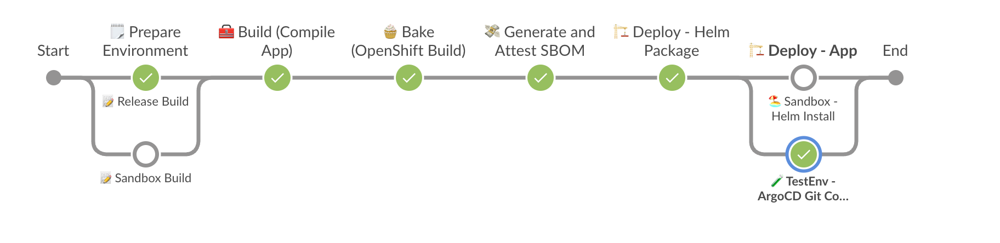
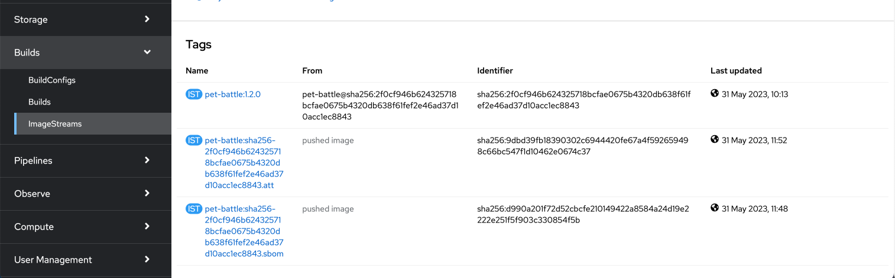

## Extend Jenkins Pipeline with Generating and Attesting SBOM

1. Add a new stage into Jenkinsfile with SBOM steps. Copy the below block into the right placeholder:

    ```groovy
            // 💸 SBOM EXAMPLE GOES HERE
            stage("💸 Generate and Attest SBOM") {
                agent { label "jenkins-agent-cosign" }           
                options {
                        skipDefaultCheckout(true)
                }
                steps {
                    script {
                        sh '''
                        curl -sSfL https://raw.githubusercontent.com/anchore/syft/main/install.sh | sh -s -- -b /tmp/
                        oc registry login
                        /tmp/syft -o spdx `oc registry info`/${DESTINATION_NAMESPACE}/${APP_NAME}:${VERSION} > ${DESTINATION_NAMESPACE}-${APP_NAME}-${VERSION}.sbom
                        cosign attach sbom --sbom ${DESTINATION_NAMESPACE}-${APP_NAME}-${VERSION}.sbom `oc registry info`/${DESTINATION_NAMESPACE}/${APP_NAME}:${VERSION}
                        cosign attest --key k8s://${TEAM_NAME}-ci-cd/${TEAM_NAME}-cosign --yes --predicate ${DESTINATION_NAMESPACE}-${APP_NAME}-${VERSION}.sbom `oc registry info`/${DESTINATION_NAMESPACE}/${APP_NAME}:${VERSION}
                        '''
                    }
                }
            }
    ```

3. Store the public key in `pet-battle` repo for anyone who would like to verify our image, alongside the Jenkinsfile changes. This push will trigger a Jenkins job for build as well.

    ```bash
    cp /tmp/cosign.pub /projects/pet-battle/
    cd /projects/pet-battle
    git add cosign.pub Jenkinsfile
    git commit -m  "⛹️ ADD - cosign public key and Jenkinsfile updated ⛹️"
    git push
    ```

    🪄 Observe the **pet-battle** pipeline running with the **SBOM** stage.
    

    After the pipeline succesfully finish, go to OpenShift UI > Builds > ImageStreams inside `<TEAM_NAME>-test` namespace and select `pet-battle`. You'll see a tag ending with `.sbom` and `.att` which shows you that an attestation for the SBOM predicate attached. With this, the SBOM is signed (and therefore tamper-proof) as it is within an attestation, and consumers can validate its authenticity.

    


4. Let's verify the signed image with the public key. Make sure you use the right `APP VERSION` for the image. (`1.2.0` in this case)

    ```bash
    cd /projects/pet-battle
    oc registry login $(oc registry info) --insecure=true
    cosign tree default-route-openshift-image-registry.<CLUSTER_DOMAIN>/<TEAM_NAME>-test/pet-battle:1.2.0 --allow-insecure-registry
    ```

    The output should be like:

    <div class="slider" style="background: #f7f7f7">
    <pre><code class="slide">
    <pre><code class="language-bash">
    📦 Supply Chain Security Related artifacts for an image: default-route-openshift-image-registry.<CLUSTER_DOMAIN>/<TEAM_NAME>-test/pet-battle:1.2.0
    └── 💾 Attestations for an image tag: default-route-openshift-image-registry.<CLUSTER_DOMAIN>/<TEAM_NAME>-test/pet-battle:sha256-2f0cf946b624325718bcfae0675b4320db638f61fef2e46ad37d10acc1ec8843.att
        └── 🍒 sha256:cf27bc99880d1f63f3cdcebda6dc216d97ea77f4f36a20faad4a4e1494336641
    └── 📦 SBOMs for an image tag: default-route-openshift-image-registry.<CLUSTER_DOMAIN>/<TEAM_NAME>-test/pet-battle:sha256-2f0cf946b624325718bcfae0675b4320db638f61fef2e46ad37d10acc1ec8843.sbom
        └── 🍒 sha256:d07f074cb397727fb52798dc98da39aef43dcbb863f4e7cf8de17b39fe8ba9dd
    </pre></code>
    </code></pre></div>
