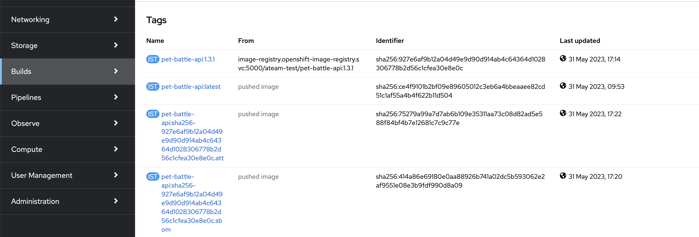

## Extend Tekton Pipeline with Generating and Attesting SBOM

1. Add a task into our codebase to generate and store SBOM.

    ```bash
    cd /projects/tech-exercise
    cat <<'EOF' > tekton/templates/tasks/generate-sbom.yaml
    apiVersion: tekton.dev/v1beta1
    kind: Task
    metadata:
      name: generate-sbom
    spec:
      workspaces:
        - name: output
      params:
        - name: APPLICATION_NAME
          description: Name of the application
          type: string
        - name: TEAM_NAME
          description: Name of the team that doing this exercise :)
          type: string
        - name: VERSION
          description: Version of the application
          type: string
        - name: COSIGN_VERSION
          type: string
          description: Version of cosign CLI
          default: 2.5.0
        - name: WORK_DIRECTORY
          description: Directory to start build in (handle multiple branches)
          type: string
      steps:
        - name: generate-sbom
          image: quay.io/openshift/origin-cli:4.12
          workingDir: $(workspaces.output.path)/$(params.WORK_DIRECTORY)
          script: |
            #!/usr/bin/env bash
            curl -sSfL https://raw.githubusercontent.com/anchore/syft/main/install.sh | sh -s -- -b /tmp
            chmod -R 775 /tmp/syft

            curl -skL -o /tmp/cosign https://github.com/sigstore/cosign/releases/download/v$(params.COSIGN_VERSION)/cosign-linux-amd64
            chmod -R 775 /tmp/cosign

            oc registry login
            SYFT_REGISTRY_INSECURE_SKIP_TLS_VERIFY="true" /tmp/syft -o spdx `oc registry info`/$(params.TEAM_NAME)-test/$(params.APPLICATION_NAME):$(params.VERSION) > $(params.TEAM_NAME)-test-$(params.APPLICATION_NAME)-$(params.VERSION).sbom
            /tmp/cosign attach sbom --allow-insecure-registry=true --sbom $(params.TEAM_NAME)-test-$(params.APPLICATION_NAME)-$(params.VERSION).sbom `oc registry info`/$(params.TEAM_NAME)-test/$(params.APPLICATION_NAME):$(params.VERSION)
            /tmp/cosign attest --allow-insecure-registry=true --key k8s://$(params.TEAM_NAME)-ci-cd/$(params.TEAM_NAME)-cosign --yes --predicate $(params.TEAM_NAME)-test-$(params.APPLICATION_NAME)-$(params.VERSION).sbom `oc registry info`/$(params.TEAM_NAME)-test/$(params.APPLICATION_NAME):$(params.VERSION)
    EOF
    ```

2. Let's add this task into pipeline. Edit `tekton/templates/pipelines/maven-pipeline.yaml` and copy below yaml where the placeholder is. Make sure you update `runAfter` accordingly.

    ```yaml
        # Syft Sbom Generate
        - name: generate-sbom
          runAfter:
          - image-signing
          taskRef:
            name: generate-sbom
          workspaces:
            - name: output
              workspace: shared-workspace
          params:
            - name: APPLICATION_NAME
              value: "$(params.APPLICATION_NAME)"
            - name: TEAM_NAME
              value: "$(params.TEAM_NAME)"
            - name: VERSION
              value: "$(tasks.maven.results.VERSION)"
            - name: WORK_DIRECTORY
              value: "$(params.APPLICATION_NAME)/$(params.GIT_BRANCH)"
    ```

3. We said this before; If it's not real unless it's in git ✨

    ```bash
    # git add, commit, push your changes..
    cd /projects/tech-exercise
    git add .
    git commit -m  "🤑 ADD - generate and attest SBOM task 🤑"
    git push
    ```

4. Store the public key in `pet-battle-api` repository for anyone who would like to verify our images. This push will also trigger the pipeline.

    ```bash
    cp /tmp/cosign.pub /projects/pet-battle-api/
    cd /projects/pet-battle-api
    git add cosign.pub
    git commit -m  "🫛 ADD - cosign public key for image verification 🫛"
    git push
    ```

    🪄 Observe the **pet-battle-api** pipeline running with the **image-sign** task.

    After the task successfully finish, go to OpenShift UI > Builds > ImageStreams and select `pet-battle-api`. You'll see a tag ending with `.sbom` and `.att` which shows you that an attestation for the SBOM predicate attached. With this, the SBOM is signed (and therefore tamper-proof) as it is within an attestation, and consumers can validate its authenticity.

    

5.  Let's verify the signed image with the public key. Make sure you use the right `APP VERSION` for the image. (`1.3.1` in this case)

    ```bash
    cd /projects/pet-battle-api
    oc registry login $(oc registry info) --insecure=true
    cosign tree default-route-openshift-image-registry.<CLUSTER_DOMAIN>/<TEAM_NAME>-test/pet-battle-api:1.3.1 --allow-insecure-registry
    ```

    The output should be like:

    <div class="slider" style="background: #f7f7f7">
    <pre><code class="slide">
    <pre><code class="language-bash">
    📦 Supply Chain Security Related artifacts for an image: default-route-openshift-image-registry.<CLUSTER_DOMAIN>/<TEAM_NAME>-test/pet-battle-api:1.3.1
    └── 💾 Attestations for an image tag: default-route-openshift-image-registry.apps.cluster-gqz4b.gqz4b.sandbox763.opentlc.com/ateam-test/pet-battle-api:sha256-927e6af9b12a04d49e9d90d914ab4c64364d1028306778b2d56c1cfea30e8e0c.att
      └── 🍒 sha256:04b22f0cb09d322083ebe6f580b4ac4af6889734f0c5ab81a264b2c2397696b2
    └── 📦 SBOMs for an image tag: default-route-openshift-image-registry.apps.cluster-gqz4b.gqz4b.sandbox763.opentlc.com/ateam-test/pet-battle-api:sha256-927e6af9b12a04d49e9d90d914ab4c64364d1028306778b2d56c1cfea30e8e0c.sbom
      └── 🍒 sha256:854c9b42c8385ca83d4b715fdcdd71f2965b82e6c6b79ebc8b73189832205fca
    </pre></code>
    </code></pre></div>
