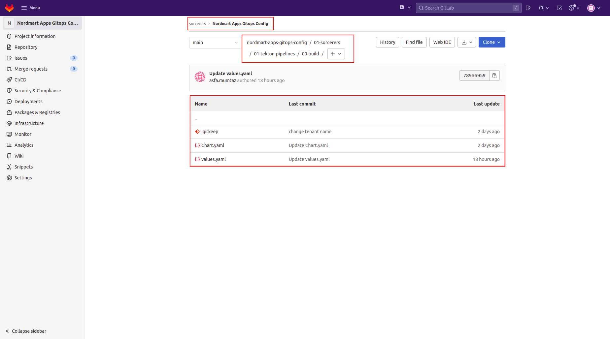
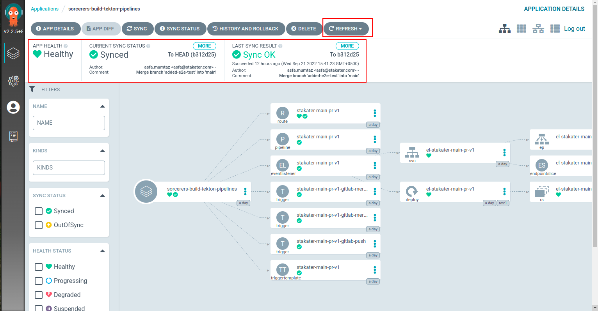
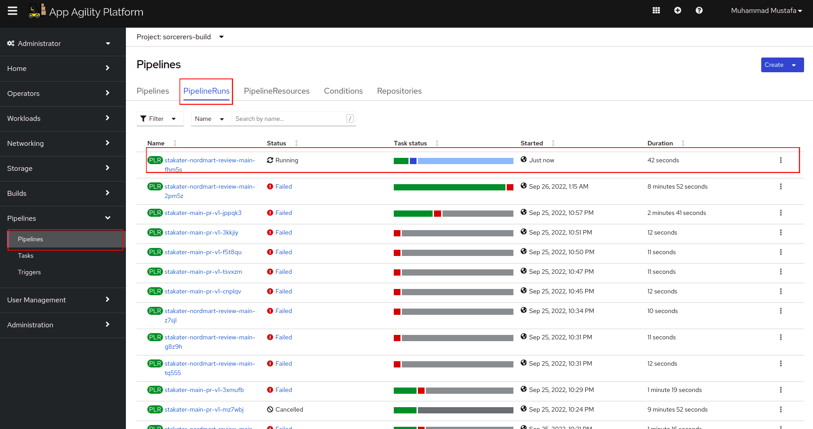
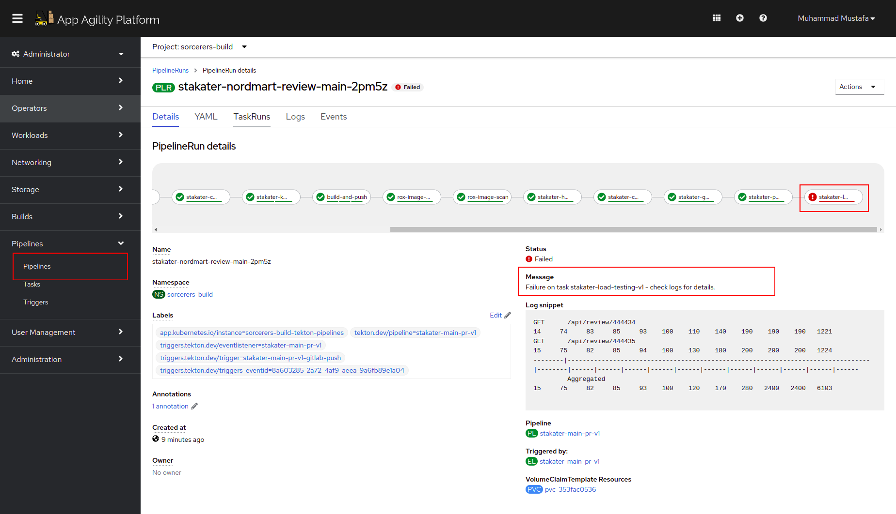
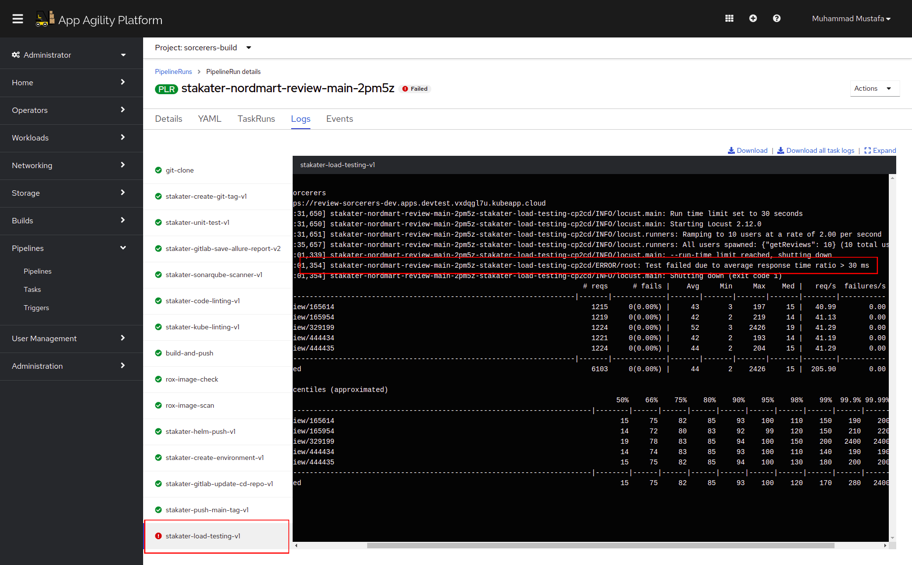
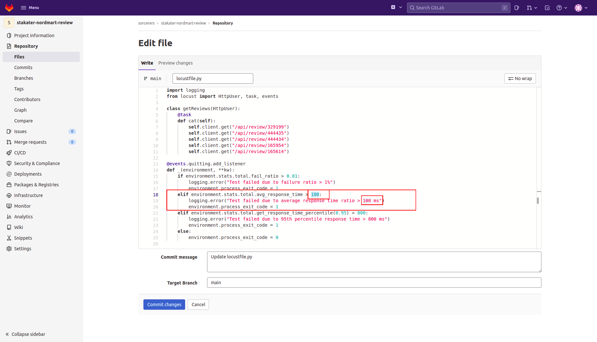
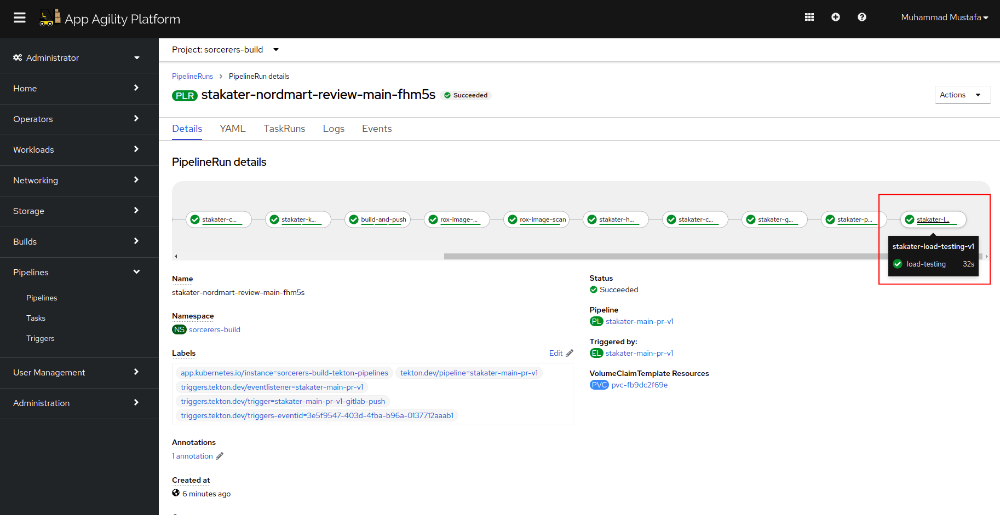
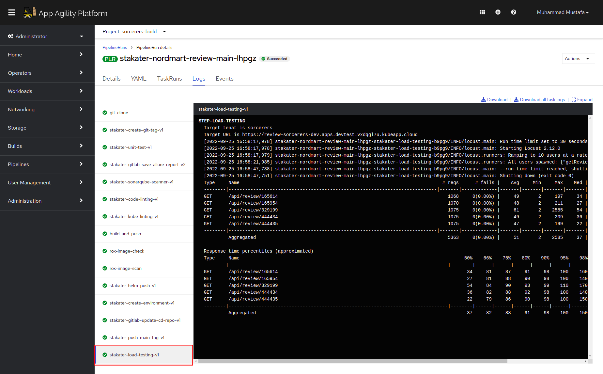

# Extend Tekton Pipeline with Load Testing (WIP)

In this section we are going to improve our already built `main-pr-v1` pipeline and add stakater-load-test-v1 task into the pipeline.
The SAAP cluster is shipped with many useful predefined cluster tasks including **stakater-load-testing-v1**.  

Lets add this task into our pipeline  **stakater-load-testing-v1**.

1. Open the Chart we added to 00-tekton-pipelines folder in section 2.
  

2. Open the `values.yaml` file in the editor. 

    ```
    - defaultTaskName: stakater-load-testing-v1
    ```

    The pipeline will now become:
    <div class="highlight" style="background: #f7f7f7">
    <pre><code class="language-yaml">apiVersion: v2
   pipeline-charts:
      name: stakater-main-pr-v1
      workspaces:
      - name: source
        volumeClaimTemplate:
          accessModes: ReadWriteOnce
          resourcesRequestsStorage: 1Gi
      pipelines:
        tasks:
          - defaultTaskName: git-clone
          - defaultTaskName: stakater-create-git-tag-v1
          - defaultTaskName: stakater-unit-test-v1
          - taskRef:
              task: allure-post-report
              kind: Task
            name: allure-post-report
            workspaces:
              - name: source
                workspace: source
            params: 
              - name: APPLICATION_NAME
              - name: IMAGE
              - name: WORK_DIRECTORY
              - name: ALLURE_HOST
          - defaultTaskName: stakater-sonarqube-scanner-v1
            runAfter:
              - allure-post-report
          - defaultTaskName: stakater-code-linting-v1
            runAfter:
              - stakater-sonarqube-scanner-v1
          - defaultTaskName: stakater-kube-linting-v1
            runAfter:
              - stakater-code-linting-v1
            params:
              - name: namespace
          - defaultTaskName: stakater-buildah-v1
            params:
              - name: BUILD_IMAGE
                value: "true"
            name: build-and-push
          - defaultTaskName: rox-image-check
          - defaultTaskName: rox-image-scan
          - defaultTaskName: stakater-helm-push-v1
          - defaultTaskName: stakater-create-environment-v1
          - defaultTaskName: stakater-gitlab-update-cd-repo-v1
          <span style="color:orange">- defaultTaskName: stakater-load-testing-v1</span>          
            params:
              - name: gitlab_group
          - defaultTaskName: stakater-push-main-tag-v1
      triggertemplate:
           params:
             - name: repoName
             - name: prnumberBranch
               default: "main"
      eventlistener:
        triggers:               
          - name: gitlab-mergerequest-create
            bindings:
              - ref: stakater-gitlab-merge-request-v1
              - name: oldcommit
                value: "NA"
              - name: newcommit
                value: $(body.object_attributes.last_commit.id)
          - name: gitlab-mergerequest-synchronize
            bindings:
              - ref: stakater-gitlab-merge-request-v1
              - name: oldcommit
                value: $(body.object_attributes.oldrev)
              - name: newcommit
                value: $(body.object_attributes.last_commit.id)
          - name: gitlab-push
            bindings:
              - ref: stakater-gitlab-push-v1
              - name: oldcommit
                value: $(body.before)
              - name: newcommit
                value: $(body.after)
          - name: nordmart-ci-mustafa-gitlab-push
            create: false
      rbac:
        enabled: false
      serviceAccount:
        name: stakater-workshop-tekton-builder
        create: false</code></pre></div>

3. Now open Argocd, Open the <TENANT_NAME>-build-tekton-pipelines application, trigger Refresh and  wait for the changes were synchronized.

    


4. If the sync is green, you're good to go. You have successfully added stakater-load-testing-v1 to your pipeline!
    
🪄🪄 Now lets observe the **stakater-nordmart-review** pipeline running with the **stakater-load-testing-v1** task.🪄🪄


5. Lets trigger our pipeline again by making a commit onto README.md in the main branch. Open the pipeline on openshift console. You ll notice our pipeline failed.

    

    


6. Navigate to TaskRuns and open the task `stakater-load-testing-v1` logs. We ll notice that our pipeline fails because our locustfile.py was configured to fail if average response time < 30ms.

    


7. Open the stakater-nordmart-review repository and edit the `locustfile.py` and change the average response time  to < 100ms.

    

    Commit to main branch and A pipeline will be initiated. Open the openshift console and navigate to PipelineRun.

    

8. Navigate to TaskRuns and open the task `stakater-load-testing-v1` logs. You ll see that the pipeline has succeeded after increasing the average response time in failure scenario.

    

    

🪄🪄 TADA. You ve successfully added load-testing to your pipeline🪄🪄

