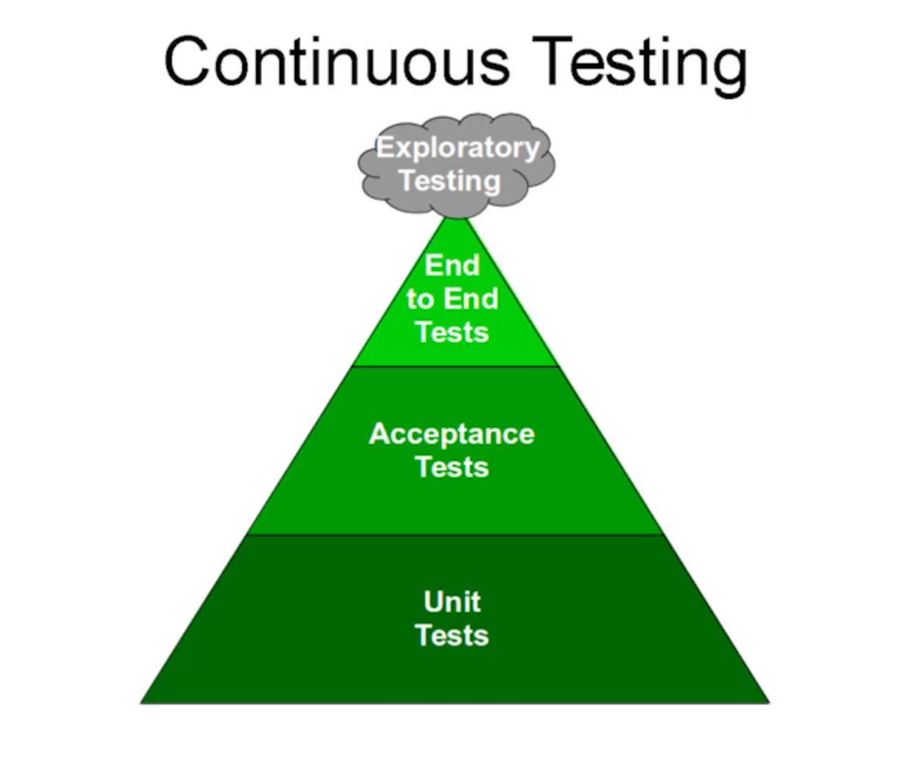

# Exercise 3 - Revenge of the Automated Testing

> Continuous Testing - End-to-end testing looks good, but is invariably bad because it will never catch all the bugs. What we really need is continuous testing.

Continuous Delivery needs rapid and reliable feedback. Investing in continuous testing is a worthwhile activity.

## 👨‍🍳 Exercise Intro

**Choose your own adventure...**

There are lots of things we can do under the heading of `Quality Gates`, so decide for yourselves what you'd like to do. In your table groups, create a Kanban with each of the exercise titles. Discuss among yourselves the order you'd like to do them in and as mobs / pairs etc take tasks from the list and implement them. At the end of each section, play back to the other group what you've accomplished. Then grab the next priortized item on your list!

## 🔨 Tools used in this exercise!
* Sonar - adding static code analysis to the pipelines
* Testing - add api, front end tests. Extend the pipleine with system tests and promote to staging environment.
* Image security - Cluster Security Operator operator showing vulnerabilities inside the images
* Coverage & linting - static code linter and coverage reports for our tests
* Image signing - sign your images 
* StackRox - provides image and host security
* ZAP - OWASP application scanning to check for common attack patterns
* Load Testing - Automated load tests in your pipeline

## 🔮 Learning Outcomes
- [ ] Add Learning Objectives
## 🖼️ Big Picture

