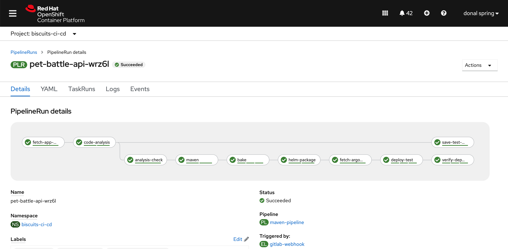
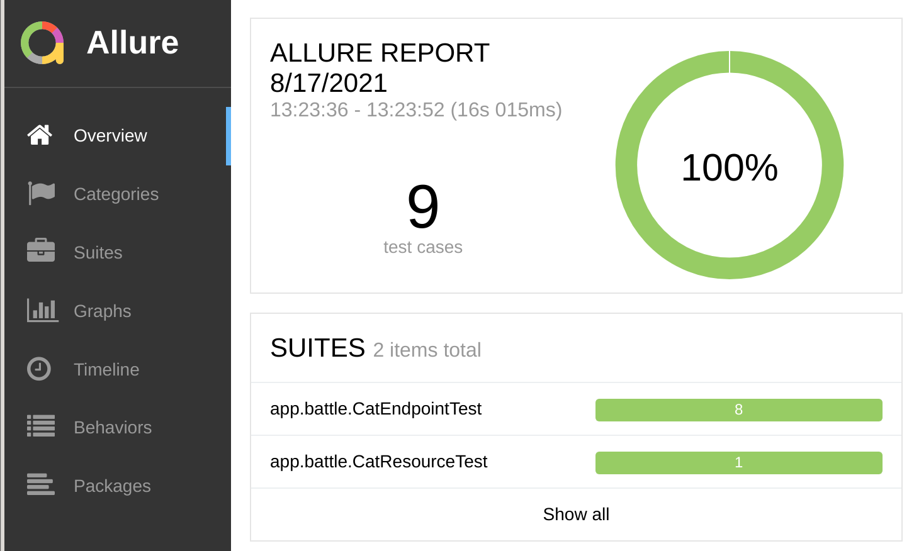
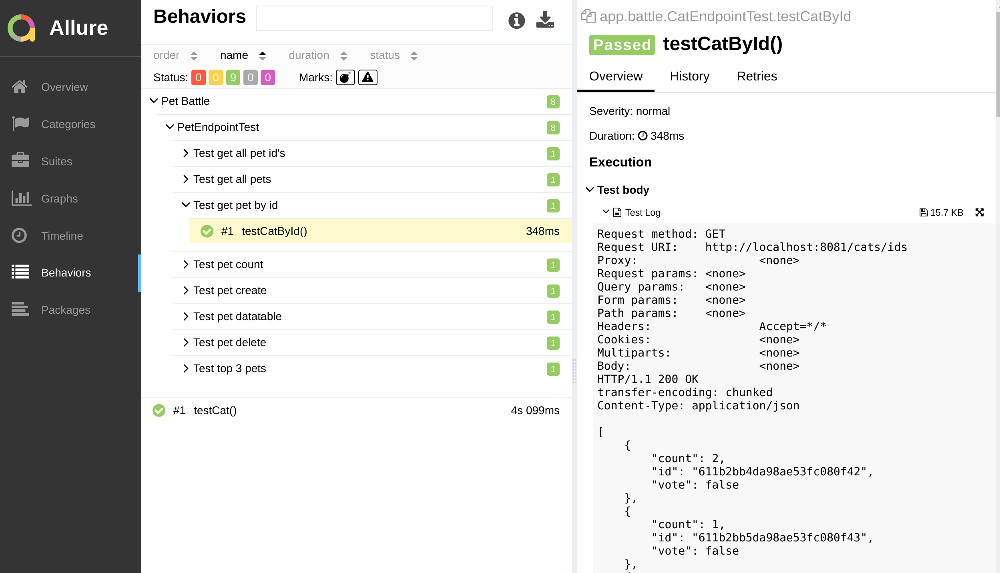
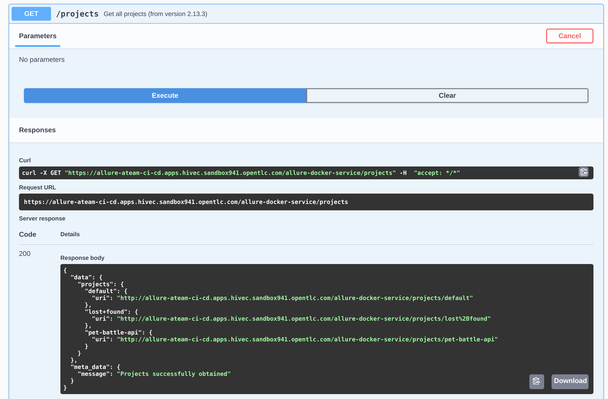

## Extend Tekton Pipeline with Automated Testing

> In this exercise we'll deploy Allure - a useful tool for managing your java tests and other reports from your CI/CD server. The exercise is in two parts: first we'll deploy Allure using gitOps and then add the tests to our pipeline

### Part 1 - Allure 

1. For this exercise, we will use a tool called **Allure**, a test repository manager for Java, but first let's create SealedSecrets object for username and password we'll use for this tool. This process should be pretty familiar by now 🃏🃏🃏

    ```bash
    cat << EOF > /tmp/allure-auth.yaml
    apiVersion: v1
    data:
      password: "$(echo -n password | base64 -w0)"
      username: "$(echo -n admin | base64 -w0)"
    kind: Secret
    metadata:
      name: allure-auth
    EOF
    ```

2. Use `kubeseal` commandline to seal the secret definition.

    ```bash
    kubeseal < /tmp/allure-auth.yaml > /tmp/sealed-allure-auth.yaml \
        -n ${TEAM_NAME}-ci-cd \
        --controller-namespace tl500-shared \
        --controller-name sealed-secrets \
        -o yaml
    ```

3. Grab the `encryptedData`:

    ```bash
    cat /tmp/sealed-allure-auth.yaml| grep -E 'username|password'
    ```

    Output should look something like this:
    <div class="highlight" style="background: #f7f7f7">
    <pre><code class="language-yaml">
        username: AgAj3JQj+EP23pnzu...
        password: AgAtnYz8U0AqIIaqYrj...
    </code></pre></div>

4. Open up `ubiquitous-journey/values-tooling.yaml` file and extend the **Sealed Secrets** entry. Copy the output of `username` and `password` from the previous command and update the values. Make sure you indent the data correctly.

    Find the Sealed Secrets entry:
    <div class="highlight" style="background: #f7f7f7">
    <pre><code class="language-yaml">
      # Sealed Secrets
      - name: sealed-secrets
        values:
          secrets:
    </code></pre></div>

    and add `allure-auth` entry:

    ```yaml
            - name: allure-auth
              type: Opaque
              data:
                username: AgAj3JQj+EP23pnzu...
                password: AgAtnYz8U0AqIIaqYrj...
    ```

5. While in the `ubiquitous-journey/value-tooling.yaml` file - install Allure by adding it's helm chart:

    ```yaml
      # Allure
      - name: allure
        enabled: true
        source: https://github.com/eformat/allure.git
        source_path: "chart"
        source_ref: "main"
        values:
          security:
            secret: allure-auth
    ```

6. Finally - push the changes to the repository:

    ```bash
    cd /projects/tech-exercise
    git add ubiquitous-journey/values-tooling.yaml
    git commit -m  "👩‍🏭 ADD - Allure tooling 👩‍🏭"
    git push 
    ```

    <p class="warn">If you get an error like <b>error: failed to push some refs to..</b>, please run <b><i>git pull</i></b>, then push your changes again by running above commands.</p>

7. You should see the Allure UI come up in a few moments after ArgoCD syncs it. You can browse the default project on Allure to verify it's up and running

    ```bash
    echo https://$(oc get route allure --template='{{ .spec.host }}' -n ${TEAM_NAME}-ci-cd)/allure-docker-service/projects/default/reports/latest/index.html
    ```

    

</br>
</br>

### Part 2 - Testing Tasks

1. In our IDE, let's create a tekton task to push our test scores to allure. Add the `allure-post-report.yaml` Task to the `tekton/templates/tasks/` folder.

    ```yaml
    cd /projects/tech-exercise
    cat <<'EOF' > tekton/templates/tasks/allure-post-report.yaml
    apiVersion: tekton.dev/v1beta1
    kind: Task
    metadata:
      name: allure-post-report
      labels:
        app.kubernetes.io/version: "0.2"
    spec:
      description: >-
        This task used for uploading test reports to allure
      workspaces:
        - name: output
      params:
        - name: APPLICATION_NAME
          type: string
          default: ""
        - name: IMAGE
          description: the image to use to upload results
          type: string
          default: "quay.io/openshift/origin-cli:4.9"
        - name: WORK_DIRECTORY
          description: Directory to start build in (handle multiple branches)
          type: string
        - name: ALLURE_HOST
          description: "Allure Host"
          default: "http://allure:5050"
        - name: ALLURE_SECRET
          type: string
          description: Secret containing Allure credentials
          default: allure-auth
      steps:
        - name: save-tests
          image: $(params.IMAGE)
          workingDir: $(workspaces.output.path)/$(params.WORK_DIRECTORY)
          env:
            - name: ALLURE_USERNAME
              valueFrom:
                secretKeyRef:
                  name: $(params.ALLURE_SECRET)
                  key: username
            - name: ALLURE_PASSWORD
              valueFrom:
                secretKeyRef:
                  name: $(params.ALLURE_SECRET)
                  key: password
          script: |
            #!/bin/bash
            curl -sLo send_results.sh https://raw.githubusercontent.com/eformat/allure/main/scripts/send_results.sh && chmod 755 send_results.sh
            ./send_results.sh $(params.APPLICATION_NAME) \
              $(workspaces.output.path)/$(params.WORK_DIRECTORY) \
              ${ALLURE_USERNAME} \
              ${ALLURE_PASSWORD} \
              $(params.ALLURE_HOST)
    EOF
    ```

2. Open the maven pipeline (`/projects/tech-exercise/tekton/templates/pipelines/maven-pipeline.yaml`) and add the `save-test-results` step to our pipeline.

    ```yaml
        # Save Test Results
        - name: save-test-results
          taskRef:
            name: allure-post-report
          params:
            - name: APPLICATION_NAME
              value: "$(params.APPLICATION_NAME)"
            - name: WORK_DIRECTORY
              value: "$(params.APPLICATION_NAME)/$(params.GIT_BRANCH)"
          runAfter:
            - maven
          workspaces:
            - name: output
              workspace: shared-workspace
    ```

3. **(Optional)** Only perform this step if you **did not** perform the previous testing section [3. Revenge of the Automated Testing / Sonarqube / Tekton](./3-revenge-of-the-automated-testing%2F1b-tekton.md#extend-tekton-pipeline-with-sonar-scanning). Otherwise skip this step. Open the maven pipeline (`/projects/tech-exercise/tekton/templates/pipelines/maven-pipeline.yaml`) and **remove** the `skipTests` argument from the pipeline. This will ensure that our unit tests are run.

    Change the build options from this:
    <div class="highlight" style="background: #f7f7f7">
    <pre><code class="language-yaml">
    - name: maven
      params:
        - name: MAVEN_BUILD_OPTS
          value: "-Dquarkus.package.type=fast-jar <strong>-DskipTests"</strong>
    </code></pre></div>
    to this:
    <div class="highlight" style="background: #f7f7f7">
    <pre><code class="language-yaml">
    - name: maven
      params:
        - name: MAVEN_BUILD_OPTS
          value: "-Dquarkus.package.type=fast-jar"
    </code></pre></div>

4. Git add, commit, push your changes

    ```bash
    cd /projects/tech-exercise
    git add .
    git commit -m  "🥽 ADD - save-test-results step 🥽"
    git push 
    ```

5. Trigger a new `PipelineRun` with an empty commit and head over to OpenShift Pipelines to see the execution:

    ```bash
    cd /projects/pet-battle-api
    git commit --allow-empty -m "🧦 test save-test-results step 🧦"
    git push
    ```

    

6. Browse to the uploaded test results from the pipeline in Allure:

    ```bash
    echo https://$(oc get route allure --template='{{ .spec.host }}' -n ${TEAM_NAME}-ci-cd)/allure-docker-service/projects/pet-battle-api/reports/latest/index.html
    ```

    From here you can browse Test results + behaviours.

    

    and even drill down to test body attachments.

    

    <p class="warn"><b>TIP</b> You can also find the available projects and test reports from Allure swagger api by navigating to <span style="color:blue;"><a href="https://allure-<TEAM_NAME>-ci-cd.<CLUSTER_DOMAIN>/allure-docker-service/">https://allure-<TEAM_NAME>-ci-cd.<CLUSTER_DOMAIN>/allure-docker-service/</a></span></p>

    
