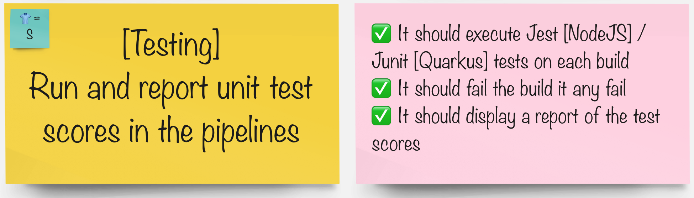

# Automated Testing

> Testing testing .... is this thing on?

Continuous Delivery needs rapid and reliable feedback. Investing in continuous testing is a worthwhile activity.

## Task

#### Integrate the pipeline with Tekton:

- Add Jest Testing to the pipeline 
- Add Junit and Alure test reporting to the pipeline 
- [tekton](3-revenge-of-the-automated-testing/2b-tekton.md)
