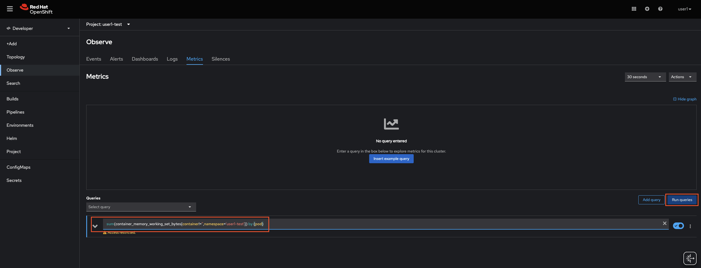
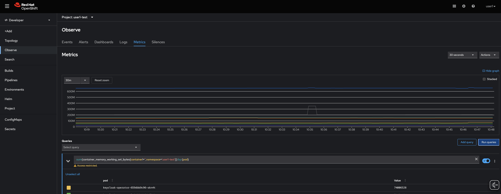
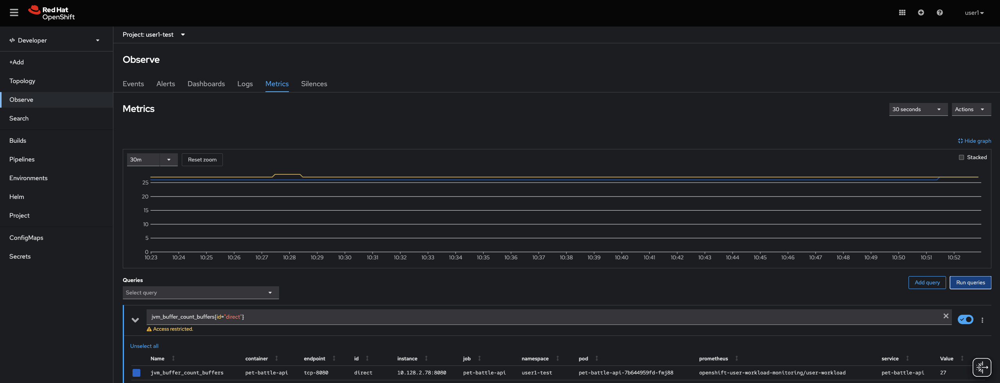
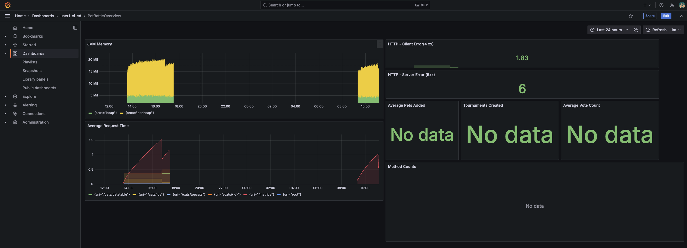
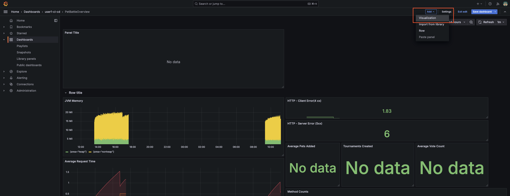
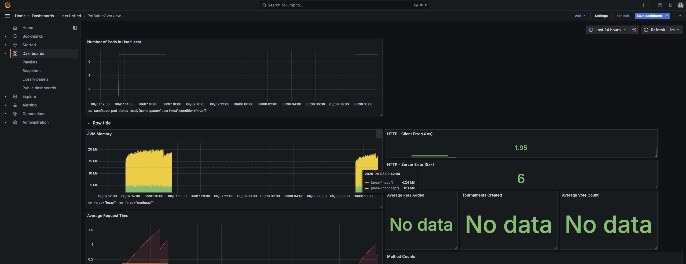

## User Workload Monitoring

OpenShift Container Platform includes a preconfigured, preinstalled, and self-updating monitoring stack that provides monitoring for core platform components. A cluster administrator can configure the monitoring stack with the supported configurations. OpenShift Container Platform delivers monitoring best practices out of the box.

A set of alerts are included by default that immediately notify administrators about issues with a cluster. Default dashboards in the OpenShift Container Platform web console include visual representations of cluster metrics to help you to quickly understand the state of your cluster. With the OpenShift Container Platform web console, you can access metrics and manage alerts.

Additionally, it is possible also having the option to enable  **monitoring for User-Defined Projects**, also known as **User Workload Monitoring**. By using this feature, cluster administrators, developers, and other users can specify how services and pods are monitored in their own projects, collecting metrics and generating custom alerts.

Please find more information about User-Defined Projects in the following <span style="color:blue;">[link](https://docs.redhat.com/en/documentation/openshift_container_platform/4.18/html/monitoring/configuring-user-workload-monitoring).</span>

### OCP Developer view Monitoring (pods etc)

1. To enable the User Workload Monitoring, a one line change has to be made to a config map and it's already been done for you.

    On the OpenShift UI, go to *Observe*, it should show basic health indicators

    

2. You can run queries across the namespace easily with `promql`, a query language for Prometheus. Run a `promql` query to get some info about the memory consumed by the pods in your test namespace

    ```bash
    sum(container_memory_working_set_bytes{container!='',namespace='<TEAM_NAME>-test'}) by (pod)
    ```

    
    

### Add Grafana & Service Monitor

> Let's super charge our monitoring with specific information about our cat based services ...

1. Lets Enable ServiceMonitor in PetBattle apps.

    OpenShift gathers the base metrics to see how our pods are doing. In order to get application specific metrics (like response time or active users etc) alongside the base ones, we need another object: _ServiceMonitor_. ServiceMonitor will let Prometheus know which endpoint the metrics are exposed so that Prometheus can scrape them. And once the Prometheus has the metrics, we can run query on them (just like we did before!) and create shiny dashboards!

    **Example** ServiceMonitor object:

    <div class="highlight" style="background: #f7f7f7">
    <pre><code class="language-yaml">
    ---
    apiVersion: monitoring.coreos.com/v1
    kind: ServiceMonitor
    metadata:
      name: my-app
    spec:
      endpoints:
        - interval: 30s
          port: tcp-8080 # port that metrics are exposed
          scheme: http
      selector:
        matchLabels:
          app: my-app
    </code></pre></div>

    Now, let's create add the `ServiceMonitor` for our PetBattle apps! Of course, we will do it through Helm and ArgoCD because this is GITOPS!!

    Our Helm Chart for pet-battle api Open up `tech-exercise/pet-battle/test/values.yaml` and `tech-exercise/pet-battle/stage/values.yaml` files. Update `values` for `pet-battle-api` with adding following:

    ```yaml
          servicemonitor: true
    ```

    Then push it to the git repo.

    ```bash
    cd /projects/tech-exercise
    git add .
    git commit -m "🖥️ ServiceMonitor enabled 🖥️"
    git push
    ```

    If you want to verify the object exists you can run from your terminal:

    ```bash
    oc get servicemonitor -n ${TEAM_NAME}-test -o yaml
    ```

    Additionally, after some seconds you will be able to run queries using the new metrics scraped by Prometheus:

    ```$bash
    jvm_buffer_count_buffers{id="direct"}
    ```

    

2. We can create our own application specific dashboards to display live data for ops use or efficiency or A/B test results. We will use Grafana to create dashboards and since it will be another tool, we need to install it through `ubiquitous-journey/values-tooling.yaml`

    ```yaml
      # Grafana
      - name: grafana
        enabled: true
        source: https://github.com/petbattle/pet-battle-infra.git
        source_path: grafana
    ```

3. Commit the changes to the repo as you've done before

    ```bash
    cd /projects/tech-exercise
    git add .
    git commit -m "📈 Grafana added 📈"
    git push
    ```

4. Once this change has been sync'd (you can check this in ArgoCD), Let's login to Grafana and view the predefined dashboards for Pet Battle;

    ```bash
    # get the route and open it in your browser
    echo https://$(oc get route pb-grafana-route --template='{{ .spec.host }}' -n ${TEAM_NAME}-ci-cd)
    ```

    If you use `Log in with OpenShift` to login and display dashboards - you user will only have `view` role which is read-only. This is alright in most cases, but we want to be able to edit and admin the boards.

5. The Dashboards should be showing some basic information and we can generate more data by firing some requests to the `pet-battle-api`. In your IDE, run on your terminal:

    ```bash
    curl -vkL $(oc get route/pet-battle-api -n ${TEAM_NAME}-test --template='{{.spec.host}}')/dogs
    curl -vkL -X POST -d '{"OK":"🐈"}' $(oc get route/pet-battle-api -n <TEAM_NAME>-test --template='{{.spec.host}}')/cats/
    curl -vkL $(oc get route/pet-battle-api -n ${TEAM_NAME}-test --template='{{.spec.host}}')/api/dogs
    curl -vkL -X POST -d '{"OK":"🦆"}' $(oc get route/pet-battle-api -n <TEAM_NAME>-test --template='{{.spec.host}}')/cats/
    curl -vkL $(oc get route/pet-battle-api -n ${TEAM_NAME}-test --template='{{.spec.host}}')/api/dogs
    curl -vkL -X POST -d '{"OK":"🐶"}' $(oc get route/pet-battle-api -n <TEAM_NAME>-test --template='{{.spec.host}}')/cats/
    ```

6. Back in Grafana, we should see some data populated into the `4xx` and `5xx` boards...

    

### Create a Dashboard

> Let's extend the Pet Battle Dashboard with a new `panel` to capture some metrics in a visual way for us. Configuring dashboards is easy through the Grafana UI. Then Dashboards are easily shared as they can be exported as a `JSON` document.

1. Once you've signed in, add a new panel clicking in **Edit**:

    

2. Once you are able to edit the dashboard, add a new panel clicking in **Add -> Visualisation**:

    

3. On the new panel, let's configure it to query for some information about our projects. We're going to use a very simple query to count the number of pods running in the namespace (feel free to use any other query). On the Panel settings, set the title to something sensible and add the query below. Hit save!

    ```bash
    sum(kube_pod_status_ready{namespace="<TEAM_NAME>-test",condition="true"})
    ```

    

4. Hit save! and review the final dashboard

    

5. With the new panel on our dashboard, let's see it in action by killing off some pods in our namespace

    ```bash
    oc delete pods -l app.kubernetes.io/instance=pet-battle-api -n ${TEAM_NAME}-test
    oc delete pods -l app.kubernetes.io/instance=pet-battle -n ${TEAM_NAME}-test
    ```

    <!-- -->

    <p class="tip">
    🐌 THIS IS NOT GITOPS - Manually configuring the dashboard is a good way to play with Grafana. See advanced exercises for creating and storing the dashboard as code 🐎
    </p>
