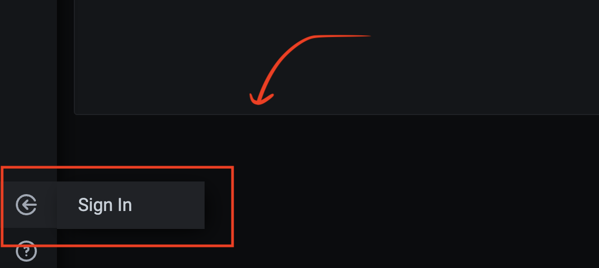

## User Workload Monitoring

> SAAP (Stakater App Agility Platform) has monitoring capabilities built in. It deploys the prometheus stack and integrates into the OpenShift UI for consuming cluster metrics.

### SAAP Developer view Monitoring (pods etc.)

> Out of the box monitoring in SAAP gives us the Kubernetes metrics for our apps such as Memory, CPU, Storage, etc.

1. User Workload Monitoring is enabled by default in SAAP.

    On the SAAP UI, go to *Observe*, it should show basic health indicators

    

2. You can run queries across the namesapce easily with `promql`, a query language for Prometheus. Run a `promql` query to get some info about the memory consumed by the pods in your `dev` namespace

    ```bash
    sum(container_memory_working_set_bytes{container!='',namespace='<TENANT_NAME>-test'}) by (pod)
    ```

    

### Add Grafana & Service Monitor

> Let's super charge our monitoring with specific information about our cat based services ...

1. Lets Enable ServiceMonitor in ProductReview apps.

    SAAP gathers the base metrics to see how our pods are doing. In order to get application specific metrics (like response time or number of reviews or active users etc) alongside the base ones, we need another object: _ServiceMonitor_. ServiceMonitor will let Prometheus know which endpoint the metrics are exposed so that Prometheus can scrape them. And once the Prometheus has the metrics, we can run query on them (just like we did before!) and create shiny dashboards!

    **Example** ServiceMonitor object:

    <div class="highlight" style="background: #f7f7f7">
    <pre><code class="language-yaml">
    ---
    apiVersion: monitoring.coreos.com/v1
    kind: ServiceMonitor
    metadata:
      name: my-app
    spec:
      endpoints:
        - interval: 30s
          port: tcp-8080 # port that metrics are exposed
          scheme: http
      selector:
        matchLabels:
          app: my-app
    </code></pre></div>

    Now, let's create add the `ServiceMonitor` for our ProductReview apps! Of course, we will do it through Helm and ArgoCD because this is GITOPS!!

    Our Helm Chart for nordmart-review api Open up `stakater-nordmart-review/deploy/values.yaml` file. Update `values` for `review` with adding following:

    ```yaml
        ## Service Monitor
        serviceMonitor:
            enabled: true    
    ```

    Then push it to the git repo.

    ```bash
    cd /projects/tech-exercise
    git add .
    git commit -m "🖥️ ServiceMonitor enabled 🖥️"
    git push
    ```

    If you want to verify the object exists you can run from your terminal:

    ```bash
    oc get servicemonitor -n ${TENANT_NAME}-dev -o yaml
    ```

2. We can create our own application specific dashboards to display live data for ops use or efficiency or A/B test results. We will use Grafana to create dashboards. SAAP monitoring stack includes grafana installation. Add an existing dashboard to norwdmart-review api; the dashboard can be found `nordmart-review/deploy/templates/grafana-dashboard.yaml` folder.

    ```yaml
        # Grafana Dashboard
        grafanaDashboard:
            enabled: true
    ```

3. Commit the changes to the repo as you've done before

    ```bash
    cd /projects/tech-exercise
    git add .
    git commit -m "📈 Grafana dashboard enabled 📈"
    git push
    ```

4. Once this change has been sync'd (you can check this in ArgoCD), Let's login to Grafana and view the predefined dashboards for nordmart-review api;

    

    If you use `Log in with OpenShift` to login and display dashboards - you user will only have `view` role which is read-only. This is alright in most cases, but we want to be able to edit and admin the boards.

5. The Dashboards should be showing some basic information and we can generate more data by firing some requests to the `pet-battle-api`. In your IDE, run on your terminal:

    ```bash
    curl -vL $(oc get route/pet-battle-api -n ${TEAM_NAME}-test --template='{{.spec.host}}')/dogs
    curl -vL -X POST -d '{"OK":"🐈"}' $(oc get route/pet-battle-api -n <TEAM_NAME>-test --template='{{.spec.host}}')/cats/
    curl -vL $(oc get route/pet-battle-api -n ${TEAM_NAME}-test --template='{{.spec.host}}')/api/dogs
    curl -vL -X POST -d '{"OK":"🦆"}' $(oc get route/pet-battle-api -n <TEAM_NAME>-test --template='{{.spec.host}}')/cats/
    curl -vL $(oc get route/pet-battle-api -n ${TEAM_NAME}-test --template='{{.spec.host}}')/api/dogs
    curl -vL -X POST -d '{"OK":"🐶"}' $(oc get route/pet-battle-api -n <TEAM_NAME>-test --template='{{.spec.host}}')/cats/
    ```

6. Back in Grafana, we should see some data populated into the boards...

    

### Create a Dashboard

> Let's extend the Pet Battle Dashboard with a new `panel` to capture some metrics in a visual way for us. Configuring dashboards is easy through the Grafana UI. Then Dashboards are easily shared as they can be exported as a `JSON` document.

1. OpenShift users have a read-only view on Grafana by default - get the `admin` user details from your cluster:

    ```bash
    oc get secret grafana-admin-credentials -o=jsonpath='{.data.GF_SECURITY_ADMIN_PASSWORD}' -n ${TEAM_NAME}-ci-cd \
    | base64 -d; echo -n
    ```

2. Back on Grafana, `login` with these creds after you've signed in using the OpenShift Auth (yes we know this is silly but so are Operators):

    

3. Once you've signed in, add a new panel:

    

4. On the new panel, let's configure it to query for some information about our projects. We're going to use a very simple query to count the number of pods running in the namespace (feel free to use any other query). On the Panel settings, set the title to something sensible and add the query below. Hit save!

    ```bash
    sum(kube_pod_status_ready{namespace="<TEAM_NAME>-test",condition="true"})
    ```

    

5. With the new panel on our dashboard, let's see it in action by killing off some pods in our namespace

    ```bash
    oc delete pods -l app.kubernetes.io/instance=pet-battle-api -n ${TEAM_NAME}-test
    oc delete pods -l app.kubernetes.io/instance=pet-battle -n ${TEAM_NAME}-test
    ```

    <!-- -->

    <p class="tip">
    🐌 THIS IS NOT GITOPS - Manually configuring the dashboard is a good way to play with Grafana. See advanced exercises for creating and storing the dashboard as code 🐎
    </p>
