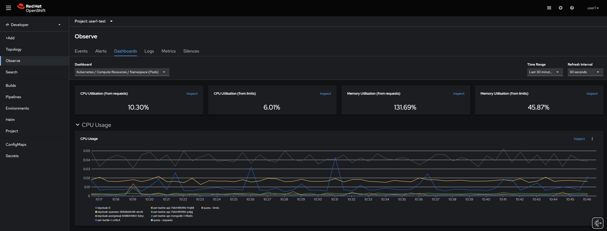
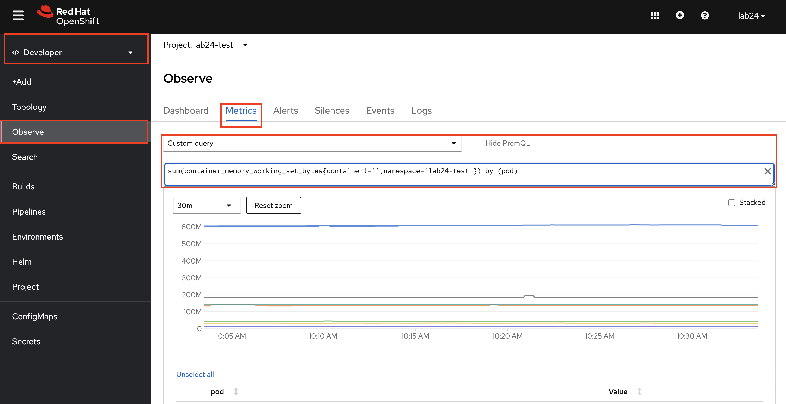

#### User Workload Monitoring
> OpenShift's monitoring capabilities.... 

[link to the docs](https://docs.openshift.com/container-platform/4.8/monitoring/enabling-monitoring-for-user-defined-projects.html)

[] enable servicemonitoring for PB
[] install Grafana through ArgoCD


### OCP Developer view Monitoring (pods etc)
> Out of the box monitoring in OpenShift - this gives us the Kubernetes metrics for our apps such as Memory usage & CPU etc.

1. Go to Monitoring, it should show basic health indicators


2. Run a promql query to get some info

3. basic basic basic....
### Add Grafana & Service Monitor
> Let's super charge our monitoring with specific JVM and API calls etc...

1. Enable SM in PB apps & show them in PROMQL in OCP?
OpenShift gathers the base metrics to see how our pods are doing. In order to get application specific metrics (like response time or active users etc) alongside the base ones, we need another object: _ServiceMonitor_. ServiceMonitor will let Prometheus know which endpoint the metrics are exposed so that Prometheus can scrape them. And once the Prometheus has the metrics, we can run query on them (just like we did before!) and create shiny dashboards!

**Example** ServiceMonitor object:
<pre>
    ---
    apiVersion: monitoring.coreos.com/v1
    kind: ServiceMonitor
    metadata:
      name: my-app
    spec:
      endpoints:
        - interval: 30s
          port: tcp-8080 <span style="color:green;" >#port that metrics are exposed</span>
          scheme: http
      selector:
        matchLabels:
          app: my-app
</pre>

Now, let's create ServiceMonitor for our PetBattle apps! Of course, we will do it through ArgoCD because this is GITOPS!!
Open up `pet-battle/test/values.yaml` and `pet-battle/staging/values.yaml` files. Update `values` for `pet-battle` and `pet-battle-api` with adding following:
```yaml
    servicemonitor: true
```

Then push it to the git repo.
```bash
git add .
git commit -m "🖥️ ServiceMonitor enabled 🖥️"
git push
```

If you want to verify the objects:
```bash
oc get servicemonitor -n ${TEAM_NAME}-test
```

2. We can create our own application specific dashboards to display live data for ops use or efficiency or A/B test results. We will use Grafana to create dashboards and since it will be another tool, we need to install it through `ubiquitous-journey/values-tooling.yaml`
```yaml
  - name: grafana
    enabled: true
    source: https://github.com/petbattle/pet-battle-infra.git
    source_path: grafana
```
3. Commit the changers
```bash
git add .
git commit -m "📈 Grafana added 📈"
git push
```

3. Show new Dashboard (Graphs/ metrics) from app specific things
4. Create a custom widget ie something not in PB's pre-canned Dashboard 
^[THIS IS NOT GITOPS - see advanced exercises for]

