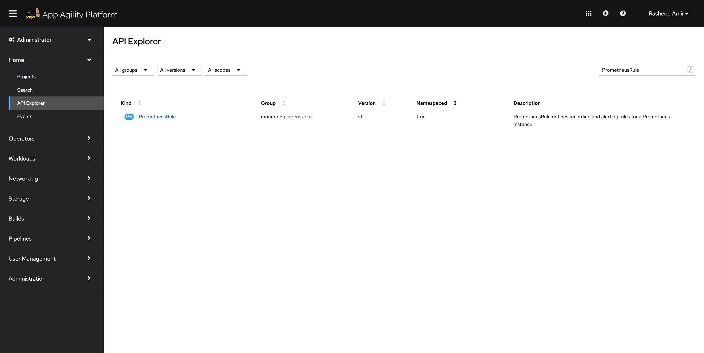
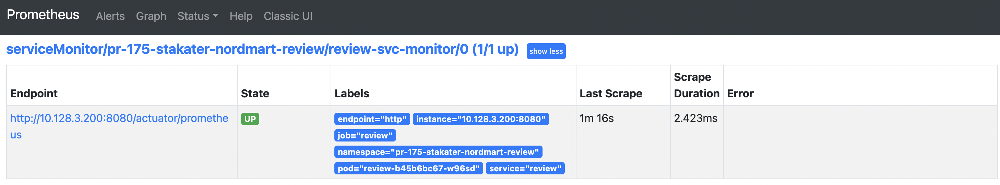
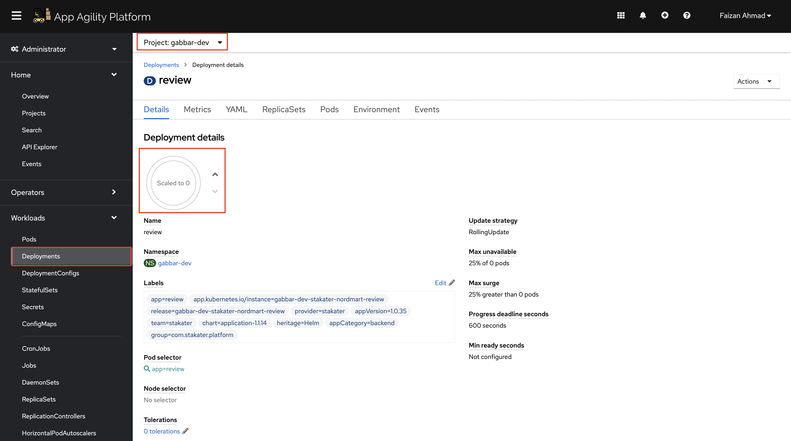
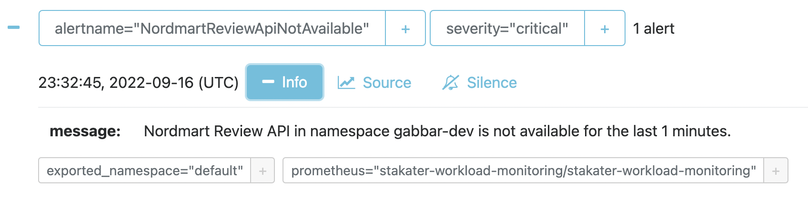
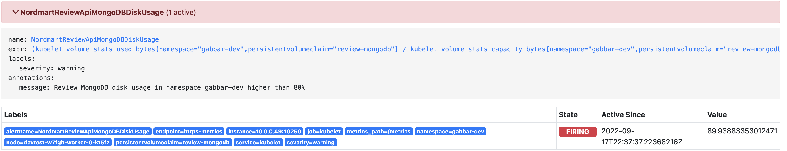
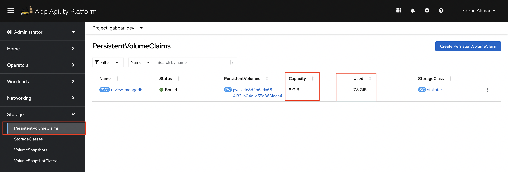

## Alerting and Notifications

> SAAP's built in alerts.... blah
### Workload Alerts

1. The Nordmart Review API and UI charts both have one basic `rule` for firing off an alert. If you open up the `stakater-nordmart-review/deploy/values.yaml` file, you'll find an alert that gets triggered when total ratings below 2 has crossed the threshold 8. The alert rules are written in PromQL. You can also add an extra alert which will be triggered when a pod is not available for one minute. In `values.yaml`add the following alert after existing `nordmart-review-low-rating-warning` alert under `prometheusRule.group`

    <div class="highlight" style="background: #f7f7f7">
    <pre><code class="language-yaml">
      - name: nordmart-review-api-rules
        rules:
        - alert: NordmartReviewApiNotAvailable
          annotations:
            message: 'Nordmart Review API in namespace (TENANT_NAME)-dev is not available for the last 1 minutes.'
          expr: (1 - absent(kube_pod_status_ready{condition="true",namespace="(TENANT_NAME)-dev"} * 
                on(pod) group_left(label_app) 
                kube_pod_labels{label_app="review",namespace="(TENANT_NAME)-dev"})) == 0
          for: 1m
          labels:
            severity: critical
    </code></pre></div>

    

    


   Once the alert is in place, you can trigger it by scaling down the deployment manually.


   
   
   

2. Let's add a new **platform type** rule to alert when the MongoDB disc gets busy / full. We can add it in the values.yaml under application.prometheusRule

    ```yaml
        rules:
        - alert: NordmartReviewApiMongoDBDiskUsage
          annotations:
            message: 'Review MongoDB disk usage in namespace gabbar-dev higher than 80%'
          expr: (kubelet_volume_stats_used_bytes{persistentvolumeclaim="review-mongodb",namespace="<TENANT_NAME>-dev"} / kubelet_volume_stats_capacity_bytes{persistentvolumeclaim="review-mongodb",namespace="<TENANT_NAME>-dev"}) * 100 > 80
          labels:
            severity: warning
    ```

3. Now push the changes into the repo:

    ```bash
    cd /projects/nordmart-review
    git add .
    git commit -m  "🌳 ADD - Alerting Rules extended 🌳"
    git push
    ```

    This push will trigger the pipeline which updates the chart version for Nordmart Review API in `stakater-nordmart-review/deploy/`.

    When the chart version is updated automatically, ArgoCD will detect your new changes and apply them to the cluster 🔥🔥🔥

4. Let's test if the alert is working as we hope - we created an alert for disk usage. First, let's see if we can fill the disk to simulate the mongodb alert.

    ```bash
    oc project ${TENANT_NAME}-test
    oc rsh `oc get po -l app.kubernetes.io/component=mongodb -o name -n ${TENANT_NAME}-dev`
    ```

    ```bash
    dd if=/dev/urandom of=/bitnami/mongodb/data/db/rando-calrissian bs=100M count=500
    ```

    You should see an output like this:

    <div class="highlight" style="background: #f7f7f7">
    <pre><code class="language-bash">
    sh-4.2$ dd if=/dev/urandom of=/bitnami/mongodb/data/db/rando-calrissian bs=100M count=500
    0+233 records in
    0+232 records out
    7806468096 bytes (7.8 GB, 7.3 GiB) copied, 152.028 s, 51.3 MB/s
    </code></pre></div>

5. Observe the alert is firing on OpenShift UI. In Developer view, go to Observe > Alerts. Make sure you select the right project from the drop down menu. You should see `NordmartReviewApiMongoDBDiskUsage` alert as below:

    
    
