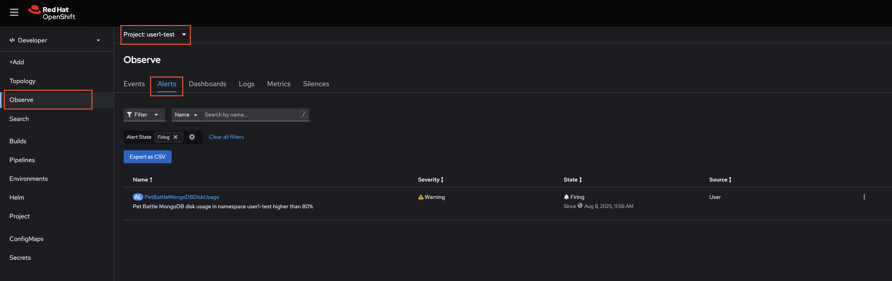

## Alerting and Notifications

> SAAP's built in alerts.... blah
### Workload Alerts

1. The Nordmart Review API and UI charts both have one basic `rule` for firing off an alert. If you open up the `/projects/pet-battle-api/chart/templates/prometheusrule.yaml` you'll see one configured to alert when a pod is not available for one minute. The alert rules are written in PromQL.

    <div class="highlight" style="background: #f7f7f7">
    <pre><code class="language-yaml">
    spec:
      groups:
      - name: nordmart-review-api-rules
        rules:
        - alert: NordmartReviewApiNotAvailable
          annotations:
            message: 'Nordmart Review API in namespace {{ .Release.Namespace }} is not available for the last 1 minutes.'
          expr: (1 - absent(kube_pod_status_ready{condition="true",namespace="{{ .Release.Namespace }}"} * 
                on(pod) group_left(label_app) 
                kube_pod_labels{label_app="review",namespace="{{ .Release.Namespace }}"})) == 0
          for: 1m
          labels:
            severity: {{ .Values.prometheusrules.severity | default "critical" }}
    </code></pre></div>

    

    

    

_TODOs_

- Validate the rule is firing by scaling down deployment

2. Let's add a new **platform type** rule to alert when the MongoDB disc gets busy / full

    ```bash
    cat << EOF >> /projects/pet-battle-api/chart/templates/prometheusrule.yaml
        - alert: NordmartReviewApiMongoDBDiskUsage
          annotations:
            message: 'Pet Battle MongoDB disk usage in namespace {{ .Release.Namespace }} higher than 80%'
          expr: (kubelet_volume_stats_used_bytes{persistentvolumeclaim="pet-battle-api-mongodb",namespace="{{ .Release.Namespace }}"} / kubelet_volume_stats_capacity_bytes{persistentvolumeclaim="pet-battle-api-mongodb",namespace="{{ .Release.Namespace }}"}) * 100 > 80
          labels:
            severity: {{ .Values.prometheusrules.severity | default "warning" }}
    EOF
    ```

3. Let's add a **workload monitoring** type rule to alert us when the API request are under load.

    ```bash
    cat << EOF >> /projects/pet-battle-api/chart/templates/prometheusrule.yaml
        - alert: NordmartReviewApiMaxHttpRequestTime
          annotations:
            message: 'Nordmart Review Api max http request time over last 5 min in namespace {{ .Release.Namespace }} exceeds 1.5 sec.'
          expr: max_over_time(http_server_requests_seconds_max{service="review",namespace="{{ .Release.Namespace }}"}[5m]) > 1.5
          labels:
            severity: warning
    EOF
    ```

_TODOs_

- Make PR
- Screenshot for gitlab PR
- Screenshot to show pipeline
- Screent shot for DTE

4. Now push the changes into the repo:

    ```bash
    cd /projects/nordmart-review
    git add .
    git commit -m  "🌳 ADD - Alerting Rules extended 🌳"
    git push
    ```

    This push will trigger the pipeline which updates the chart version for Nordmart Review API in `/projects/tech-exercise/pet-battle/test`.

    When the chart version is updated automatically, ArgoCD will detect your new changes and apply them to the cluster 🔥🔥🔥

5. Let's test if the alerts are working as we hope - we created two alerts, one for HTTP Requests and one for disk usage. First, let's see if we can fill the disk to simulate the mongodb alert.

    ```bash
    oc project ${TENANT_NAME}-test
    oc rsh `oc get po -l app.kubernetes.io/component=mongodb -o name -n ${TENANT_NAME}-dev`
    ```

    ```bash
    dd if=/dev/urandom of=/var/lib/mongodb/data/rando-calrissian bs=10M count=50
    ```

    You should see an output like this:

    <div class="highlight" style="background: #f7f7f7">
    <pre><code class="language-bash">
    sh-4.2$ dd if=/dev/urandom of=/var/lib/mongodb/data/rando-calrissian bs=10M count=50
    50+0 records in
    50+0 records out
    524288000 bytes (524 MB) copied, 11.2603 s, 46.6 MB/s
    </code></pre></div>

7. Observe the alert is firing on OpenShift UI. In Developer view, go to Observe > Alerts. Make sure you select the right project from the drop down menu. You should see ` PetBattleMongoDBDiskUsage` alert as below:

    

