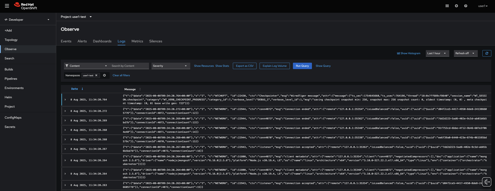
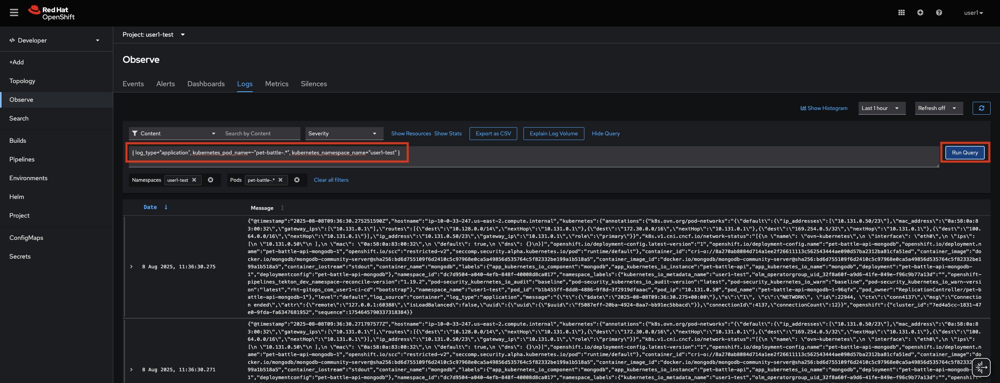
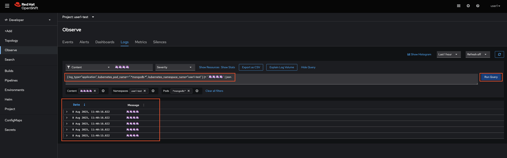

## Aggregated Logging

> OpenShift's built in logging is deployed as an operator using the LokiStack. By default collects all output from all containers that are logging to system out. This means no logging needs to be configured explicitly in the application. Logs are collected using a collector running on each nodes, then popped into LokiStack where they are indexed in a timeseries as JSON. OpenShift has a built in visualisation UI, but you can also use an external Grafana as well.


1. Observe logs from any given container:

    ```bash
    oc project ${TEAM_NAME}-test
    oc logs `oc get po -l app.kubernetes.io/component=mongodb -o name -n ${TEAM_NAME}-test` --since 10m
    ```

    By default, these logs are not stored in a database, but there are a number of reasons to store them (ie troubleshooting, legal obligations..)

2. OpenShift magic provides a great way to collect logs across services, anything that's pumped to `STDOUT` or `STDERR` is collected and added to LokiStack. This makes indexing and querrying logs very easy. Let's take a look at OpenShift Logs UI now.

    


7. Let's filter the information, look for the logs specifically for pet-battle apps running in the test nameaspace by adding this to the query bar. Click `Show Query`, paste the below and then hit `Run Query`. 

    ```bash
    { log_type="application", kubernetes_pod_name=~"pet-battle-.*", kubernetes_namespace_name="<TEAM_NAME>-test" }`
    ```

    

8. Container logs are ephemeral, so once they die you'd loose them unless they're aggregated and stored somewhere. Let's generate some messages and query them from the UI. Connect to pod via rsh and generate logs.

    ```bash
    oc project ${TEAM_NAME}-test
    oc rsh `oc get po -l app.kubernetes.io/component=mongodb -o name -n ${TEAM_NAME}-test`
    ```

    Then inside the container you've just remote logged on to we'll add some nonsense messages to the logs:

    ```bash
    echo "🦄🦄🦄🦄" >> /tmp/custom.log
    tail -f /tmp/custom.log > /proc/1/fd/1 &
    echo "🦄🦄🦄🦄" >> /tmp/custom.log
    echo "🦄🦄🦄🦄" >> /tmp/custom.log
    echo "🦄🦄🦄🦄" >> /tmp/custom.log
    echo "🦄🦄🦄🦄" >> /tmp/custom.log
    exit
    ```

9. Back on Kibana we can filter and find these messages with another query:

    ```yaml
    { log_type="application", kubernetes_pod_name=~".*mongodb.*", kubernetes_namespace_name="<TEAM_NAME>-test" } |= `🦄🦄🦄🦄` | json
    ```

    
