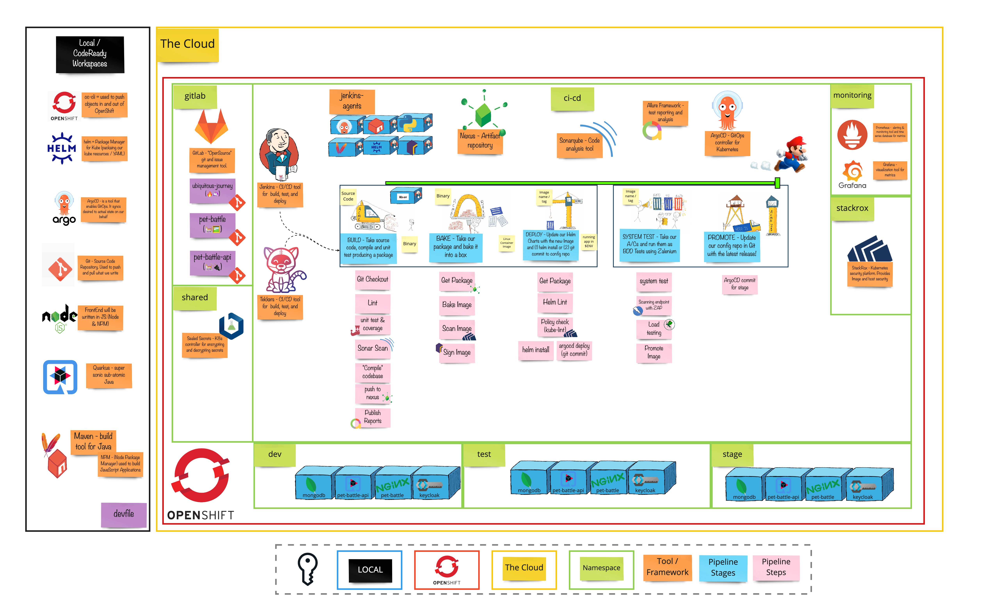

# Exercise 4 - Return of the Monitoring

> A metrics-driven transformation focuses on using value-based business metrics to understand how technology-related investments impact organizational performance and provide specific tools and guidance to help improve those metrics.

With software, there are often two competing forces at work. Innovation, which inherently is accompanied by system change, and running software, which is serving end customers and implies that the system is stable. We can identify two important areas to focus on here:

- To help measure the effectiveness of a team's development and delivery
practices
- To start measuring and monitoring activities that allow the rapid diagnosis
of issues

## 👨‍🍳 Exercise Intro

In this exercise, we will use OpenShift out-of-the-box monitoring and logging stack. We will collect PetBattle metrics with `Prometheus` and set alerts with some sensible tresholds. Also visualize PetBattle metrics with `Grafana` to have a better understanding of PetBattle's status. Moreover, we will gather logs of the apps to store in `ElasticSearch` and visualize them with the help of `Kibana`.
## 🖼️ Big Picture

## 🔮 Learning Outcomes

- [ ] Can add ServiceMonitor for apps to gather metrics
- [ ] Can query Prometheus to see metrics 
- [ ] Can create alerts with PrometheusRule
- [ ] Can install Grafana create dashboards with it
- [ ] Can create search index in Kibana

## 🔨 Tools used in this exercise!

* [Prometheus](https://prometheus.io/) - Stores our metrics and used for alerting
* [Grafana](https://grafana.com/) - Used to visualize our metrics
* [ElasticSearch](https://www.elastic.co/) - Stores logs & data in an unstructured way
* [Kibana](https://www.elastic.co/kibana/) - Used to visualize ElasticSearch data
