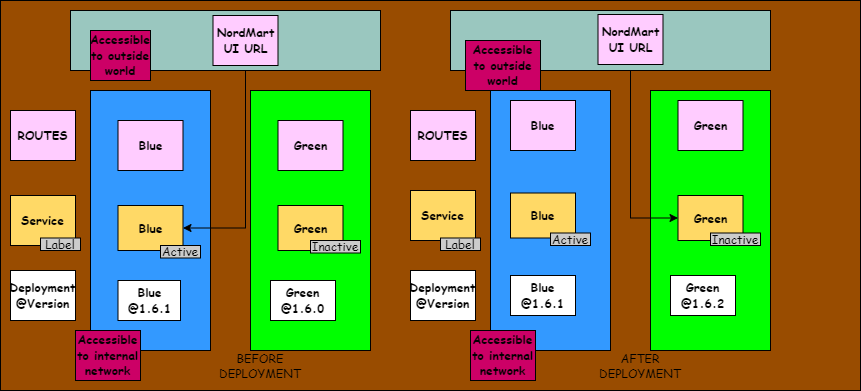
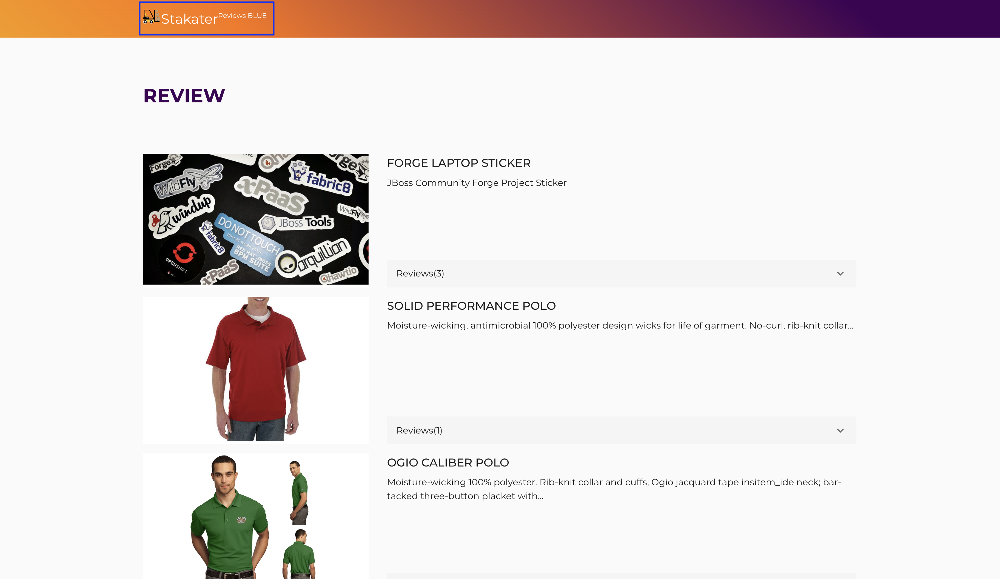
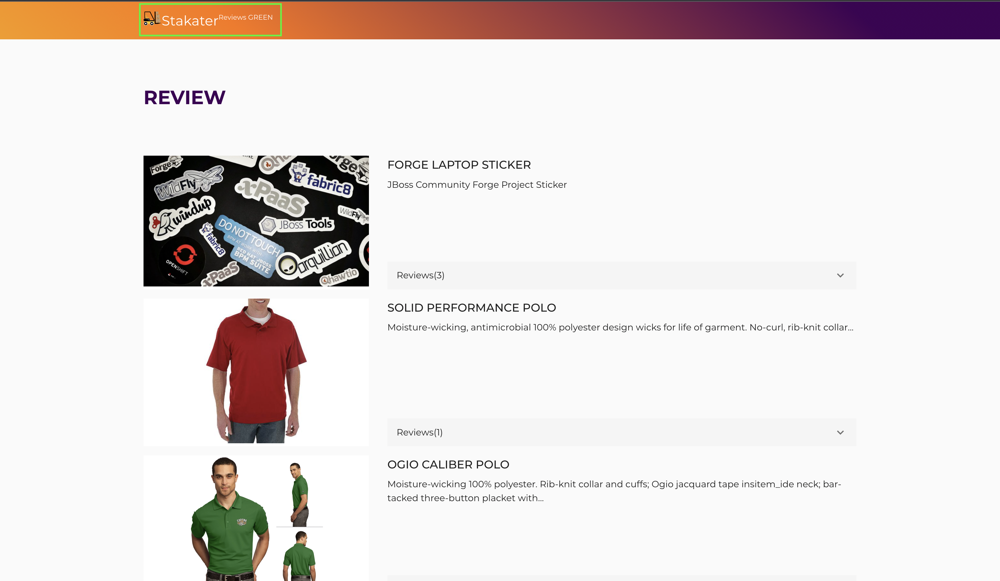

## Blue/Green Deployments

> Blue/Green deployments involve running two versions of an application at the same time. While the blue environment runs the current version of the application being used, the green environment runs the new application version
> Once the green environment has been thoroughly tested, traffic is diverted towards it and the blue environment is deprecated. The Blue/Green strategy is followed to increase application availability. It makes switching between application versions easy.

<span style="color:blue;">[OpenShift Docs](https://docs.openshift.com/container-platform/4.9/applications/deployments/route-based-deployment-strategies.html#deployments-blue-green_route-based-deployment-strategies)</span> is pretty good at showing an example of how to do a manual Blue/Green deployment. But in the real world you'll want to automate this switching of the active routes based on some test or other metric. Plus this is GitOps! So how do we do a Blue/Green with all of this automation and new tech, let's take a look with our Nordmart review UI!



1. Let's create two new deployments in our ArgoCD Repo, `nordmart-apps-gitops-config` for the `nordmart-review-ui` front end.We'll call one Blue and the other Green.

2. Navigate to `<TENANT_NAME> > 00-argocd-apps > 01-dev` . 

3. Add a new ArgoCD applications with name `<TENANT_NAME>-dev-stakater-nordmart-review-ui-bg-blue` with the following content. 

    > Make sure you replace all instances of <TENANT_NAME> with your tenant.

    ```yaml
      apiVersion: argoproj.io/v1alpha1
      kind: Application
      metadata:
        name: <TENANT_NAME>-dev-stakater-nordmart-review-ui-bg-blue
        namespace: openshift-gitops
        labels:
          stakater.com/tenant: <TENANT_NAME>
          stakater.com/env: dev
          stakater.com/kind: dev            
      spec:
        destination:
          namespace: <TENANT_NAME>-dev
          server: 'https://kubernetes.default.svc'
        project: <TENANT_NAME>
        source:
          path: 01-<TENANT_NAME>/03-stakater-nordmart-review-ui-bg-blue/01-dev
          repoURL: 'https://gitlab.apps.devtest.vxdqgl7u.kubeapp.cloud/<TENANT_NAME>/nordmart-apps-gitops-config.git'
          targetRevision: HEAD
        syncPolicy:
          automated:
            prune: true
            selfHeal: true
    ```
3. Now add another ArgoCD applications with name `<TENANT_NAME>-dev-stakater-nordmart-review-ui-bg-green` with the following content.

    ```yaml
      apiVersion: argoproj.io/v1alpha1
      kind: Application
      metadata:
        name: <TENANT_NAME>-dev-stakater-nordmart-review-ui-bg-green
        namespace: openshift-gitops
        labels:
          stakater.com/tenant: <TENANT_NAME>
          stakater.com/env: dev
          stakater.com/kind: dev            
      spec:
        destination:
          namespace: <TENANT_NAME>-dev
          server: 'https://kubernetes.default.svc'
        project: <TENANT_NAME>
        source:
          path: 01-<TENANT_NAME>/03-stakater-nordmart-review-ui-bg-green/01-dev
          repoURL: 'https://gitlab.apps.devtest.vxdqgl7u.kubeapp.cloud/<TENANT_NAME>/nordmart-apps-gitops-config.git'
          targetRevision: HEAD
        syncPolicy:
          automated:
            prune: true
            selfHeal: true
    ```
The above two ArgoCD applications will point to the Helm charts for our `Blue` and `Green` application versions.

4. Now let's add an ArgoCD application that points to the route. Name this ArgoCD application `<TENANT_NAME>-dev-stakater-nordmart-review-ui-bg-route` and add the below content to it. 

    ```yaml
      apiVersion: argoproj.io/v1alpha1
      kind: Application
      metadata:
        name: <TENANT_NAME>-dev-stakater-nordmart-review-ui-bg-route
        namespace: openshift-gitops
        labels:
          stakater.com/tenant: <TENANT_NAME>
          stakater.com/env: dev
          stakater.com/kind: dev            
      spec:
        destination:
          namespace: <TENANT_NAME>-dev
          server: 'https://kubernetes.default.svc'
        project: <TENANT_NAME>
        source:
          path: 01-<TENANT_NAME>/03-stakater-nordmart-review-ui-bg-route/01-dev
          repoURL: 'https://gitlab.apps.devtest.vxdqgl7u.kubeapp.cloud/<TENANT_NAME>/nordmart-apps-gitops-config.git'
          targetRevision: HEAD
        syncPolicy:
          automated:
            prune: true
            selfHeal: true
    ```

Now we need to deploy two charts for our green and blue application versions and also a route that handles the traffic to these applications.

5. Open up the 01-<TENANT_NAME> folder and create a folder named `03-stakater-nordmart-review-ui-bg-blue` in it. Inside the folder, create a `01-dev` folder. 

6. Add a Chart.yaml file in this folder with the following content:

    ```yaml
      apiVersion: v2
      name: review-web-blue
      description: A Helm chart for Kubernetes
      dependencies:
      - name: stakater-nordmart-review-ui
        version: 1.0.14
        repository: https://nexus-helm-stakater-nexus.apps.devtest.vxdqgl7u.kubeapp.cloud/repository/helm-charts/
      version: 1.0.14
    ```
7. Now in the same folder, add a values.yaml with the below content:

    ```yaml
      stakater-nordmart-review-ui:
        application:
          applicationName: "review-ui-blue"
          deployment:
            imagePullSecrets: []
            image:
              repository: stakater/stakater-nordmart-review-ui
              tag: 1.0.15-blue
          service:
            additionalLabels:
              blue_green: active
          route:
            enabled: false
    ```

8. Let's deploy the chart for our green environment now. Open up the 01-<TENANT_NAME> folder present at the project root level again and create a folder named `03-stakater-nordmart-review-ui-bg-green` in it. Inside the folder, create a `01-dev` folder.

9. Inside this dev folder, add a Chart.yaml with the following content.

    ```yaml
      apiVersion: v2
      name: review-web-green
      description: A Helm chart for Kubernetes
      dependencies:
        - name: stakater-nordmart-review-ui
          version: 1.0.14
          repository: https://nexus-helm-stakater-nexus.apps.devtest.vxdqgl7u.kubeapp.cloud/repository/helm-charts/
      version: 1.0.14
    ```
10. In the same folder, add a values.yaml with the below content.
    ```yaml
      stakater-nordmart-review-ui:
        application:
          applicationName: "review-ui-green"
          deployment:
            imagePullSecrets: []
            additionalLabels:
              blue_green: inactive
            image:
              repository: stakater/stakater-nordmart-review-ui
              tag: 1.0.15-green
          service:
            additionalLabels:
              blue_green: inactive
          route:
            enabled: false
    ```
> If you notice, we are using different images in both the values file, meaning that both the application versions are different. 
> Also notice that we added a label to the service in the values chart. Green application service has an inactive label and blue has an active label.

11. Let's add a route for these applications.

12. Go back to the 01-<TENANT_NAME> folder and create a folder named `03-stakater-nordmart-review-ui-bg-route` in it. Inside the folder, create a `01-dev` folder.
    
13. Now add a route.yaml to it with the below content. 
     
    > Replace the <TENANT_NAME> with your tenant.

    ```yaml
      kind: Route
      apiVersion: route.openshift.io/v1
      metadata:
        name: review-ui-bg
      spec:
        host: review-ui-bg-<TENANT_NAME>-dev.apps.devtest.vxdqgl7u.kubeapp.cloud
        to:
          kind: Service
          name: review-ui-blue
          weight: 100
        port:
          targetPort: http
        tls:
          termination: edge
          insecureEdgeTerminationPolicy: Redirect
        wildcardPolicy: None
    ```

14. Commit the changes and in OpenShift UI, you'll see two new deployments are coming alive.


15. Verify each of the services contains the correct labels - one should be `active` and the other `inactive`. Run the commands below on your CRW workspace.

    ```bash
    oc get svc -l blue_green=inactive --no-headers -n <TENANT_NAME>-dev
    oc get svc -l blue_green=active --no-headers -n <TENANT_NAME>-dev
    ```

16. With both deployed, let's assume that our blue deployment is the active one with the service having `active` label pointing towards blue deployment and the service having `inactive` label pointing towards green deployment. 

We can validate that blue service is currently running by getting the host of our route

```bash
oc get route/review-ui-bg -n <TENANT_NAME>-dev --template='{{.spec.host}}'
```
and then using this URL in browser: `https://review-ui-bg-<TENANT_NAME>-dev.apps.devtest.vxdqgl7u.kubeapp.cloud/#/reviews`





17. Let's update the values.yaml for our deployments and switch the labels for services to point the active service towards green deployment. And then update the route to point towards active green service as well. 

    To do this, change the following

    a. Change the service label to `inactive` in blue service `03-stakater-nordmart-review-ui-bg-blue\01-dev\values.yaml`

    b. Change the service label to `active` in green service `03-stakater-nordmart-review-ui-bg-green\01-dev\values.yaml`

    c. Change the `name` of service in `03-stakater-nordmart-review-ui-bg-route\01-dev\route.yaml` route to `review-ui-green`

18. Commit all these changes:


8. When ArgoCD syncs, you should see things progress and the blue green deployment happen automatically. You can go to this URL again in browser: `https://review-ui-bg-<TENANT_NAME>-dev.apps.devtest.vxdqgl7u.kubeapp.cloud/#/reviews` and see the green deployment working



    This is a simple example to show how we can automate a blue green deployment using GitOps. However, we did not remove the
    previous deployment of `nordmart-review`, in the real world we would do this.
