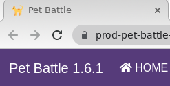
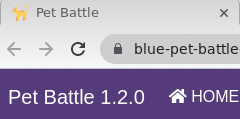

## Blue/Green Deployments

> Blue/Green deployments involve running two versions of an application at the same time and moving the traffic from the old version to the new version. Blue/Green deployments make switching between two different versions very easy.

<span style="color:blue;">[OpenShift Docs](https://docs.openshift.com/container-platform/4.9/applications/deployments/route-based-deployment-strategies.html#deployments-blue-green_route-based-deployment-strategies)</span> is pretty good at showing an example of how to do a manual Blue/Green deployment. But in the real world you'll want to automate this switching of the active routes based on some test or other metric. Plus this is GITOPS! So how do we do a Blue/Green with all of this automation and new tech, let's take a look with our Pet Battle UI!


1. Let's create two new deployments in our ArgoCD Repo for the pet-battle front end. We'll call one Blue and the other Green. Add 2 new application in `tech-exercise/pet-battle/test/values.yaml`. Adjust the `source_ref` helm chart version and `image_version` to match what you have built.

    ```bash
    cat << EOF >> /projects/tech-exercise/pet-battle/test/values.yaml
      # Pet Battle UI Blue
      blue-pet-battle:
        name: blue-pet-battle
        enabled: true
        source: http://nexus:8081/repository/helm-charts
        chart_name: pet-battle
        source_ref: 1.0.6 # helm chart version - may need adjusting!
        values:
          image_version: latest # container image version - may need adjusting!
          fullnameOverride: blue-pet-battle
          blue_green: active
          # we controll the prod route via the "blue" chart for simplicity
          prod_route: true
          prod_route_svc_name: blue-pet-battle
          config_map: '{
            "catsUrl": "https://pet-battle-api-<TEAM_NAME>-test.<CLUSTER_DOMAIN>",
            "tournamentsUrl": "https://pet-battle-tournament-<TEAM_NAME>-test.<CLUSTER_DOMAIN>",
            "matomoUrl": "https://matomo-<TEAM_NAME>-ci-cd.<CLUSTER_DOMAIN>/",
            "keycloak": {
              "url": "https://keycloak-<TEAM_NAME>-test.<CLUSTER_DOMAIN>/auth/",
              "realm": "pbrealm",
              "clientId": "pbclient",
              "redirectUri": "http://localhost:4200/tournament",
              "enableLogging": true
            }
          }'

      # Pet Battle UI Green
      green-pet-battle:
        name: green-pet-battle
        enabled: true
        source: http://nexus:8081/repository/helm-charts
        chart_name: pet-battle
        source_ref: 1.0.6 # helm chart version - may need adjusting!
        values:
          image_version: latest # container image version - may need adjusting!
          fullnameOverride: green-pet-battle
          blue_green: inactive
          config_map: '{
            "catsUrl": "https://pet-battle-api-<TEAM_NAME>-test.<CLUSTER_DOMAIN>",
            "tournamentsUrl": "https://pet-battle-tournament-<TEAM_NAME>-test.<CLUSTER_DOMAIN>",
            "matomoUrl": "https://matomo-<TEAM_NAME>-ci-cd.<CLUSTER_DOMAIN>/",
             "keycloak": {
              "url": "https://keycloak-<TEAM_NAME>-test.<CLUSTER_DOMAIN>/auth/",
              "realm": "pbrealm",
              "clientId": "pbclient",
              "redirectUri": "http://localhost:4200/tournament",
              "enableLogging": true
            }
          }'
    EOF
    ```

2. Git commit the changes and in OpenShift UI, you'll see two new deployments are coming alive.

    ```bash
    cd /projects/tech-exercise
    git add pet-battle/test/values.yaml
    git commit -m  "🍔 ADD - blue & green environments 🍔"
    git push
    ```

3. Verify each of the services contains the correct labels - one should be `active` and the other `inactive`. Our pipeline will push new deployments to the inactive one before switching the labels around:

    ```bash
    oc get svc -l blue_green=inactive --no-headers -n <TEAM_NAME>-test
    oc get svc -l blue_green=active --no-headers -n <TEAM_NAME>-test
    ```

4. With both deployed, let's Update the `Jenkinsfile` to do the deployment for the `inactive` one. Jenkins will over write the currently labelled `inactive` deployment. Jenkins will then run some tests (🪞💨) and verify things working fine. Finally he will switch the traffic to it and swap the labels so this becomes the active service. The other svc will be labelled `inactive` and wait ready to switch back in case of an unwanted result.

    To do this, add the below stage in the right placeholder:

    ```groovy
    // 💥🔨 BLUE / GREEN DEPLOYMENT GOES HERE 
    stage("🔷✅ Blue Green Deploy") {
      agent {
        label "jenkins-agent-argocd"
      }
      options {
         skipDefaultCheckout(true)
      }
      steps {
        echo '### set env to test against ###'
        sh '''
          #🌻 1. Get the current active / inactive
          export INACTIVE=$(oc get svc -l blue_green=inactive --no-headers -n ${DESTINATION_NAMESPACE} | cut -d' ' -f 1)
          export ACTIVE=$(oc get svc -l blue_green=active --no-headers -n ${DESTINATION_NAMESPACE} | cut -d' ' -f 1)

          #🌻 2. Deploy the new changes to hte current `inactive`
          printenv
          git clone https://${GIT_CREDS}@${ARGOCD_CONFIG_REPO} config-repo
          cd config-repo
          git checkout ${ARGOCD_CONFIG_REPO_BRANCH} # master or main
          yq eval -i .applications.\\"${INACTIVE}\\".source_ref=\\"${CHART_VERSION}\\" "${ARGOCD_CONFIG_REPO_PATH}"
          yq eval -i .applications.\\"${INACTIVE}\\".values.image_version=\\"${VERSION}\\" "${ARGOCD_CONFIG_REPO_PATH}"
          # Commit the changes :P
          git config --global user.email "jenkins@rht-labs.bot.com"
          git config --global user.name "Jenkins"
          git config --global push.default simple
          git add ${ARGOCD_CONFIG_REPO_PATH}
          git commit -m "🚀 AUTOMATED COMMIT - Deployment of ${APP_NAME} at version ${VERSION} 🚀" || rc1=$?
          git remote set-url origin  https://${GIT_CREDS}@${ARGOCD_CONFIG_REPO}
          git push -u origin ${ARGOCD_CONFIG_REPO_BRANCH}

          #🌻 3. do some kind of verification of the deployment  
          sleep 10
          echo "🪞💨 TODO - some kinda test to validate blue or green is working as expected ... 🪞💨"
          curl -k -L -f $(oc get route --no-headers ${INACTIVE//_/-} -n $DESTINATION_NAMESPACE | cut -d' ' -f 4) 

          #🌻 4. If "tests" have passed swap inactive to active to and vice versa
          yq eval -i .applications.\\"${INACTIVE}\\".values.blue_green=\\"active\\" "${ARGOCD_CONFIG_REPO_PATH}"
          yq eval -i .applications.\\"${ACTIVE}\\".values.blue_green=\\"inactive\\" "${ARGOCD_CONFIG_REPO_PATH}"

          #🌻 5. update the 'prod' route to point to the new active svc
          export NEW_ACTIVE=${INACTIVE//_/-}
          echo "🐥 - ${NEW_ACTIVE}"
          yq eval -i .applications.blue-pet-battle.values.prod_route_svc_name=\\"${NEW_ACTIVE}\\" "${ARGOCD_CONFIG_REPO_PATH}"
          git add ${ARGOCD_CONFIG_REPO_PATH}
          git commit -m "🚀 AUTOMATED COMMIT - Deployment of ${APP_NAME} at version ${VERSION} 🚀" || rc1=$?
          git remote set-url origin  https://${GIT_CREDS}@${ARGOCD_CONFIG_REPO}
          git push -u origin ${ARGOCD_CONFIG_REPO_BRANCH}
        '''
      }
    }
    ```

5. Before we commit the changes to the `Jenkinsfile`, let's make a simple application change to make this more visual. In the frontend, we'll change the banner along the top of the app. In your IDE, open `pet-battle/src/app/shell/header/header.component.html`. Uncomment the `<nav>` under the `<!-- PB - Purple -->` comment and remove the line above it so it appears like this:

    ```html
    <header>
        <!-- PB - Purple -->
        <nav class="navbar  navbar-expand-lg navbar-dark" style="background-color: #563D7C;">
    ```

6. Bump the version of the application to trigger a new release by updating the `version` in the `package.json` at the root of the frontend's repository

    <div class="highlight" style="background: #f7f7f7">
    <pre><code class="language-yaml">
    "name": "pet-battle",
    "version": "1.6.1",  <- bump this
    "private": true,
    "scripts": ...
    </code></pre></div>

7. Commit all these changes:

    ```bash
    cd /projects/pet-battle
    git add .
    git commit -m "🔵 ADD - Blue / Green deployment to pipeline 🟩"
    git push
    ```

8. When Jenkins executes, you should see things progress and the blue green deployment happen automatically.

    The version in production is now the new `1.6.1` published with the latest change. As you can check from the
    nav bar of the application from the production route `prod-pet-battle` (linked to the `green` service):

    

    The previous `1.2.0` version, now identified as `blue`, is already available from the blue route `blue-pet-battle`:

    

    Every time you change the `version` variable in the `package.json` file the blue and green version will switch. Try it
    publishing a new version of the application, e.g: `1.6.2`. Which one is in production? Which is `blue`? Which is `green`?

    This is a simple example to show how we can automate a blue green deployment using GitOps. However, we did not remove the
    previous deployment of pet-battle, in the real world we would do this.

