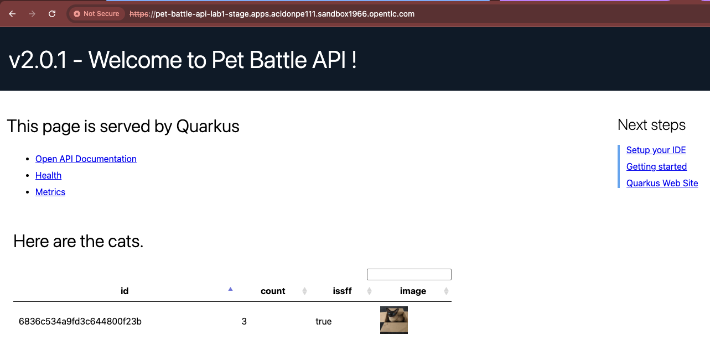
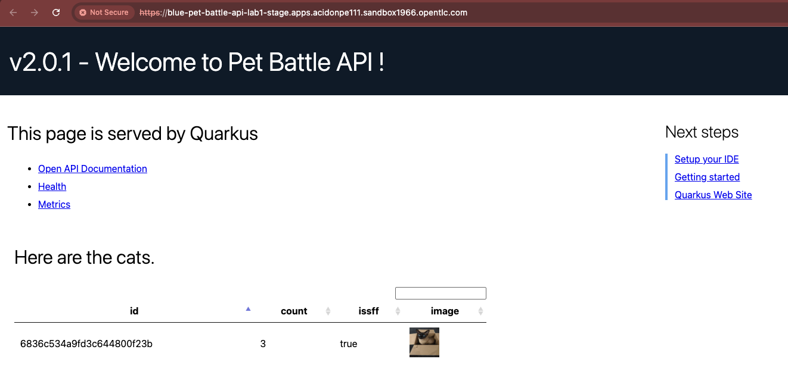

## Extend Tekton Pipeline with Blue/Green Deployments

In this exercise, we'll implement a blue/green deployment strategy for the Pet Battle API application using Tekton pipelines and Argo CD. Blue/green deployments allow you to run two identical production environments side-by-side, with only one serving live traffic at a time. This enables zero-downtime deployments and instant rollback capabilities.

### Understanding Blue/Green Deployments

In a blue/green deployment:
- **Blue Environment**: One production environment (currently active or inactive)
- **Green Environment**: Another identical production environment (currently active or inactive)
- **Active Service**: The service currently receiving production traffic
- **Inactive Service**: The service ready to receive the new deployment

The deployment process works as follows:
1. Deploy the new version to the currently inactive environment
2. Run tests to verify the deployment
3. Switch production traffic from the active to the newly deployed inactive service
4. Swap the active/inactive labels

This approach provides instant rollback—if something goes wrong, you simply switch traffic back to the previous environment. (For applications that don't persist data in the database, this is a good approach.)

Each environment folder (test / stage) contains the configuration for the corresponding projects in OpenShift. All we need to do is extend or edit the list of `applications` for the changes to be synced to the cluster. We can also separate test environment config from staging or even prod using this method.

---

## Implementing Blue/Green Deployment

We'll create two versions of the Pet Battle API application (blue and green) and configure Tekton to automatically manage the deployment and traffic switching process.

### Phase 1: Create Blue and Green Environments

**Step 1: Add Blue and Green Application Definitions**

Let's create two new deployments in our Argo CD repository for the pet-battle-api. We'll call one Blue and the other Green. Add two new applications in `tech-exercise/pet-battle/stage/values.yaml`. Adjust the `source_ref` Helm chart version and `image_version` to match what you have built.

```bash
cat << EOF >> /projects/tech-exercise/pet-battle/stage/values.yaml
  # Pet Battle API Blue
  blue-pet-battle-api:
    name: blue-pet-battle-api
    enabled: true
    source: http://nexus:8081/repository/helm-charts
    chart_name: pet-battle-api
    source_ref: 1.5.0  # <----------- IMPORTANT: Define the current Pet Battle API version
    values:
      image_name: pet-battle-api
      image_version: latest
      hpa:
        enabled: false
  # Pet Battle API Green
  green-pet-battle-api:
    name: green-pet-battle-api
    enabled: true
    source: http://nexus:8081/repository/helm-charts
    chart_name: pet-battle-api
    source_ref: 1.5.0  # <----------- IMPORTANT: Define the current Pet Battle API version
    values:
      image_name: pet-battle-api
      image_version: latest
      hpa:
        enabled: false
EOF
```

> **Note**: Make sure to adjust the `source_ref` (Helm chart version) and `image_version` to match the versions you have available in your Nexus repository.

**Step 2: Deploy the Blue and Green Environments**

Push your changes to the repository. Remember—if it's not in Git, it's not real!

```bash
cd /projects/tech-exercise
git add .
git commit -m "🐩 ADD - pet battle APIs blue & Green 🐩"
git push
```

**Step 3: Verify the Deployments**

Let's verify that everything is working correctly. You should be able to see the Pet Battle API Blue & Green Applications running:

🪄 🪄 You should be able to see the Pet Battle API Blue & Green Applications running. 🪄 🪄

- [https://blue-pet-battle-api-<TEAM_NAME>-stage.<CLUSTER_DOMAIN>](https://blue-pet-battle-api-<TEAM_NAME>-stage.<CLUSTER_DOMAIN>)
- [https://green-pet-battle-api-<TEAM_NAME>-stage.<CLUSTER_DOMAIN>](https://green-pet-battle-api-<TEAM_NAME>-stage.<CLUSTER_DOMAIN>)
- [https://pet-battle-api-<TEAM_NAME>-stage.<CLUSTER_DOMAIN>](https://pet-battle-api-<TEAM_NAME>-stage.<CLUSTER_DOMAIN>)

### Phase 2: Extend the Tekton Pipeline

**Step 4: Add Blue/Green Deployment Tasks to the Pipeline**

Now we need to extend the Tekton pipeline to include the blue/green deployment workflow. Edit `tekton/templates/pipelines/maven-pipeline.yaml` and copy the YAML below where the placeholder indicates. Make sure you update the `runAfter` parameter accordingly:

```yaml
    # Blue/Green Deployment
    - name: promote-image-stage
      taskRef:
        name: promote-image-stage
      workspaces:
        - name: output
          workspace: shared-workspace
      params:
        - name: APPLICATION_NAME
          value: "$(params.APPLICATION_NAME)"
        - name: TEAM_NAME
          value: "$(params.TEAM_NAME)"
        - name: VERSION
          value: "$(tasks.maven.results.VERSION)"
      runAfter: 
        - verify-deployment # <-------- Update this runAfter properly
      
    - name: analyze-bg-deployment
      taskRef:
        name: analyze-bg
      workspaces:
        - name: output
          workspace: shared-workspace
      params:
        - name: APPLICATION_NAME
          value: "$(params.APPLICATION_NAME)"
        - name: TEAM_NAME
          value: "$(params.TEAM_NAME)"
        - name: PREVIOUS_VERSION
          value: "$(tasks.deploy-test.results.PREVIOUS_VERSION)"
        - name: WORK_DIRECTORY
          value: "tech-exercise/main/pet-battle/"
        - name: DEPLOY_ENVIRONMENT
          value: "stage"
      runAfter: 
        - promote-image-stage

    - name: deploy-bg
      taskRef:
        name: deploy
      workspaces:
        - name: output
          workspace: shared-workspace
      params:
        - name: APPLICATION_NAME
          value: "$(tasks.analyze-bg-deployment.results.BG_APPLICATION_NAME)"
        - name: WORK_DIRECTORY
          value: "tech-exercise/main/pet-battle/"
        - name: DEPLOY_ENVIRONMENT
          value: "stage"
        - name: TEAM_NAME
          value: "$(params.TEAM_NAME)"
        - name: VERSION
          value: "$(tasks.maven.results.VERSION)"
        - name: CHART_VERSION
          value: "$(tasks.helm-package.results.CHART_VERSION)"
      runAfter: 
        - analyze-bg-deployment
      
    - name: verify-bg
      taskRef:
        name: verify-deployment
      workspaces:
        - name: output
          workspace: shared-workspace
      params:
        - name: WORK_DIRECTORY
          value: "tech-exercise/main/pet-battle/"
        - name: PREVIOUS_VERSION
          value: "$(tasks.deploy-test.results.PREVIOUS_VERSION)"
        - name: PREVIOUS_CHART_VERSION
          value: "$(tasks.deploy-test.results.PREVIOUS_CHART_VERSION)"
        - name: TEAM_NAME
          value: "$(params.TEAM_NAME)"
        - name: VERSION
          value: "$(tasks.maven.results.VERSION)"
        - name: APPLICATION_NAME
          value: "$(tasks.analyze-bg-deployment.results.BG_APPLICATION_NAME)"
        - name: DEPLOY_ENVIRONMENT
          value: "stage"
      runAfter:
        - deploy-bg

    - name: deploy-bg-route-stage
      taskRef:
        name: deploy-bg-route
      workspaces:
        - name: output
          workspace: shared-workspace
      params:
        - name: WORK_DIRECTORY
          value: "tech-exercise/main/pet-battle/"
        - name: TEAM_NAME
          value: "$(params.TEAM_NAME)"
        - name: VERSION
          value: "$(tasks.maven.results.VERSION)"
        - name: APPLICATION_NAME
          value: "$(params.APPLICATION_NAME)"
        - name: BG_COLOR
          value: "$(tasks.analyze-bg-deployment.results.BG_COLOR)"
        - name: DEPLOY_ENVIRONMENT
          value: "stage"
      runAfter: 
        - verify-bg
```

> **How it works**: These Tekton tasks automatically:
> 1. **promote-image-stage**: Promotes the image to the stage environment
> 2. **analyze-bg-deployment**: Determines which environment (blue or green) is currently inactive
> 3. **deploy-bg**: Deploys the new version to the inactive environment
> 4. **verify-bg**: Verifies the deployment is working correctly
> 5. **deploy-bg-route-stage**: Switches the production route to point to the newly deployed service

**Step 5: Commit the Pipeline Changes**

Remember—if it's not in Git, it's not real!

```bash
cd /projects/tech-exercise
git add .
git commit -m "🔵 ADD - Blue / Green deployment to pipeline 🟩"
git push
```

### Phase 3: Make Visual Changes and Test

**Step 6: Update the Application Version**

Now it's time to trigger the pipeline via webhook by checking in some code for Pet Battle API. Let's make a simple change to the application version. Edit the `pom.xml` file found in the root of the `pet-battle-api` project and update the `version` number. The pipeline will update the `chart/Chart.yaml` with these versions for us:

```xml
<artifactId>pet-battle-api</artifactId>
<version>2.0.1</version>
```

You can also run this command to do the replacement automatically:

```bash
cd /projects/pet-battle-api
mvn -ntp versions:set -DnewVersion=2.0.1
```

**Step 7: Update the HTML Banner**

Make a change in your Pet Battle API application by introducing the version in the HTML file `/projects/pet-battle-api/src/main/resources/META-INF/resources/index.html` (line 118):

```xml
<div class="banner lead">
    v2.0.1 - Welcome to Pet Battle API !
</div>
```

This change will make the new version visually distinct, making it easy to see which version you're viewing when testing.

**Step 8: Commit and Push the Changes**

As always, push the code to Git:

```bash
cd /projects/pet-battle-api
git add .
git commit -m "🍕 UPDATED - pet-battle-version to 2.0.1 🍕"
git push
```

🪄 **Observe the Pipeline Running** - Watch the **pet-battle-api** pipeline running with the tasks related to blue/green deployment: **promote-image-stage**, **analyze-bg-deployment**, **deploy-bg**, **verify-bg**, and **deploy-bg-route-stage**.

### Phase 4: Observe the Blue/Green Deployment

**Step 9: Watch the Deployment Process**

When Tekton executes, you should see things progress and the blue or green deployment happen automatically. The pipeline will:
1. Analyze which environment (blue or green) is currently inactive
2. Deploy the new version to the inactive environment
3. Verify the deployment is working
4. Switch the production route to point to the newly deployed service

**The Effect:**

The version in production is now the new `2.0.1` published with the latest change. As you can check from the nav bar of the application from the production route `pet-battle-api` (linked to the `blue` service):





The previous `1.5.0` version, now identified as `green`, is still available from the green route:


**How It Works:**

Every time you change the `version` variable in the `pom.xml` and the HTML file, the blue and green versions will switch. The Tekton pipeline automatically:
1. Determines which environment is inactive
2. Deploys the new version to that environment
3. Verifies the deployment
4. Switches the production route to the new version

Try publishing a new version of the application, e.g: `2.0.2`. Which one is in production? Which is `blue`? Which is `green`?

!> **WARNING**<br>
If you are not seeing the blue/green deployment happening, it might be because you didn't finish the previous pipeline exercises. You can shortcut this by updating the following configuration in the `/projects/tech-exercise/pet-battle/stage/values.yaml` file.<br>
```yaml
  pet-battle-api:
    name: pet-battle-api
    enabled: true
    source: http://nexus:8081/repository/helm-charts # <--- Nexus!!
    chart_name: pet-battle-api
    source_ref: 2.0.1     # <---- This should match a valid version in Nexus!!
```


> **Note**: This is a simple example to show how we can automate a blue/green deployment using GitOps. However, we did not remove the previous deployment of pet-battle; in the real world, you would clean up old deployments after a successful rollout.
