## A/B Deployments

> A/B deployments generally imply running two (or more) versions of the application at the same time for testing or experimentation purposes. A/B deployment distributes the traffic between two different versions of the application.

<span style="color:blue;">[OpenShift Docs](https://docs.openshift.com/container-platform/4.9/applications/deployments/route-based-deployment-strategies.html#deployments-ab-testing_route-based-deployment-strategies)</span> is pretty good at showing an example of how to do a manual A/B deployment. But in the real world you'll want to automate this by increasing the load of the alternative service based on some tests or other metric. Plus this is GitOps! So how do we do a A/B with all of this automation and new tech, let's take a look with our Pet Battle UI!

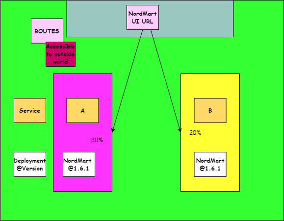

- As you see in the diagram, OpenShift can distribute the traffic that coming to Route. But how does it do it? Let's explore `route` definition. This is a classic Route definition:

    <div class="highlight" style="background: #f7f7f7">
    <pre><code class="language-yaml">
    apiVersion: route.openshift.io/v1
    kind: Route
    metadata:
      name: pet-battle
    spec:
      port:
        targetPort: 8080-tcp
      to:
        kind: Service
        name: pet-battle
        weight: 100       <-- All of the traffic goes to `pet-battle` service
      ...
    </code></pre></div>

    In order to split the traffic, we introduce something called `alternateBackends`.

    <div class="highlight" style="background: #f7f7f7">
    <pre><code class="language-yaml">
    apiVersion: route.openshift.io/v1
    kind: Route
    metadata:
      name: pet-battle
    spec:
      port:
        targetPort: 8080-tcp
      to:
        kind: Service
        name: pet-battle
        weight: 80
      alternateBackends: <-- This helps us to divide the traffic
      - kind: Service
        name: pet-battle-b
        weight: 20       <-- based on the percentage we give
    </code></pre></div>

    PetBattle UI Helm chart already has this capability. We just need to enable it through `values`. But before that, we need to install a helper tool.

### A/B and Analytics

> The reason we are doing these advanced deployment strategies is to experiment, to see if our newly introduced features are liked by our end users, to see how the performance is of the new version and so on. But splitting traffic is not enough for this. We need to track and measure the effect of the changes. Therefore, we will use a tool called `Matomo` to get detailed reports on Nordmart and record the users' behaviour.

Before we jump to A/B deployment, let's deploy Matomo through Argo CD.

Note: Each user will have a separate deployment of Matomo running in your tenant.

1. Open up  nordmart-apps-gitops-config and navigate to `<TENANT-NAME>/00-argocd-apps/01-dev` path, create a new file named `<TENANT-NAME>-matomo.yaml` and add the following config to deploy Matomo through ArgoCD.

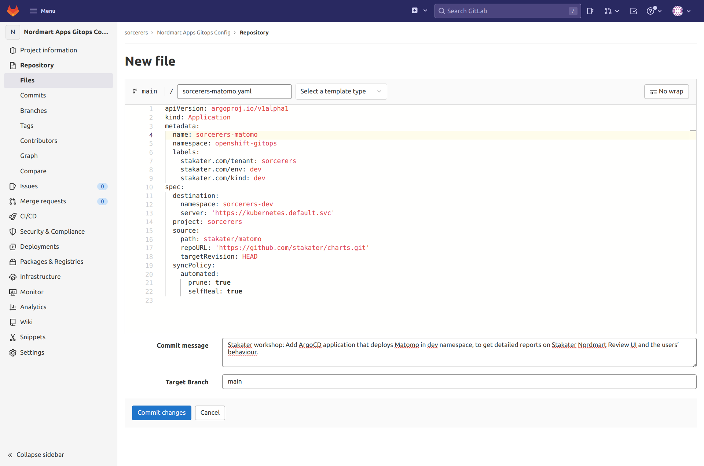

    ```yaml
      # Matomo
      apiVersion: argoproj.io/v1alpha1
      kind: Application
      metadata:
        name: <TENANT-NAME>-matomo
        namespace: openshift-gitops
        labels:
          stakater.com/tenant: <TENANT-NAME>
          stakater.com/env: dev
          stakater.com/kind: dev         
      spec:
        destination:
          namespace: <TENANT-NAME>-dev
          server: 'https://kubernetes.default.svc'
        project: <TENANT-NAME> 
        source:
          path: stakater/matomo
          repoURL: 'https://github.com/stakater/charts.git'
          targetRevision: HEAD
        syncPolicy:
          automated:
            prune: true
            selfHeal: true
    ```
  Track the change through ArgoCD. An app `<TENANT-NAME>-matomo` should appear in ArgoCD.

  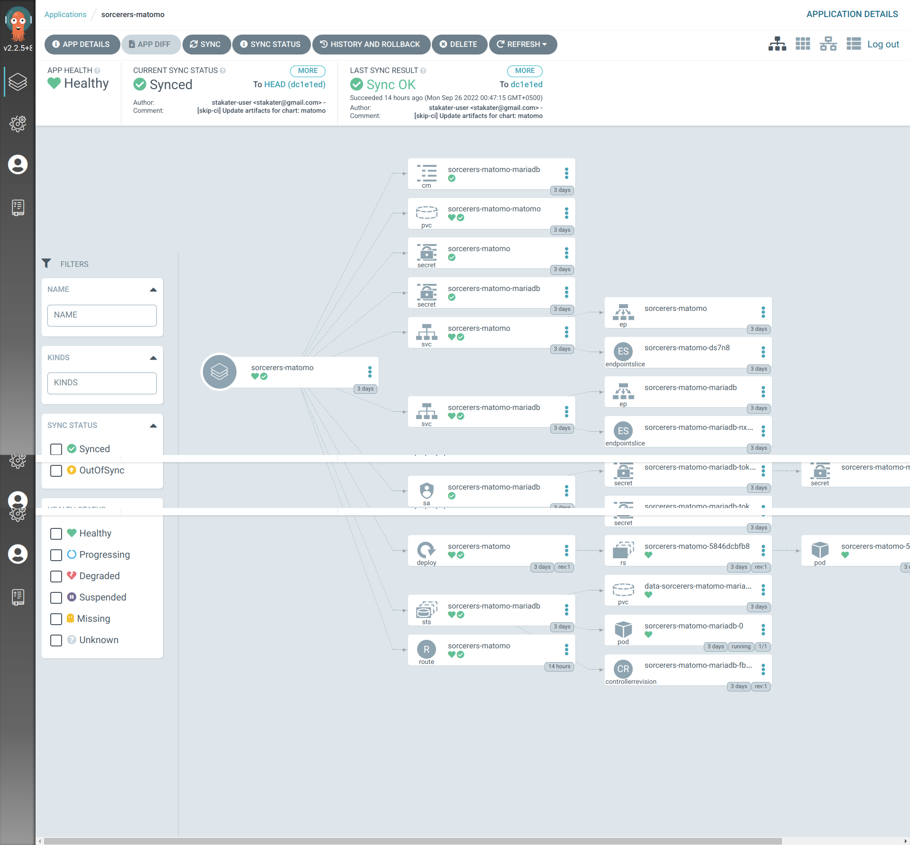

  Once matomo is deployed and synced in argoCD, head over to Openshift Console and in your `<TENANT-NAME>-dev` namespace, click on `Networking>Routes` and copy the link for `<TENANT-NAME>-matomo` route, we will use this in the steps to follow.

  

2. Log in to matomo using username `user` and password `password`. (Yes the literal strings user and password)
   Currently, there is no data yet. But Stakater Nordmart Review UI is already configured to send data to Matomo every time a connection happens. Let's start experimenting with A/B deployment and check Matomo UI on the way.

### A/B Deployment

For this experiment, we are going to deploy 2 instances of Stakater Nordmart Review UI. We will call them `A` and `B`.

1. Let's deploy `A`. In your Gitlab, navigate to `nordmart-apps-gitops-config/01-<TENANT_NAME>`and create a New Directory with name `stakater-nordmart-review-ui-ab-a/01-dev`. 

  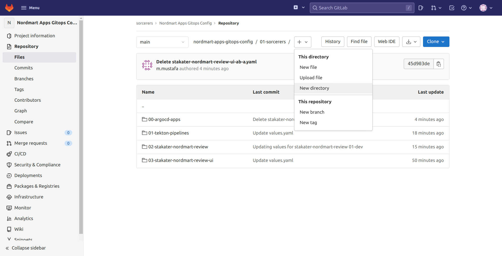

  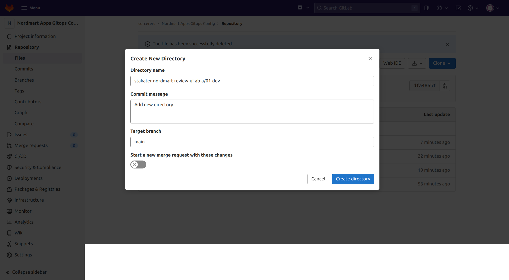

2. Create a file with name `Chart.yaml` and paste below yaml in it.

    ```yaml
      apiVersion: v2
      name: stakater-nordmart-review-ui-ab-a
      description: A Helm chart for Kubernetes
      dependencies:
        - name: stakater-nordmart-review-ui
          version: 1.0.14
          repository:  https://nexus-helm-stakater-nexus.apps.devtest.vxdqgl7u.kubeapp.cloud/repository/helm-charts/
      version: 1.0.14
    ```
    
  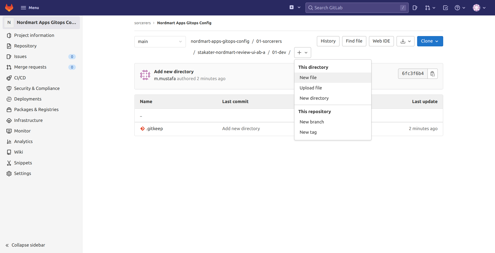

  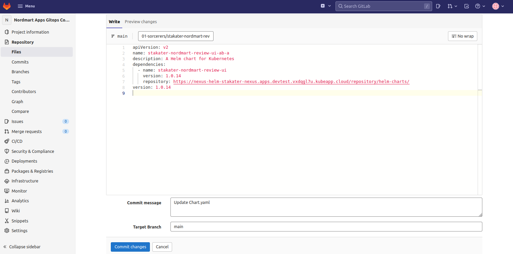

3. Create another file named `values.yaml` in the same directory and paste below yaml in it.

    **Note: Substitute the value of Matomo route we copied in the previous section in `MATOMO_BASE_URL` in the yaml below**

    ```yaml
      stakater-nordmart-review-ui:
        application:
          applicationName: "review-ui-ab-a"
          deployment:
            image:
              repository: stakater/stakater-nordmart-review-ui
              tag: 1.0.24-a
            env:
              REVIEW_API:
                  value: "https://review-{{ .Release.Namespace }}.apps.devtest.vxdqgl7u.kubeapp.cloud/"
              MATOMO_BASE_URL:
                  value: "<YOUR_MATOMO_URL_HERE>"
          route:
            enabled: false

    ```
  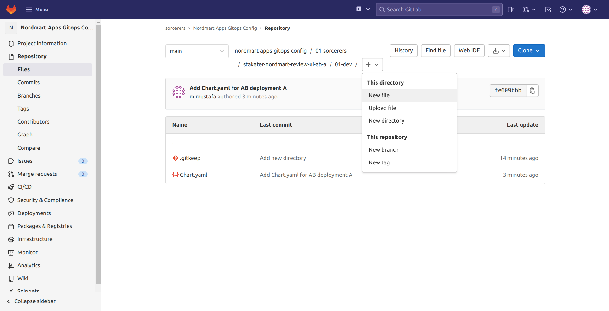

  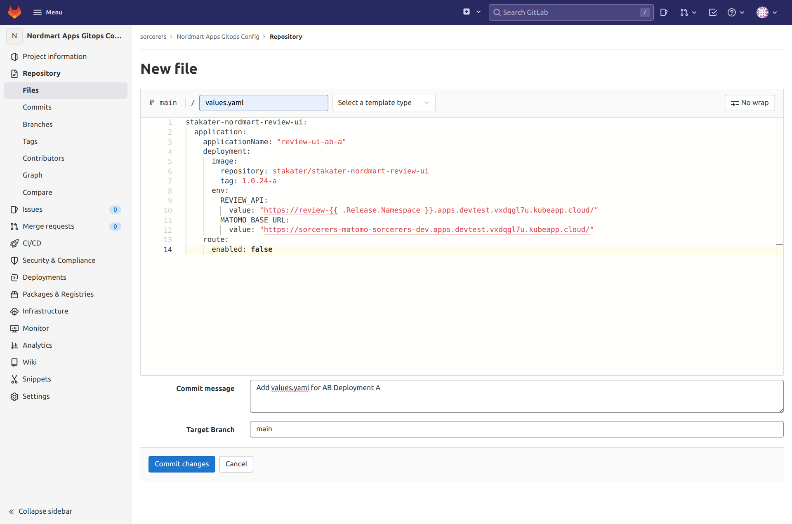

4. Now we will create an ArgoCD app that deploys our `A` application. Navigate to `nordmart-apps-gitops-config/01-sorcerers/00-argocd-apps/01-dev` and create a new file named `<TENANT_NAME>-stakater-nordmart-review-ui-ab-a.yaml` and paste below yaml in it.

    ```yaml
    apiVersion: argoproj.io/v1alpha1
    kind: Application
    metadata:
      name: <TENANT-NAME>-stakater-nordmart-review-ui-ab-a
      namespace: openshift-gitops
      labels:
        stakater.com/tenant: <TENANT-NAME>
        stakater.com/env: dev
        stakater.com/kind: dev
    spec:
      destination:
        namespace: <TENANT-NAME>-dev
        server: 'https://kubernetes.default.svc'
      project: <TENANT-NAME>
      source:
        path: 01-<TENANT-NAME>/stakater-nordmart-review-ui-ab-a/01-dev
        repoURL: 'https://gitlab.apps.devtest.vxdqgl7u.kubeapp.cloud/<TENANT-NAME>/nordmart-apps-gitops-config.git'
        targetRevision: HEAD
      syncPolicy:
        automated:
          prune: true
          selfHeal: true

    ```
  
    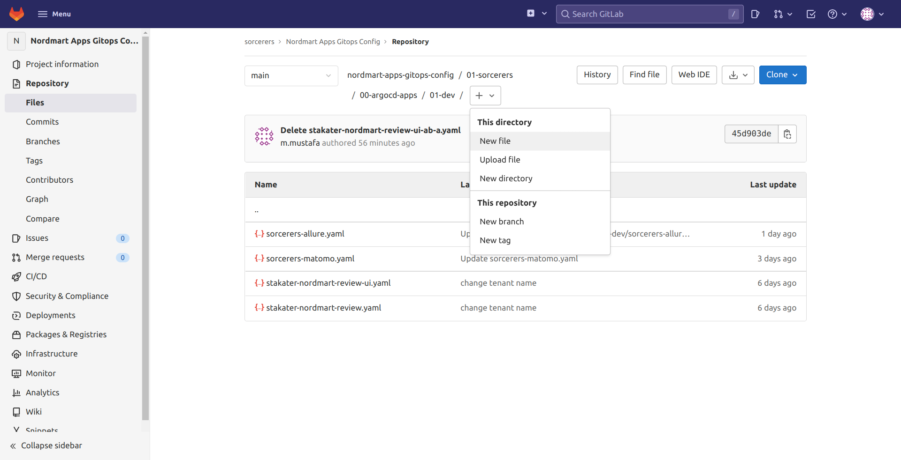

    


5. Now let's deploy `B`. Navigate to `01-<TENANT_NAME>` again and create a New Directory with name `stakater-nordmart-review-ui-ab-b/01-dev`.

  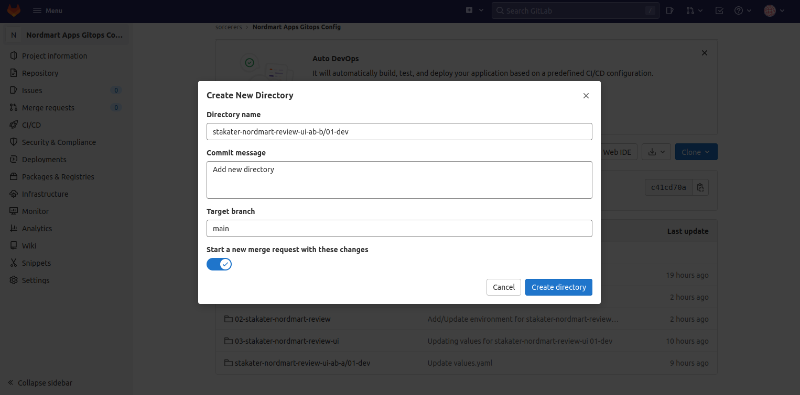

6. Create a file with name `Chart.yaml` and paste below yaml in it.

    ```yaml
      apiVersion: v2
      name: stakater-nordmart-review-ui-ab-b
      description: A Helm chart for Kubernetes
      dependencies:
      - name: stakater-nordmart-review-ui
        version: 1.0.14
        repository: https://nexus-helm-stakater-nexus.apps.devtest.vxdqgl7u.kubeapp.cloud/repository/helm-charts/
      version: 0.0.0
    ```

   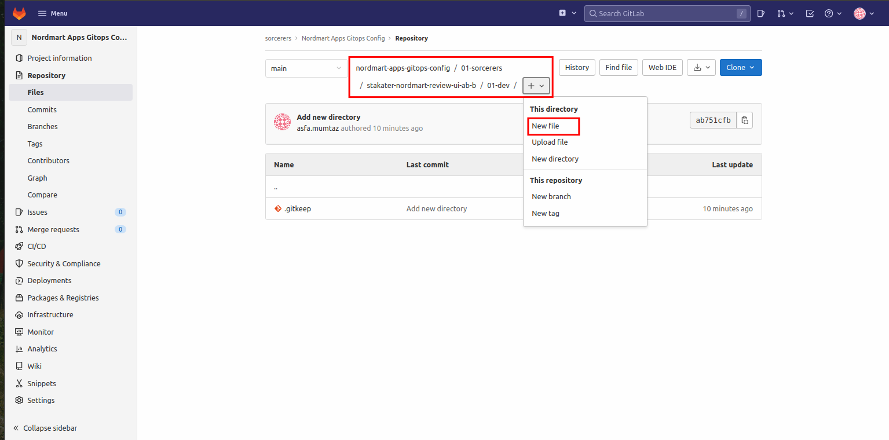

   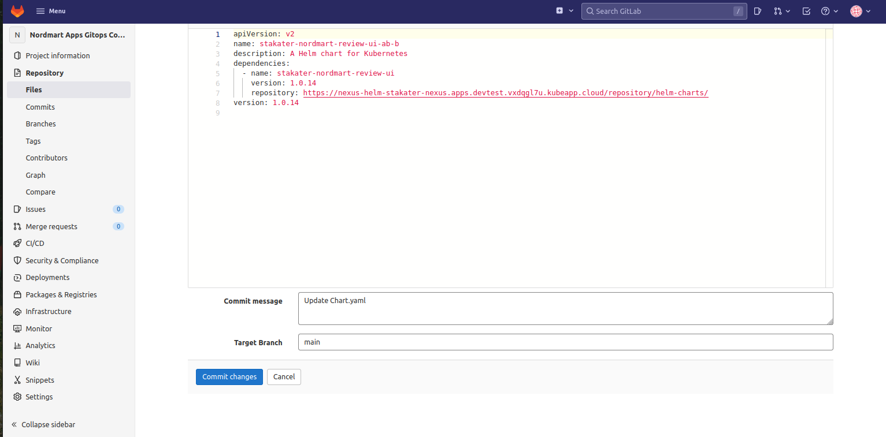

7. Create another file named `values.yaml` in the same directory and paste below yaml in it.

   **Note: Dont forget to replace the matomo URL.**

    ```yaml
      stakater-nordmart-review-ui:
        application:
          applicationName: "review-ui-ab-b"
          deployment:
            image:
              repository: stakater/stakater-nordmart-review-ui
              tag: 1.0.24-b
            env:
              REVIEW_API:
                  value: "https://review-{{ .Release.Namespace }}.apps.devtest.vxdqgl7u.kubeapp.cloud/"
              MATOMO_BASE_URL:
                  value: "<YOUR_MATOMO_URL_HERE>"
          route:
            enabled: false

    ```
   

8. Now we will create a ArgoCD app for deploying `B` application. Navigate to `nordmart-apps-gitops-config/01-sorcerers/00-argocd-apps/01-dev` and create a new file named `<TENANT_NAME>-stakater-nordmart-review-ui-ab-b.yaml` and paste below yaml in it.

    ```yaml
    apiVersion: argoproj.io/v1alpha1
    kind: Application
    metadata:
      name: <TENANT-NAME>-stakater-nordmart-review-ui-ab-b
      namespace: openshift-gitops
      labels:
        stakater.com/tenant: <TENANT-NAME>
        stakater.com/env: dev
        stakater.com/kind: dev
    spec:
      destination:
        namespace: <TENANT-NAME>-dev
        server: 'https://kubernetes.default.svc'
      project: <TENANT-NAME>
      source:
        path: 01-<TENANT-NAME>/stakater-nordmart-review-ui-ab-b/01-dev
        repoURL: 'https://gitlab.apps.devtest.vxdqgl7u.kubeapp.cloud/<TENANT-NAME>/nordmart-apps-gitops-config.git'
        targetRevision: HEAD
      syncPolicy:
        automated:
          prune: true
          selfHeal: true

    ```

   

   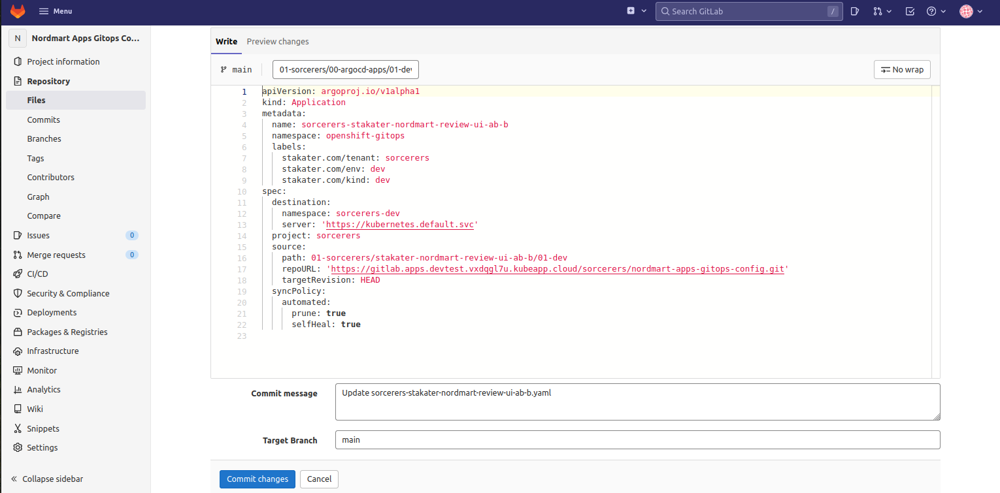

9. Now lets head over to ArgoCD to check if our application B was deployed.
   
   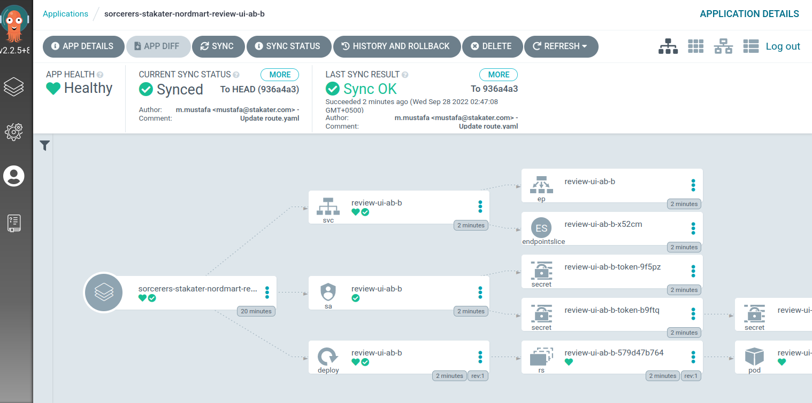


2. Extend the configuration for the existing Pet Battle deployment (`A`) by adding the `a_b_deploy` properties to the `values` section. Copy the below lines under `pet-battle` application definition in `/projects/tech-exercise/pet-battle/test/values.yaml` file.

    ```yaml
          a_b_deploy:
            a_weight: 80
            b_weight: 20 # 20% of the traffic will be directed to 'A'
            svc_name: pet-battle-b
    ```

    The `pet-battle-a` definition in `test/values.yaml` should look something like this (the version numbers may be different):

    <div class="highlight" style="background: #f7f7f7">
    <pre><code class="language-yaml">
      pet-battle:
        name: pet-battle
        enabled: true
        source: http://nexus:8081/repository/helm-charts 
        chart_name: pet-battle
        source_ref: 1.0.6 # Helm chart version
        values:
          image_version: latest # container image version  
          <strong>a_b_deploy:
            a_weight: 80
            b_weight: 20 # 20% of the traffic will be directed to 'B'
            svc_name: pet-battle-b</strong>
          config_map: ...
    </code></pre></div>

3. Git commit the changes and in OpenShift UI, you'll see two new deployments are coming alive.

    ```bash
    cd /projects/tech-exercise
    git add pet-battle/test/values.yaml
    git commit -m  "🍿 ADD - A & B environments 🍿"
    git push
    ```

4. Verify if you have the both service definition.

    ```bash
    oc get svc -l app.kubernetes.io/instance=pet-battle -n ${TENANT_NAME}-test
    oc get svc -l app.kubernetes.io/instance=pet-battle-b -n ${TENANT_NAME}-test
    ```

5. Before verify the traffic redirection, let's make a simple application change to make this more visual! In the frontend, we'll change the banner along the top of the app. In your IDE, open `/projects/pet-battle/src/app/shell/header/header.component.html`. Uncomment the `<nav>` HTML Tag under the `<!-- Green #009B00 -->`.

    <strong>Remove the line</strong> for the original `<nav class="navbar navbar-expand-lg navbar-dark bg-dark">`. It appears like this:

    ```html
    <header>
        <!-- Green #009B00 -->
        <nav class="navbar  navbar-expand-lg navbar-dark" style="background-color: #009B00;">
    ```

6. Bump the version of the application to trigger a new release by updating the `version` in the `package.json` at the root of the frontend repository.

    <div class="highlight" style="background: #f7f7f7">
    <pre><code class="language-yaml">
    "name": "pet-battle",
    "version": "1.6.1", <- bump this
    "private": true,
    "scripts": ...
    </code></pre></div>

7. Commit all these changes:

    ```bash
    cd /projects/pet-battle
    git add .
    git commit -m "🫒 ADD - Green banner 🫒"
    git push
    ```

8. When Jenkins executes, it'll bump the version in ArgoCD configuration. ArgoCD triggers the new version deployment while `pet-battle-b` is still running in the previous version.

    If you open up `pet-battle` in your browser, 20 percent of the traffic is going to `b`. You have a little chance to see the green banner.

    ```bash
    oc get route/pet-battle -n ${TENANT_NAME}-test --template='{{.spec.host}}'
    ```

9. Now let's redirect 50% of the traffic to `B`, that means that only 50% of the traffic will go to `A`. So you need to update `weight` value in `tech-exercise/pet-battle/test/values.yaml` file.
And as always, push it to the Git repository - <strong>Because if it's not in Git, it's not real!</strong>

    ```bash
    cd /projects/tech-exercise
    yq eval -i .applications.pet-battle.values.a_b_deploy.a_weight='100' pet-battle/test/values.yaml
    yq eval -i .applications.pet-battle.values.a_b_deploy.b_weight='100' pet-battle/test/values.yaml
    git add pet-battle/test/values.yaml
    git commit -m  "🏋️‍♂️ service B weight increased to 50% 🏋️‍♂️"
    git push
    ```

10. Open an incognito browser and connect to the same URL. You'll have 50% chance to get a green banner.

    ```bash
    oc get route/pet-battle -n ${TENANT_NAME}-test --template='{{.spec.host}}'
    ```

11. Apparently people like green banner on PetBattle UI! Let's redirect all traffic to service `A`. Yes, for that we need to make weight 0 for service `B`. If you refresh the page, you should only see the green banner.

    ```bash
    cd /projects/tech-exercise
    yq eval -i .applications.pet-battle.values.a_b_deploy.a_weight='100' pet-battle/test/values.yaml
    yq eval -i .applications.pet-battle.values.a_b_deploy.b_weight='0' pet-battle/test/values.yaml
    git add pet-battle/test/values.yaml
    git commit -m  "💯 service B weight increased to 100 💯"
    git push
    ```

    ..and do not forget to check Matomo!
