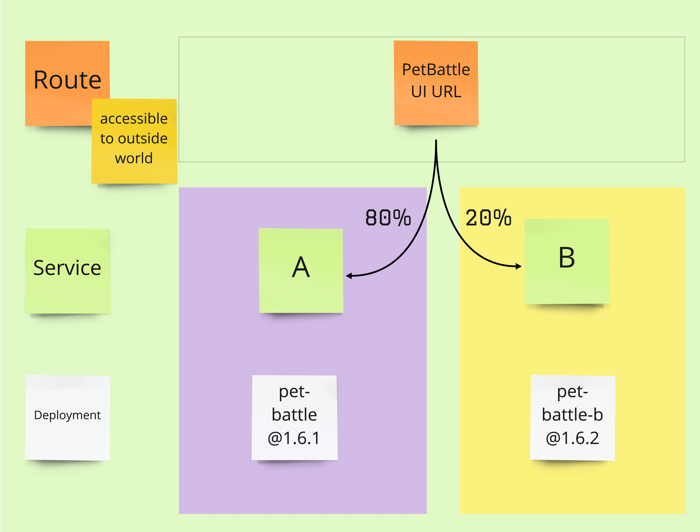

## A/B Deployments

> A/B deployments generally imply running two (or more) versions of the application at the same time for testing or experimentation purposes.

<span style="color:blue;">[OpenShift Docs](https://docs.openshift.com/container-platform/4.9/applications/deployments/route-based-deployment-strategies.html#deployments-ab-testing_route-based-deployment-strategies)</span> is pretty good at showing an example of how to do a manual A/B deployment. But in the real world you'll want to automate this by increasing the load of the alternative service based on some tests or other metric. Plus this is GITOPS! So how do we do a A/B with all of this automation and new tech, let's take a look with our Pet Battle UI!



- As you see in the diagram, OpenShift can distribute the traffic that coming to Route. But how does it do it? Let's explore `route` definition. This is a classic Route definition:

    <div class="highlight" style="background: #f7f7f7">
    <pre><code class="language-yaml">
    apiVersion: route.openshift.io/v1
    kind: Route
    metadata:
      name: pet-battle
    spec:
      port:
        targetPort: 8080-tcp
      to:
        kind: Service
        name: pet-battle
        weight: 100       <-- All of the traffic goes to `pet-battle` service
      ...
    </code></pre></div>

    In order to split the traffic, we introduce something called `alternateBackends`.

    <div class="highlight" style="background: #f7f7f7">
    <pre><code class="language-yaml">
    apiVersion: route.openshift.io/v1
    kind: Route
    metadata:
      name: pet-battle
    spec:
      port:
        targetPort: 8080-tcp
      to:
        kind: Service
        name: pet-battle
        weight: 80
      alternateBackends: <-- This helps us to divide the traffic
      - kind: Service
        name: pet-battle-b
        weight: 20       <-- based on the percentage we give
    </code></pre></div>

    PetBattle UI helm chart already has this capability. We just need to enable it through `values`. But before that, we need to install a helper tool.

### A/B and Analytics

> The reason we are doing these advanced deployment strategies is to experiment, to see if our newly introduced features are liked by our endusers, to see how the performance is of the new version and so on. But splitting traffic is not enough for this. We need to track and measure the effect of the changes. Therefore, we will use a tool called `Matomo` to get detailed reports on our PetBattle and the users' behaviour.

Before we jumping to A/B deployment, let's deploy Matomo through Argo CD.

1. Open up `tech-exercise/ubiquitous-journey/values-tooling.yaml` file and add the following application definition:

    ```yaml
      # Matomo
      - name: matomo
        enabled: true
        source: https://petbattle.github.io/helm-charts
        chart_name: matomo
        source_ref: "4.1.1+01"
    ```

    Push the changes:

    ```bash
    cd /projects/tech-exercise
    git add .
    git commit -m  "📈 ADD - matomo app 📈"
    git push 
    ```

    See Matomo is deploying:

    ```bash
    oc get pod -n ${TEAM_NAME}-ci-cd -w
    ```

    When Matomo pods are running, get the URL and connect it:

    ```bash
    echo https://$(oc get route/matomo -n ${TEAM_NAME}-ci-cd --template='{{.spec.host}}')
    ```

    - Username: `admin`
    - Password: `My$uper$ecretPassword123#`

2. Currently, there is no data yet. But Pet Battle is already configured to send data to Matomo every time a connection happens. (open up `tech-exercise/pet-battle/test/values.yaml` file and look for `matomo`) Let's start experimenting with A/B deployment and check Matomo UI on the way.

### A/B Deployment

1. Let's deploy our experiment we want to compare -  let's call this `B`. Adjust the `source_ref` helm chart version and `image_version` to match what you have built.

    ```bash
    cat << EOF >> /projects/tech-exercise/pet-battle/test/values.yaml
      # Pet Battle UI - experiment
      pet-battle-b:
        name: pet-battle-b
        enabled: true
        source: http://nexus:8081/repository/helm-charts
        chart_name: pet-battle
        source_ref: 1.0.6 # helm chart version - may need adjusting!
        values:
          image_version: latest # container image version - may need adjusting!
          fullnameOverride: pet-battle-b
          route: false
          config_map: '{
            "catsUrl": "https://pet-battle-api-<TEAM_NAME>-test.<CLUSTER_DOMAIN>",
            "tournamentsUrl": "https://pet-battle-tournament-<TEAM_NAME>-test.<CLUSTER_DOMAIN>",
            "matomoUrl": "https://matomo-<TEAM_NAME>-ci-cd.<CLUSTER_DOMAIN>/",
            "keycloak": {
              "url": "https://keycloak-<TEAM_NAME>-test.<CLUSTER_DOMAIN>/auth/",
              "realm": "pbrealm",
              "clientId": "pbclient",
              "redirectUri": "http://localhost:4200/tournament",
              "enableLogging": true
            }
          }'
    EOF
    ```

    We will use our existing Pet Battle deployment as `A`.

2. Extend the configuration for the existing Pet Battle deployment (`A`) by adding the `a_b_deploy` properties to the `values` section. Copy the below lines under `pet-battle` application definition in `/projects/tech-exercise/pet-battle/test/values.yaml` file.

    ```yaml
          a_b_deploy:
            a_weight: 80
            b_weight: 20 # 20% of the traffic will be directed to 'A'
            svc_name: pet-battle-b
    ```

    The `pet-battle-a` definition in `test/values.yaml` should look something like this (the version numbers may be different):

    <div class="highlight" style="background: #f7f7f7">
    <pre><code class="language-yaml">
      pet-battle:
        name: pet-battle
        enabled: true
        source: http://nexus:8081/repository/helm-charts 
        chart_name: pet-battle
        source_ref: 1.0.6 # helm chart version
        values:
          image_version: latest # container image version  
          <strong>a_b_deploy:
            a_weight: 80
            b_weight: 20 # 20% of the traffic will be directed to 'B'
            svc_name: pet-battle-b</strong>
          config_map: ...
    </code></pre></div>

3. Git commit the changes and in OpenShift UI, you'll see two new deployments are coming alive.

    ```bash
    cd /projects/tech-exercise
    git add pet-battle/test/values.yaml
    git commit -m  "🍿 ADD - A & B environments 🍿"
    git push
    ```

4. Verify if you have the both service definition.

    ```bash
    oc get svc -l app.kubernetes.io/instance=pet-battle -n ${TEAM_NAME}-test
    oc get svc -l app.kubernetes.io/instance=pet-battle-b -n ${TEAM_NAME}-test
    ```

5. Before verify the traffic redirection, let's make a simple application change to make this more visual! In the frontend, we'll change the banner along the top of the app. In your IDE, open `/projects/pet-battle/src/app/shell/header/header.component.html`. Uncomment the `<nav>` HTML Tag under the `<!-- Green #009B00 -->`.

    <strong>Remove the line</strong> for the original `<nav class="navbar navbar-expand-lg navbar-dark bg-dark">`. It appears like this:

    ```html
    <header>
        <!-- Green #009B00 -->
        <nav class="navbar  navbar-expand-lg navbar-dark" style="background-color: #009B00;">
    ```

6. Bump the version of the application to trigger a new release by updating the `version` in the `package.json` at the root of the frontend's repository.

    <div class="highlight" style="background: #f7f7f7">
    <pre><code class="language-yaml">
    "name": "pet-battle",
    "version": "1.6.1", <- bump this
    "private": true,
    "scripts": ...
    </code></pre></div>

7. Commit all these changes:

    ```bash
    cd /projects/pet-battle
    git add .
    git commit -m "🫒 ADD - Green banner 🫒"
    git push
    ```

8. When Jenkins executes, it'll bump the version in ArgoCD configuration. ArgoCD triggers the new version deployment while `pet-battle-b` is still running in the previous version.

    If you open up `pet-battle` in your browser, 20 percent of the traffic is going to `b`. You have a little chance to see the green banner.

    ```bash
    oc get route/pet-battle -n ${TEAM_NAME}-test --template='{{.spec.host}}'
    ```

9. Now let's redirect 50% of the traffic to `B`, that means that only 50% of the traffic will go to `A`. So you need to update `weight` value in `tech-exercise/pet-battle/test/values.yaml` file.
And as always, push it to the Git repository - <strong>Because if it's not in Git, it's not real!</strong>

    ```bash
    cd /projects/tech-exercise
    yq eval -i .applications.pet-battle.values.a_b_deploy.a_weight='100' pet-battle/test/values.yaml
    yq eval -i .applications.pet-battle.values.a_b_deploy.b_weight='100' pet-battle/test/values.yaml
    git add pet-battle/test/values.yaml
    git commit -m  "🏋️‍♂️ service B weight increased to 50% 🏋️‍♂️"
    git push
    ```

10. Open an incognito browser and connect to the same URL. You'll have 50% chance to get a green banner.

    ```bash
    oc get route/pet-battle -n ${TEAM_NAME}-test --template='{{.spec.host}}'
    ```

11. Apparently people like green banner on PetBattle UI! Let's redirect all traffic to service `A`. Yes, for that we need to make weight 0 for service `B`. If you refresh the page, you should only see the green banner.

    ```bash
    cd /projects/tech-exercise
    yq eval -i .applications.pet-battle.values.a_b_deploy.a_weight='100' pet-battle/test/values.yaml
    yq eval -i .applications.pet-battle.values.a_b_deploy.b_weight='0' pet-battle/test/values.yaml
    git add pet-battle/test/values.yaml
    git commit -m  "💯 service B weight increased to 100 💯"
    git push
    ```

    ..and do not forget to check Matomo!
