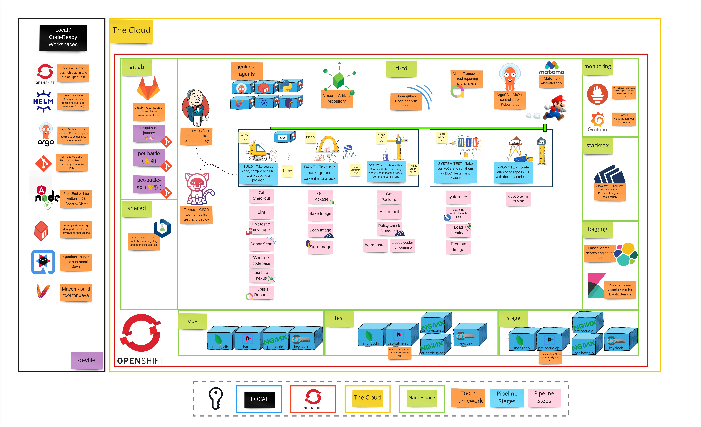

# Exercise 5 - The Deployments Strike Back

> Each application has different requirements for availability (and other considerations) during deployments. Advanced Deployment Strategies are here to support a variety of deployment scenarios.

The time between software being written and tested, till it is deployed in production, should be as short as possible. There are simply too many details and configuration items that need to be changed when deploying to production that even for our small application suite. Manual deployment becomes error-prone and tedious. We continually drive to reduce this manual toil by automating the deployment processes and by utilizing the platform capabilities that OpenShift offers.

## 👨‍🍳 Exercise Intro

In this exercise, we will enable autoscale for frontend and run some tests to trigger scaling. Then, we will experience Blue/Green and A/B deployments with OpenShift's existing capabilities: deployments, services and routes. 
## 🖼️ Big Picture

## 🔮 Learning Outcomes

- [ ] Can enable Horizontal Pod Autoscaler
- [ ] Can add Blue/Green deployment method into pipeline
- [ ] Can shift traffic gradually between two different versions with A/B deployment method

## 🔨 Tools used in this exercise!

* Nothing special. OpenShift's existing capabilities help us to deploy these methods.
