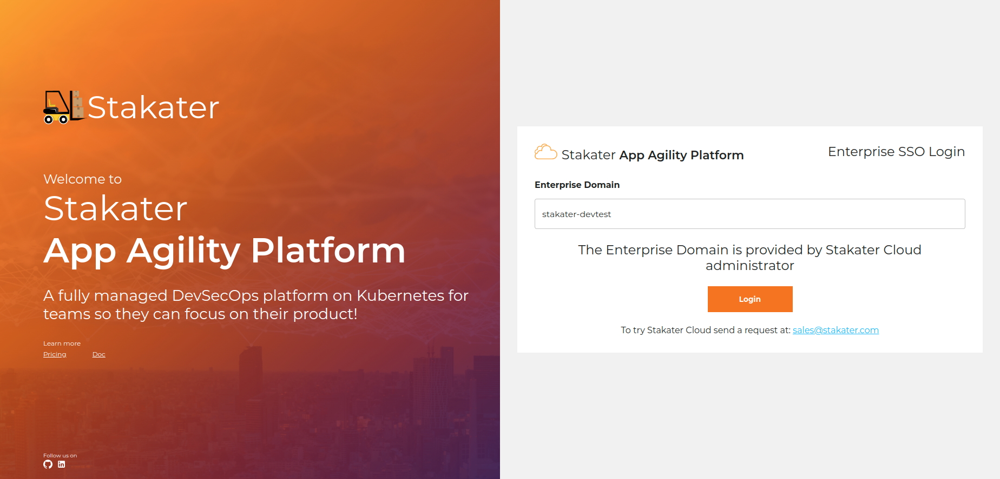
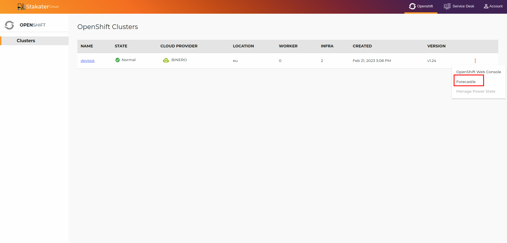
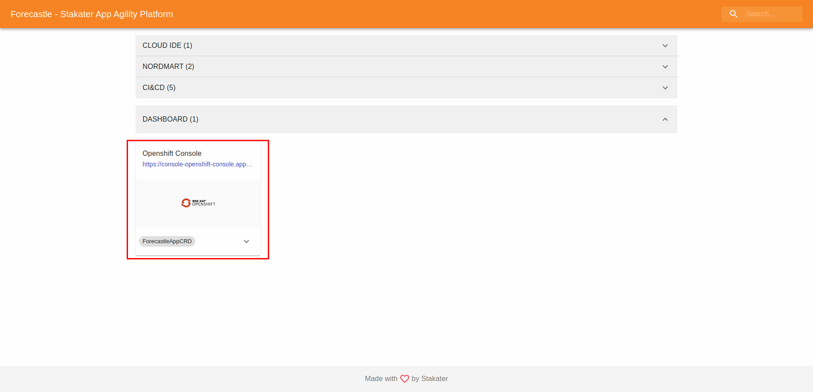
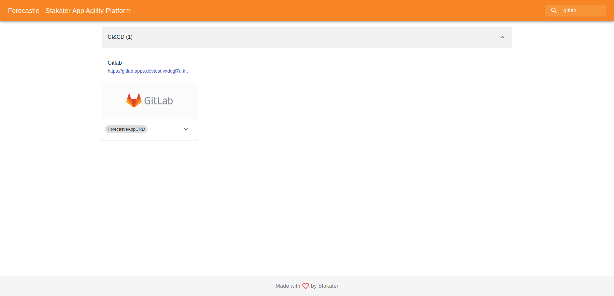
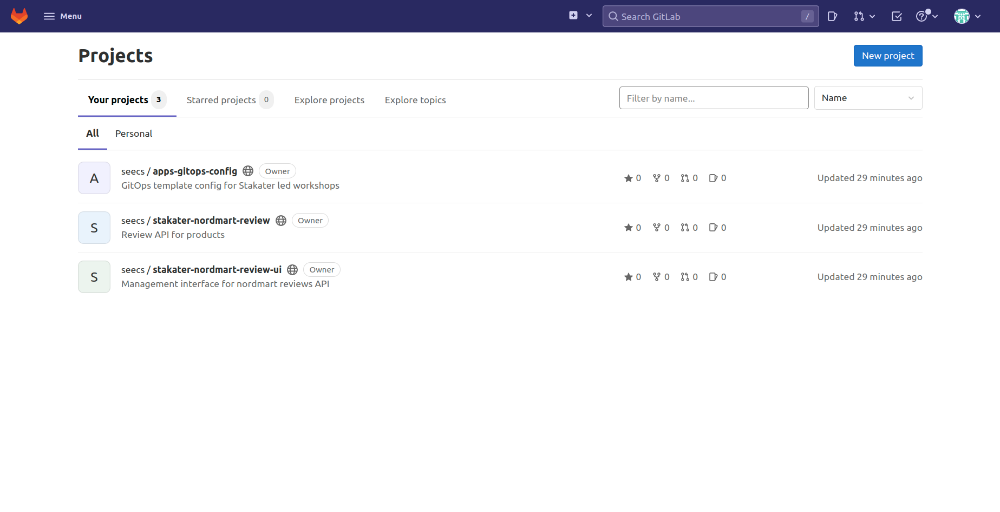
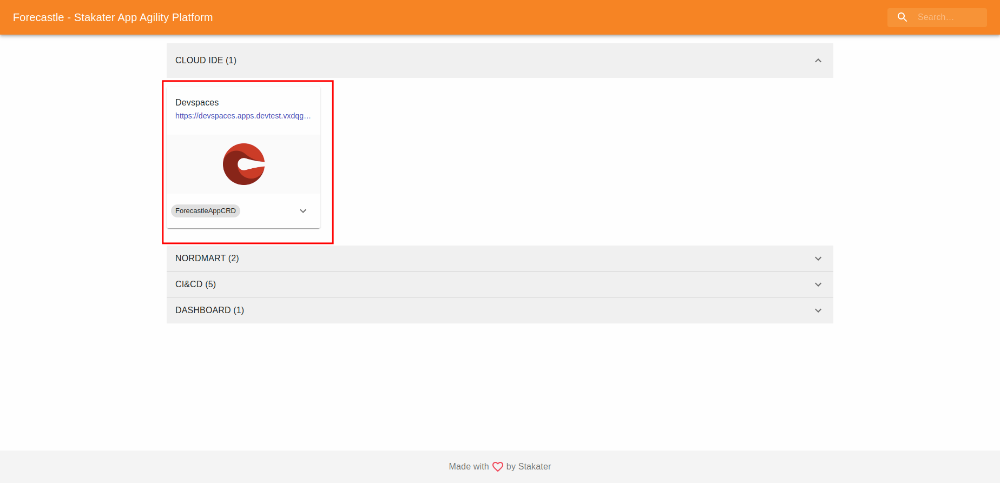

# OUR SETUP

SAAP - Stakater App Agility Platform is Kubernetes based fully managed DevSecOps platform on cloud of your choice for teams so, they can focus on their product!

SAAP enables developers to control and configure the entire cloud development loop in order to ship software faster!

We will register our SAAP user in the following section.
> [SAAP Login](https://dev.cloud.stakater.com/)
# Setting up your account

1. Open up SAAP login provided above. You will see the following screen. Type in stalater-devtest in Enterprise domain.
   

2. Now click on three dots next to 'devtest' and select forecastle from the dropdown. This will take you to Forecastle.
   

3. Open up 'Openshift Console' from the links displayed on forecastle. You will be taken to the cluster login page.
   

   

4. Select Register User from the above menu. This will redirect you to the registration form.

5. Fill in the form with required details and hit Register.

   *Note* Use your professional email for registration

6. Once you hit enter, the following screen will be shown, and you will a verification email will be sent to you on the email address you used in step 3.

7. Use the link provided in the email to verify your user.

8. Once you've verified your user, you will be redirected to SAAP.
   SAAP will then configure some things for you behind the scenes. Brief explanation of these configuration are provided in the following sections.

## Tenant creation

Once you've verified your user, a tenant bearing the name of organization will be created on SAAP.

*_Tenant_* is a concept used by Multi Tenant Operator. For the sake of simplicity you can think of tenant as an isolation between different teams, but it can do much more than that. You can read more about Multi Tenant Operator here.

If you now go to the projects page of SAAP, you will start seeing three projects:
* [ORGANIZATION]-dev
* [ORGANIZATION]-[YOUR-NAME]-sandbox
* [ORGANIZATION]-workshop-parent

Let's look at all of these projects.

#### [ORGANIZATION]-workshop-parent

This namespace is used for deploying the workshop related resource needed. It contains a custom resource called 'Gitlab'
The Gitlab resource creates your gitlab group and a clones a few repositories in your gitlab group.

##### [ORGANIZATION]-[YOUR-NAME]-sandbox project:
As the name suggest, this is playground namespace/project for the users in a tenant. Every user belonging to a tenant will have his/her own sandbox
The namespace will also run our devworkspace. You will learn more about devworkspace in the proceeding sections.

#### [ORGANIZATION]-dev
This is the namespace in which we will be deploying our demo app in section 3. For now, this will be empty

## Tenant-Vault Integration

Multi Tenant Operator has an integration with vault that allow the tenant users to add and use secrets from vault in their tenant namespaces while keeping the data hidden from others.
When Tenant vault access is enabled in Tenant, MTO does the following two things:

* Creates path in vault for adding secrets. For instance, if the tenant name is 'stakater', a path stakater will be added to vault.
* Configures OIDC as a login mechanism allowing Single Sign On

Let's take a look at vault and try to log in:

1. Open up Forecastle.
2. Search for Vault and click the link that is displayed.

3. Once you see the log in screen, use OIDC from the dropdown menu in 'Method' and hit enter.

4. You will be logged in to vault. You should now be able to see a path with you tenant name in vault.

## Gitlab Automation

As already mentioned, a Gitlab resource in deployed in the [ORGANIZATION]-workshop-parent namespace. This resource automates the following things for us:

* Adds a gitlab group with your organization/tenant name in gitlab.
* Cloned the projects needed in this showcase to your gitlab group.

Let's view these things in action!

1. To open Gitlab, head over to [forecastle](https://forecastle-stakater-forecastle.apps.devtest.vxdqgl7u.kubeapp.cloud/) again and search for Gitlab.
   

2. Hit the url, you will be redirected to gitlab.
   

3. You will see three repositories. The nordmart-review and nordmart-review-ui and apps-gitops-config. 
  

## Devworkspace Creation

When you registered your user, we also configured a devworkspace for you.

The devworkspace will act and as IDE for you. It provides  consistent, secure, and zero-configuration development environment. You will learn more about devworkspace in the next section.

We have already linked the projects added in Gitlab to your devworkspace through a devfile. More on this later!!!

For now, you can check the devworkspace by opening [forecastle](https://forecastle-stakater-forecastle.apps.devtest.vxdqgl7u.kubeapp.cloud/)  and clicking devworkspace.

## Argocd Application

The apps-gitops-config repository we saw in your gitlab acts as a gitops repository for deploying the nordmart-review application.

Behind the scene, we created an argocd application for you that point to this repository. Argocd will deploy the nordmart review app in [ORGANIZATION]-dev namespace. 
You can check this by going to openshift console, switching the project to [ORGANIZATION]-dev and opening up the pods. You should se nordmart-review pod running
