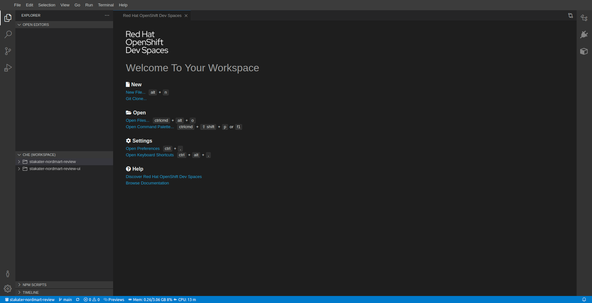
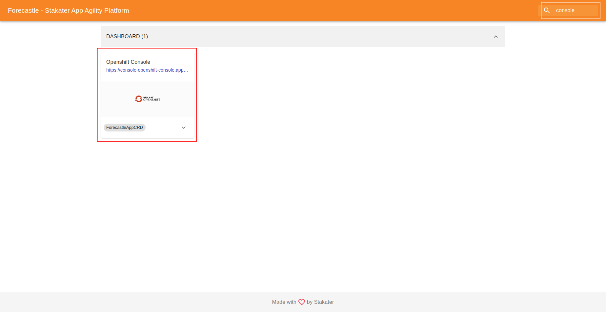
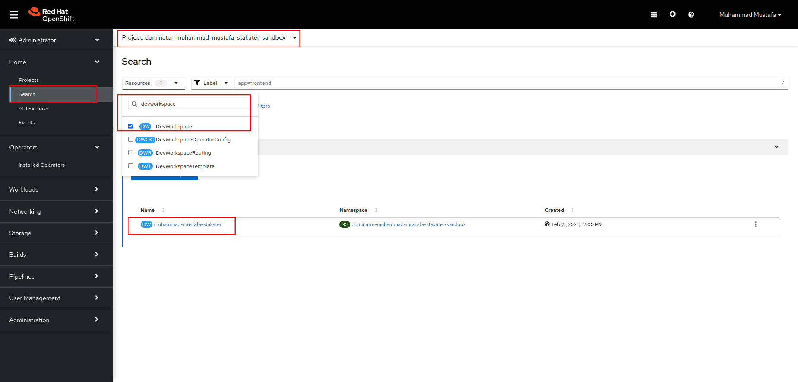
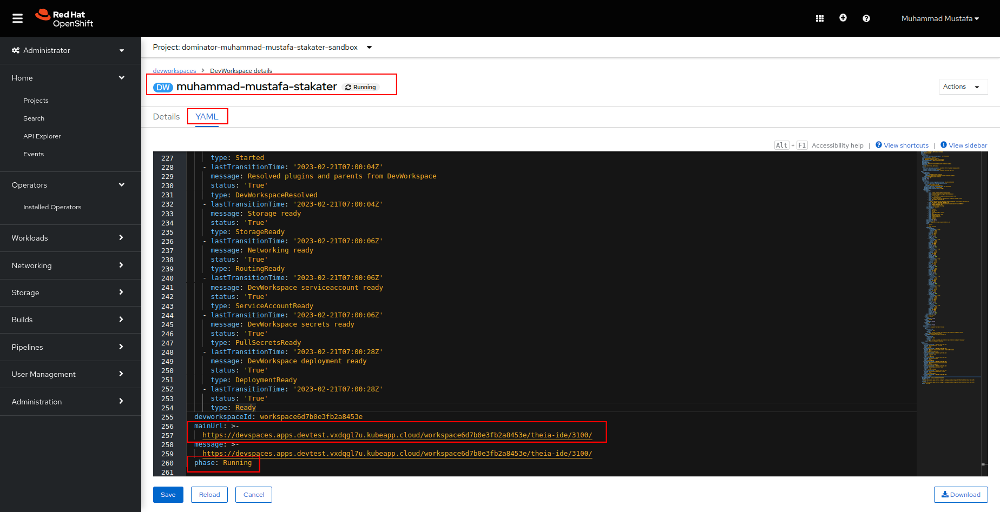
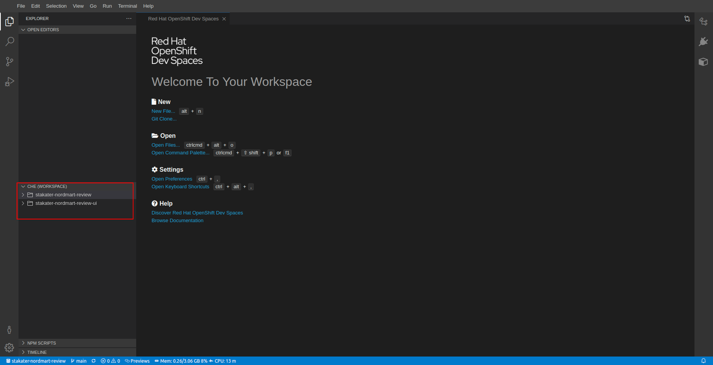
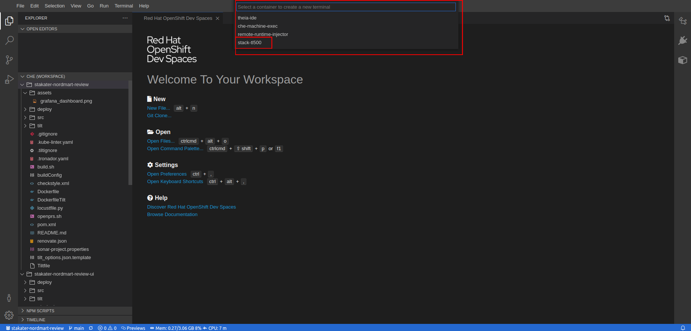
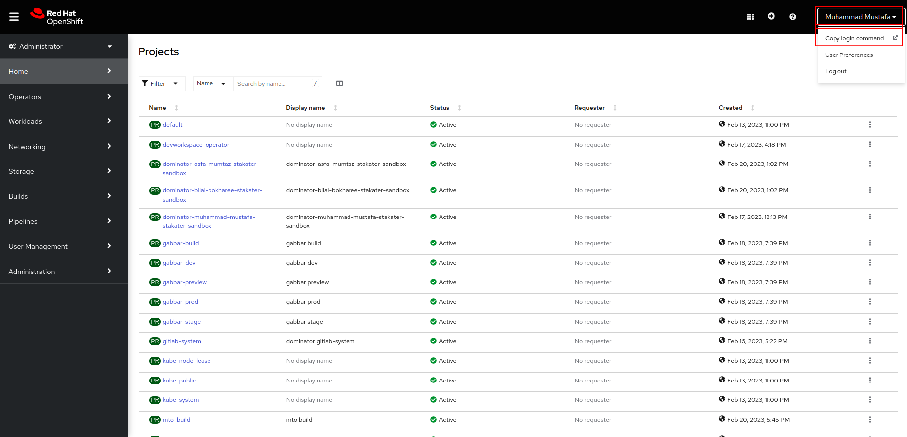

# Devworkspaces

Built on the open Eclipse Che project, Red Hat OpenShift Dev Spaces uses Kubernetes and containers to provide any member of the development or IT team with a consistent, secure, and zero-configuration development environment. The experience is as fast and familiar as an integrated development environment on your laptop.

Red Hat OpenShift Dev Spaces provides developer workspaces with everything you need to code, build, test, run, and debug applications:

- Project source code
- Web-based integrated development environment (IDE)
- Tool dependencies needed by developers to work on a project
- Application runtime: a replica of the environment where the application runs in production

Pods manage each component of a OpenShift Dev Spaces workspace. Therefore, everything running in a OpenShift Dev Spaces workspace is running inside containers. This makes a OpenShift Dev Spaces workspace highly portable.

Read More at https://access.redhat.com/products/red-hat-openshift-dev-spaces

## How to access

A devworkspace is created automatically whenever a new user signs up as discussed in the previous section. In order to access your users devworkspace, do the following steps:

### From Forecastle
1. Search devspaces in search bar at top right corner, Click the URL to devspaces, If prompted Select `Login via Openshift` and Login using your username and password.

    

2. Click on Workspaces from sidebar, You will see a devworkspace named `<USER_NAME>-<DOMAIN>`, Click on `Options > Open` to open the devworkspace.

    

3. You will be directed to devworkspace created for your user. 

        

### From Openshift Cluster

1. Find the URL to openshift console via forecastle and Login to the cluster.

    

3. Open the search page from `Home > Search`, Click Resources and search `Devworkspace`. Select `Devworkspace` to show only `Devworkspace` resources. Make sure to change to sandbox project/namespace called `<TENANT_NAME>-<USER_NAME>-<DOMAIN_NAME>-sandbox` on the top bar e.g. if you are registered as mustafa@stakater.com, project name will be `mustafa-mustafa-stakater-sandbox`.

    

4. Open the Devworkspace resource in your sandbox namespace and click on yaml. Scroll down to `status` field, Check if workspace is running, Look for `mainURL` field. This URL is the link to your provisioned Devsworkspace as part of automation discussed earlier. Open the URL and verify if the Devworkspace is accessible. 

    console-devworkspace-yaml
    
    
You are now successfully logged into the cluster.

## Switch between projects

We specified the Gitlab repositories deployed for your user into our Devworkspace as projects. 

You can view these projects in bottom left window named `Che (workspace)`.

## Accessing the terminal

Open terminal on your DevSpace by pressing ` Ctrl+` ` or clicking Terminal > New Terminal from top menu as highlighted below. 

You will be prompted to `Select a container to create a new terminal`

## oc login to cluster

Your user is already logged to the cluster in the devworkspace. If you still have any issues, perform the following steps:

1. Find the URL to openshift console via forecastle and Login to the cluster.

    

2. Hover over the User Name displayed at top right corner of openshift console and select `Copy Login Command` from drop down menu. Click `Display` and copy the oc login command.

    

3. Open terminal on your DevSpace by pressing ` Ctrl+` ` or clicking Options > Terminal > New Terminal as highlighted below and paste the command copied in the previous step.

    --- Add Image ---
