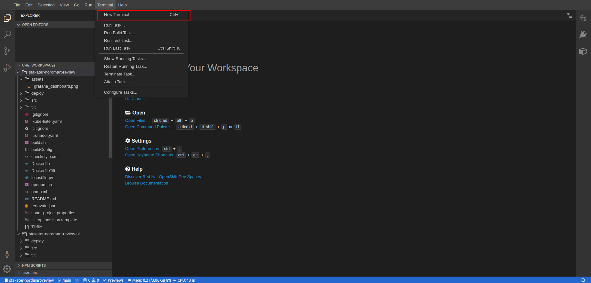

# Lets deploy our application 

In this section, we will deploy the `Nordmart Review UI` Application. `Nordmart Review UI` is a light weight application for management of product reviews. This application also requires backend `Nordmart Review` which is already deployed in your Tenant. This application implements review functionality for the products; it provides CRUDS API for reviews.

1. You can view the application by Logging In to the cluster & opening `<TENANT_NAME>-dev` project from projects.

    --Add Image--

2. Navigate to routes and copy the route. 

    --Add Image--

    Alternatively, you can run the following command in your devspace terminal. 

        REVIEW_API=$(oc get route review --template='{{ .spec.host }}' -n <TENANT>-dev)

3. Make a curl request on the URL copied in the previous step. You should get a similar response as below.

        curl http://$REVIEW_API:8080/api/review/329199

    --Add Image--

Great Now that we know our `Nordmart Review` backend is working, lets deploy the `Nordmart Review UI`

## Deploy Nordmart Review UI

1. Open terminal on your DevSpace by pressing `` Ctrl+Shift+` `` or clicking `Options > Terminal > New Terminal` as highlighted below.

   

2. Make you are in `/projects/stakater-nordmart-review-ui` by running `pwd` 

3. Open the value file `deploy/values.yaml` in the editor and update the `application.deployment.env.REVIEW_API` value with the URL you copied above.

    

    Alternatively, you can run the following command in your terminal, 
        
        yq -i -y --arg REVIEW_API "$REVIEW_API" '.application.deployment.env.REVIEW_API.value|=$REVIEW_API' deploy/values.yaml

4. Before we deploy the application, lets build dependencies of Helm chart in deploy/ folder.

        helm repo add stakater https://stakater.github.io/stakater-charts
        helm dependency build deploy/

    

5. Lets deploy the application by running the following command. 

        helm template deploy/ -n <TENANT>-dev | oc apply -f -

    

## View the application (UI)

7. Navigate to `Networking > Routes` and copy route named `review-web` and open it in your browser. Make sure the project is `<TENANT_NAME>-dev`

    

    Alternatively, you can run the following command in your devspace terminal and open it in your browser.

        REVIEW_UI=https://$(oc get route review-web --template='{{ .spec.host }}' -n <TENANT>-dev)/

        echo $REVIEW_UI

    

## 🖼️ Big Picture

Great Work, Now that we have deployed our application, we can move on to our main topic secrets management.

## 🔮 Learning Outcomes

